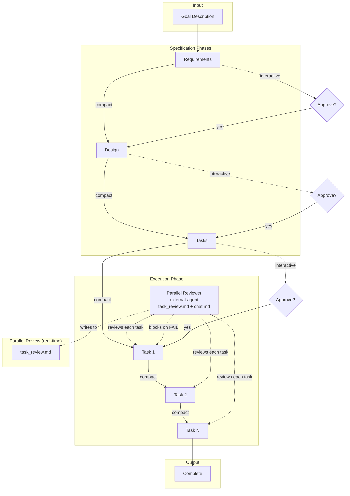
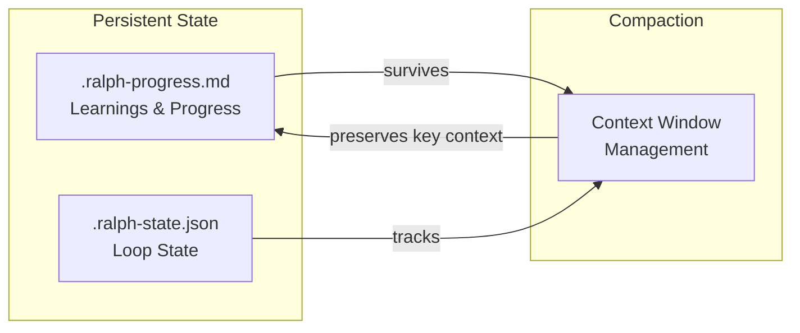
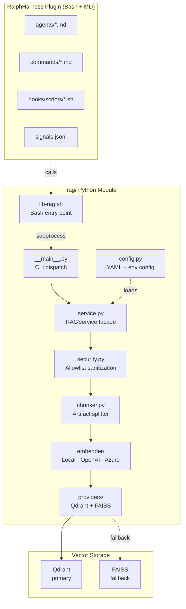
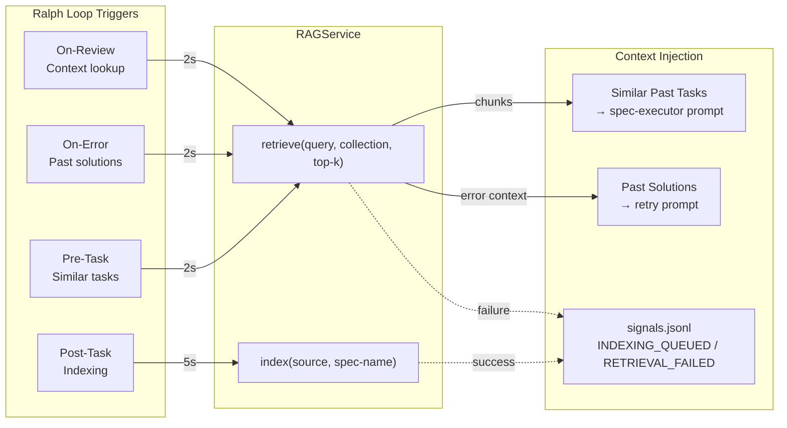
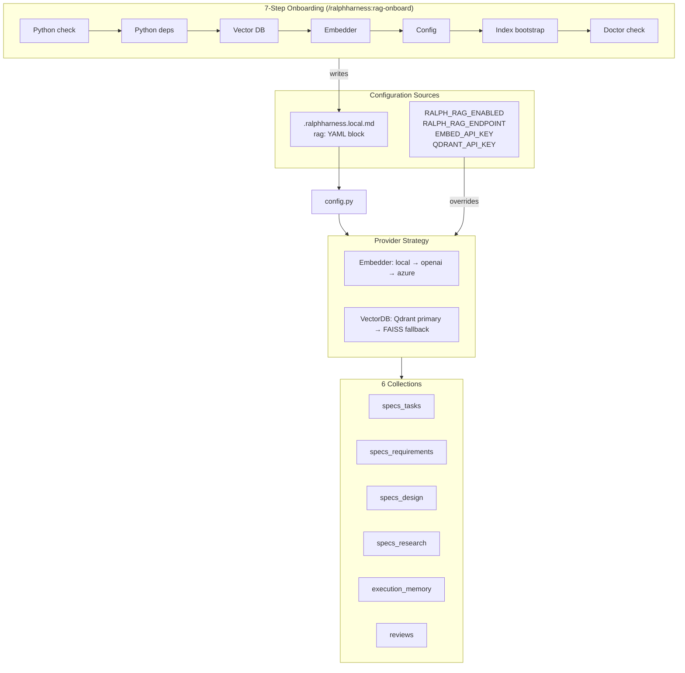

# RalphHarness

Spec-driven development with smart compaction. A Claude Code plugin that combines the Ralph Wiggum agentic loop with structured specification workflow.

## Features

- **Spec-Driven Workflow**: Automatically generates requirements, design, and tasks from a goal description
- **Smart Compaction**: Strategic context management between phases and tasks
- **Persistent Progress**: Learnings and state survive compaction via progress file
- **Two Modes**: Interactive (pause per phase) or fully autonomous
- **BMAD Bridge**: Import BMAD planning artifacts (PRD, epics, architecture) into ralphharness specs via `/ralph-bmad:import`
- **Loop Safety**: Pre-loop git checkpoint, circuit breaker, per-task metrics, and read-only detection
- **Role Boundaries**: Mechanical enforcement of file access rules per agent role
- **RAG Integration (opt-in)**: Retrieval-augmented generation layer enriches execution context with past spec data; optional install via `/ralphharness:rag-onboard`

## Installation

### From Marketplace (Recommended)

```bash
# Add the marketplace
/plugin marketplace add informatico-madrid/ralphharness

# Install the plugin
/plugin install ralphharness@ralphharness

# Restart Claude Code to load
```

### From GitHub Repository

```bash
# Clone the repo
git clone https://github.com/informatico-madrid/ralphharness.git

# Install from local path
/plugin install /path/to/ralphharness

# Or install directly from GitHub
/plugin install https://github.com/informatico-madrid/ralphharness
```

### Local Development

```bash
# Clone and link for development
git clone https://github.com/informatico-madrid/ralphharness.git
cd ralphharness
/plugin install .
```

## Packaged Distribution

When installed via the Codex-packaged distribution (`ralphharness-codex`), commands are exposed with the `ralphharness-` prefix:

```
$ralphharness-triage "Build a multi-tenant SaaS platform"
$ralphharness-research
$ralphharness-requirements
$ralphharness-design
$ralphharness-tasks
$ralphharness-implement
$ralphharness-start my-feature "Build user authentication"
$ralphharness-cancel
$ralphharness-status
$ralphharness-feedback
$ralphharness-help
$ralphharness-index
$ralphharness-refactor
$ralphharness-rollback
$ralphharness-switch
```

See the [Codex plugin README](plugins/ralphharness-codex/README.md) for full Codex-specific documentation.

## Quick Start

### Interactive Mode (Recommended)

```
/ralphharness "Add user authentication with JWT tokens" --mode interactive --dir ./auth-spec
```

This will:
1. Generate `requirements.md` and pause for approval
2. After `/ralphharness:approve`, generate `design.md` and pause
3. After approval, generate `tasks.md` and pause
4. After approval, execute all tasks (compacting after each)

### Autonomous Mode

```bash
# The smart way (auto-detects resume or new)
/ralphharness:start user-auth Add JWT authentication

# Quick mode (skip spec phases, auto-generate everything)
/ralphharness:start "Add user auth" --quick

# The step-by-step way
/ralphharness:new user-auth Add JWT authentication
/ralphharness:requirements
/ralphharness:design
/ralphharness:tasks
/ralphharness:implement
```

### Import from BMAD Planning Artifacts

If you've already created planning documents in BMAD, skip the research phase and import directly into a ralphharness spec:

```bash
/ralph-bmad:import <bmad-project-path> <spec-name>
```

**Arguments:**
- `bmad-project-path` (required): Path to BMAD project directory (must contain `_bmad-output/`)
- `spec-name` (required): Kebab-case name for the new spec

**What Gets Generated:**
- `requirements.md` — User stories extracted from PRD functional requirements
- `design.md` — Architecture decisions and technical decisions
- `tasks.md` — Story breakdown as executable Phase 1 tasks (ready for `/ralphharness:implement`)

**Example:**

```bash
# From project root with BMAD artifacts
/ralph-bmad:import . rag-integration

# From external BMAD project
/ralph-bmad:import ../bmad-projects/my-feature feature-name
```

The import command converts BMAD's structured planning (PRD, epics, architecture) into RalphHarness's executable format. No manual reformatting needed — specs are ready to execute immediately.

---

## Commands

| Command | Description |
|---------|-------------|
| `/ralphharness "goal" [options]` | Start the spec-driven loop |
| `/ralphharness:start` | Smart entry point (auto-detects new or resume) |
| `/ralphharness:approve` | Approve current phase (interactive mode) |
| `/ralphharness:cancel` | Cancel active loop and cleanup |
| `/ralphharness:feedback` | Collect and process user feedback |
| `/ralphharness:help` | Show help |
| `/ralphharness:index` | Index/rebuild spec directory |
| `/ralphharness:refactor` | Refactor existing spec |
| `/ralphharness:rollback` | Rollback to git checkpoint |
| `/ralphharness:switch` | Switch to another spec |
| `/ralph-bmad:import` | Import BMAD planning artifacts into a spec |
| `/ralphharness:rag-onboard` | Interactive RAG setup wizard (7-step detection) |
| `/ralphharness:rag-doctor` | Health check for RAG configuration |
| `/ralphharness:rag-search` | Query past spec artifacts across all collections |
| `/ralphharness:index-all` | Index all spec artifacts for RAG retrieval |

---

## How It Works



### State Management



### Smart Compaction

Each phase transition uses targeted compaction:

| Phase | Preserves |
|-------|-----------|
| Requirements | User stories, acceptance criteria, FR/NFR, glossary |
| Design | Architecture, patterns, file paths |
| Tasks | Task list, dependencies, quality gates |
| Per-task | Current task context only |

### RAG Integration

RAG (Retrieval-Augmented Generation) is an opt-in layer that enriches the Ralph Loop with past spec data. Enable via `/ralphharness:rag-onboard`.

#### Architecture



#### Retrieval Flows

RAG integrates at four points in the Ralph Loop — each call uses a short timeout (2–5s) and never blocks the loop on failure:



#### Configuration

Configured in `.ralphharness.local.md` under the `rag:` YAML block. Environment variables override any setting.



### Progress File

The `.ralph-progress.md` file carries state across compactions:

```markdown
# Ralph Progress

## Current Goal
**Phase**: execution
**Task**: 3/7 - Implement auth flow
**Objective**: Create login/logout endpoints

## Completed
- [x] Task 1: Setup scaffolding
- [x] Task 2: Database schema
- [ ] Task 3: Auth flow (IN PROGRESS)

## Learnings
- Project uses Zod for validation
- Rate limiting exists in middleware/

## Next Steps
1. Complete JWT generation
2. Add refresh tokens
```

## Files Generated

In your spec directory:

| File | Purpose |
|------|---------|
| `requirements.md` | User stories, acceptance criteria |
| `design.md` | Architecture, patterns, file matrix |
| `tasks.md` | Phased task breakdown |
| `.ralph-state.json` | Loop state (deleted on completion) |
| `.ralph-progress.md` | Progress and learnings (deleted on completion) |

## Configuration

### Max Iterations

Default: 50 iterations. The loop stops if this limit is reached to prevent infinite loops.

### Templates

Templates in `templates/` can be customized for your project's needs.

## Troubleshooting

### Loop not continuing?

1. Check if in interactive mode waiting for `/ralphharness:approve`
2. Verify `.ralph-state.json` exists in spec directory
3. Check iteration count hasn't exceeded max

### Lost context after compaction?

1. Check `.ralph-progress.md` for preserved state
2. Learnings should persist across compactions
3. The skill always reads progress file first

### Cancel and restart?

```
/ralphharness:cancel --dir ./your-spec
/ralphharness "your goal" --dir ./your-spec
```

## Development

### Plugin Structure

```text
RalphHarness/
├── .claude-plugin/
│   └── marketplace.json
├── commands/
│   ├── ralph-loop.md
│   ├── cancel-ralph.md
│   ├── approve.md
│   ├── help.md
│   ├── rag-onboard.md
│   ├── rag-search.md
│   ├── rag-doctor.md
│   └── index-all.md
├── skills/
│   └── spec-workflow/
│       └── SKILL.md
├── hooks/
│   ├── hooks.json
│   └── scripts/
│       ├── stop-handler.sh
│       └── lib-rag.sh
├── rag/
│   ├── __main__.py
│   ├── service.py
│   ├── config.py
│   ├── security.py
│   ├── chunker.py
│   ├── signals.py
│   ├── onboarding.py
│   ├── providers/
│   │   ├── qdrant.py
│   │   └── faiss.py
│   └── embedder/
│       ├── base.py
│       ├── local.py
│       ├── openai.py
│       └── azure.py
├── templates/
│   ├── requirements.md
│   ├── design.md
│   ├── tasks.md
│   └── progress.md
└── README.md
```

## Acknowledgments

This project is a fork of [smart-ralph](https://github.com/tzachbon/smart-ralph) by [@tzachbon](https://github.com/tzachbon). We are deeply grateful to Tzach for creating the original smart-ralph, which served as the foundation for RalphHarness. His work on spec-driven development with Ralph's agentic loop provided the essential architecture that made this plugin possible.

## Credits

- [Ralph agentic loop pattern](https://ghuntley.com/ralph/) by Geoffrey Huntley
- [smart-ralph](https://github.com/tzachbon/smart-ralph) by [@tzachbon](https://github.com/tzachbon) — original foundation
- Built for [Claude Code](https://claude.ai/code)
- Inspired by every developer who wished their AI could just figure out the whole feature

---

<div align="center">

**Made with confusion and determination**

*"The doctor said I wouldn't have so many nosebleeds if I kept my finger outta there."*

MIT License

</div>
