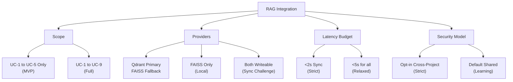

# Winston's Architectural Analysis - RAG Integration for Smart Ralph

**Date:** 2026-05-20
**Agent:** Winston (🏗️ System Architect)
**Context:** Project Context Analysis - Party Mode Roundtable

---

## Executive Summary

He revisado el PRD, arquitectura existente, y research técnico. Identifico 6 preocupaciones arquitectónicas críticas y 4 trade-offs que necesitamos discutir en el roundtable.

---

## 6 Preocupaciones Arquitectónicas

### 1. Dual-Phase Integration (Planning + Execution)

**El problema:** 9 puntos de retrieval distribuidos:
- **Execution (UC-1 a UC-5):** spec-executor, external-reviewer
- **Planning (UC-6 a UC-9):** research-analyst, requirements-generator, design-analyst, task-planner

**Trade-off:** Cobertura completa vs Complejidad de implementación

```
⚠️ PREOCUPACIÓN: Cada trigger point añade latencia potencial.
   - Pre-Task (UC-1): Síncrono, <2s obligatorio
   - On-Error (UC-2): Debe ser ultra-rápido, bloquea retry
   - Planning phases (UC-6 a UC-9): Menos críticos, pueden ser async
```

**Recomendación:** Implementar fases 1-2 del research (UC-1, UC-2, UC-4) primero. UC-6 a UC-9 son "nice to have" para MVP.

---

### 2. Multi-Provider Vector DB (Qdrant vs FAISS)

| Provider | Ventajas | Desventajas | Trade-off |
|----------|----------|-------------|-----------|
| **Qdrant** | Escalable, filtering avanzado, cloud-native | Servidor externo, config compleja | Flexibilidad vs Ops overhead |
| **FAISS** | Local, no servidor, mejor privacy | No escala horizontal, rebuild para updates | Simplicidad vs Funcionalidad |

**⚠️ PREOCUPACIÓN CRÍTICA:** La caída entre proveedores debe ser **stateless**:
- Si Qdrant falla, ¿el índice FAISS está sincronizado?
- ¿Cómo manejamos el caso donde Qdrant tiene datos más recientes?

**Recomendación:** Considerar FAISS como **cache read-only** de Qdrant, no como write-target independiente.

---

### 3. Signal Protocol Integration

El PRD propone 4 nuevas señales:
- `RETRIEVAL_REQUEST`
- `RETRIEVAL_COMPLETE`  
- `RETRIEVAL_FAILED`
- `INDEXING_QUEUED`

**Trade-off:** Observabilidad completa vs Sobrecarga en signals.jsonl

```
⚠️ PREOCUPACIÓN: signals.jsonl crece rápidamente en proyectos activos.
   - 1 spec con 20 tasks × 2 signals (request + complete) = 40 entries
   - 100 specs = 4000 entries solo de RAG
```

**Recomendación:** 
- `INDEXING_QUEUED` debería ser batched, no por-task
- Considerar `RETRIEVAL_REQUEST` como opt-in (solo si `RAG_VERBOSE=true`)

---

### 4. NFRs Críticos: Latency y OOM

| NFR | Target | Challenge |
|-----|--------|-----------|
| Retrieval latency | <2s | Síncrono bloquea task start |
| Indexing latency | <5s | Async pero compite con task execution |
| OOM prevention | <8GB RAM | Bulk index puede exceeding memory |

**⚠️ PREOCUPACIÓN:** El bulk indexing (UC-3) es el más peligroso:

```
Streaming index para >100 specs:
- Batches de 50 specs
- Cada spec ~10-50 chunks
- 50 specs × 50 chunks × embedding_size = RAM pressure
```

**Recomendación:** 
- Chunking strategy debe ser **lazy** (solo chunk lo que se va a indexar)
- Usar `mmap` para FAISS si dataset >1M vectors

---

### 5. Security Hardening: Principio de Defensa en Profundidad

El PRD menciona sanitización, rate limiting, auth, y HMAC integrity. Pero hay gaps:

| Requisito PRD | Gap | Risk |
|---------------|-----|------|
| Sanitización con regex | ¿Regex para API keys es suficiente? | Falsos negativos |
| Rate limiting bulk index | ¿1 request/min por proyecto o por usuario? | DoS entre equipos |
| Qdrant auth | ¿Qué tipo? Basic? API key? mTLS? | Depende de infraestructura |
| HMAC para FAISS | ¿Clave compartida dónde se almacena? | Key management |

**⚠️ PREOCUPACIÓN:** La chain de seguridad es tan fuerte como su eslabón más débil:

```
Input → Sanitize → Index → Retrieve → Display
              ↑
         ¿Regex suficiente?
```

**Recomendación:** 
- Usar allowlist de patterns, no solo denylist de regex
- Auditoría de dependencias (no confiar ciegamente en qdrant-client)

---

### 6. Collection Isolation vs Cross-Project Learning

El PRD dice:
- "Collection isolation: Cada proyecto tiene separate RAG collection"
- "Cross-project retrieval requiere explicit opt-in"

**Trade-off:** Privacy vs Learning effect

```
⚠️ PREOCUPACIÓN: Si todos los equipos tienen RAG enabled, ¿cómo garantizamos
   que "opt-in" para cross-project es realmente consciente?
   
   - Un developer podría inadvertently compartir secrets
   - El "org-level" RAG collection podría crecer descontroladamente
```

**Recomendación:** Implementar 3 tiers de isolation:
1. **Project-only** (default): Solo retrieval local
2. **Team-level**: Colección compartida por team
3. **Organization-level**: Solo patterns aceptados, no content raw

---

## Trade-offs para Roundtable



---

## Preguntas para el Roundtable

1. **Scope:** ¿Priorizamos UC-1, UC-2, UC-4 (execution-critical) o incluimos UC-6 a UC-9 (planning) en MVP?

2. **Provider Strategy:** ¿FAISS es solo fallback o primera opción para equipos sin infraestructura Qdrant?

3. **Signals:** ¿Limitamos signals RAG a solo `RETRIEVAL_FAILED` y `INDEXING_QUEUED` para reducir volumen?

4. **Security:** ¿Aceptamos regex-based sanitization o requerimos structured parsing?

---

*Winston - 🏗️ System Architect*
