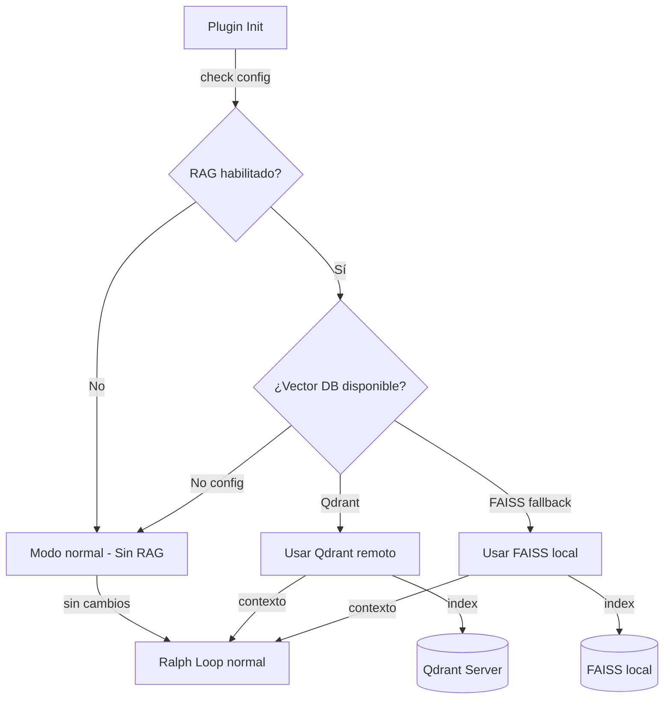
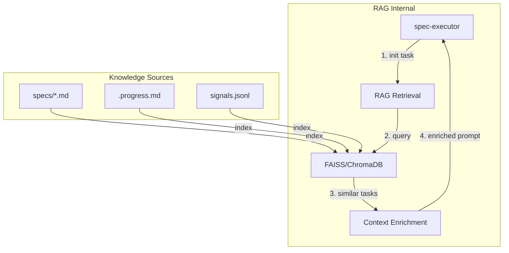

# Product Brief: RAG Integration for Smart Ralph

## Executive Summary

**Problem:** Smart Ralph es un plugin de Claude Code que ayuda a equipos a implementar desarrollo driveado por specs. Sin embargo, el plugin opera en silos - cada task empieza sin contexto de tasks similares completados, y specs de proyectos anteriores no se reutilizan para mejorar nuevas especificaciones.

**Solution:** Implementar RAG (Retrieval-Augmented Generation) como capability interna del plugin que mejora el Ralph Loop con conocimiento recuperado, y opcionalmente ayuda al proyecto hospedante a implementar su propio RAG.

**Key Insight:** Smart Ralph es un plugin que se instala en proyectos de terceros. Esto define DOS direcciones ortogonales:
1. **RAG Interno** - El plugin usa RAG para mejorar SU propia ejecución
2. **RAG como Feature** - El plugin ayuda al usuario a implementar RAG en SU proyecto

---

## Problem Statement

### Pain Points

1. **Context Loss Between Tasks** - Cada task corre con contexto fresco, sin beneficiarse de patterns de tasks similares
2. **No Cross-Project Learning** - Especs completados en un proyecto no benefician a proyectos nuevos
3. **Research Repetition** - Research-analyst hace el mismo trabajo de investigación cada vez
4. **Suboptimal Task Planning** - Task-planner no tiene acceso a estimaciones de proyectos comparables
5. **Debugging Inefficiency** - Errors similares no se resuelven con soluciones previas

### Why Now?

- RAG technology maturity: Qdrant, FAISS, embeddings establecidos
- Smart Ralph tiene arquitectura extensible via hooks y skills
- Ralph Loop ya tiene estado y contexto que puede indexarse
- Proyectos actuales generan specs que pueden ser corpus inicial
- **Qdrant ya disponible** en servidor del usuario

---

## Strategic Positioning

### Target Users

| User | Need | Value Delivered |
|------|------|-----------------|
| Plugin Developers | Improve Ralph Loop performance | Faster task completion, better context |
| Project Teams | Reuse specs across projects | Knowledge accumulation, consistency |
| Research Phase | Better initial research | Access to similar specs, patterns |
| Debugging | Faster issue resolution | Pattern matching, solution retrieval |

### Competitive Differentiation

- **Unique Position:** Ningún plugin de Claude Code ofrece RAG nativo para spec-driven development
- **First-Mover Advantage:** RAG como capability del plugin vs external RAG tools
- **Organic Growth:** Cada proyecto que usa el plugin genera specs que mejoran RAG corpus

---

## Proposed Solution

### Scope: Phase 1 (Quick Wins)

**Core Features:**

#### 1. Spec Executor + RAG
- Indexar specs completados del proyecto actual
- Retrieve similar tasks cuando spec-executor inicia
- Context recovery entre task retries

#### 2. .progress.md Learnings Persistence
- Indexar secciones de learnings de cada iteration
- Retrieve insights cuando task similar inicia
- Knowledge accumulation sin reentrenamiento

#### 3. Research Analyst + Cross-Project Knowledge
- Indexar todos los research.md del workspace
- Retrieve specs similares para investigación inicial
- Acceder a patterns de diseño de otros proyectos

#### 4. **Chat.md + Task Review — LA FUENTE DE VERDAD** ⭐
- **chat.md**: Log detallado de ejecución de cada spec
  - Fallos y por qué fallaron
  - Aciertos documentados
  - Decisiones tomadas durante ejecución
  - Contexto del agent en cada momento
- **task_review.md**: Reviews super detallados
  - Métricas de ejecución
  - Análisis de qué funcionó vs qué no
  - Patrones de errores recurrentes
  - Lecciones aprendidas por spec

**¿Por qué son únicos?**
Estos archivos no existen en ningún otro plugin o herramienta de desarrollo. Contienen:
- El historial completo de implementación (no solo specs, sino EL PROCESO)
- Fallos documentados con causa raíz
- Revisiones que capturan conocimiento de debugging
- Métricas que permiten Pattern matching

**Indexación propuesta:**
```yaml
collections:
  specs:
    sources: ["specs/**/requirements.md", "specs/**/design.md", "specs/**/tasks.md"]
  execution_memory:
    sources: ["specs/**/chat.md", "specs/**/task_review.md"]
    chunking: "section-based"  # Preserva estructura de secciones
    metadata: ["spec_name", "execution_date", "task_outcome", "error_type"]
  learnings:
    sources: ["specs/**/.progress.md"]
    filter: "only_learnings_sections"
```

### Technology Stack

| Component | Choice | Rationale |
|-----------|--------|-----------|
| Vector DB (Primary) | Qdrant (externo) | Usuario tiene servidor existente |
| Vector DB (Fallback) | FAISS (in-process) | Cuando no hay servidor externo |
| Embeddings | OpenAI embeddings (text-embedding-3) | Calidad probada, fallback a local (bge) |
| Integration | MCP Server o Pre-task Hook | Reutiliza infraestructura existente |

### Deployment Modes

El plugin debe funcionar en DOS modos:

#### Modo 1: CON RAG (Opt-in)
- Usuario configura endpoint de su Vector DB en settings
- Plugin pregunta: "¿Tienes servidor vector DB? ¿Cuál? ¿Credenciales?"
- Usa Qdrant/FAISS según configuración del usuario
- Parameters configurables por proyecto:
  - `QDRANT_ENDPOINT` (e.g., `http://192.168.1.100:6333`)
  - `QDRANT_API_KEY` (si tiene auth)
  - `EMBEDDING_PROVIDER` (openai, cohere, local)
  - `EMBEDDING_MODEL` (específico por provider)

#### Modo 2: SIN RAG (Default, como ahora)
- Plugin funciona exactamente como hoy
- No requiere ninguna configuración de RAG
- Zero dependencies adicionales
- Sin breaking changes



### Configuration Interface

```
# En .ralphharness.local.md o config similar
rag:
  enabled: false  # Default: off
  provider: qdrant  # qdrant | faiss
  qdrant:
    endpoint: ""  # http://localhost:6333
    api_key: ""   # si aplica
    collection: "smart-ralph-specs"
  embeddings:
    provider: openai  # openai | cohere | local
    model: "text-embedding-3-small"
```

**UX Flow:**
1. Plugin detecta que RAG podría ayudar
2. Pregunta: "¿Quieres habilitar RAG para este proyecto?"
3. Si sí → pide credenciales del servidor (endpoint, API key)
4. Si no → continúa sin RAG, sin breaking changes



---

## Success Metrics

| Metric | Baseline | Target | Measurement |
|--------|----------|--------|-------------|
| Task completion time | Sin RAG | -15% | Timer en implement.md |
| Research quality | Sin contexto previo | +20% improvement | Human review |
| Context retrieval accuracy | N/A | >70% relevance | Sampled review |
| Agent coherence | Inconsistente | Consistente | Diff review |

---

## Risks & Mitigations

| Risk | Likelihood | Impact | Mitigation |
|------|-----------|--------|------------|
| Cold start (nuevo proyecto sin specs) | Medium | Medium | Templates de ejemplo, seed corpus |
| Latencia de retrieval | Low | Low | Caching, async indexing |
| Relevance de resultados | Medium | High | Iterative tuning, human feedback |
| Fragmentación de conocimiento | Medium | Medium | Chunking strategy definido |

---

## Out of Scope (for v1)

- Graph RAG (complejidad excesiva)
- Multi-modal RAG (specs son markdown)
- Re-ranking advanced (optimización prematura)
- Background services (plugin no corre servicios)

---

## Next Steps

1. **Approve Brief** - User reviews and approves
2. **Create Spec** - Generar spec de implementación para Fase 1
3. **Prototype** - Implementar Spec Executor + RAG como POC
4. **Measure** - Validar impacto con métricas definidas
5. **Iterate** - Extender a .progress.md y Research Analyst

---

*Documento creado: 2026-05-20*
*Base: brainstorming-session-2026-05-20-09-04.md*