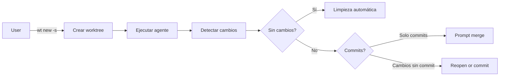
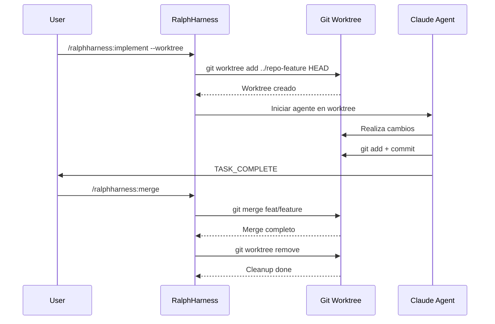
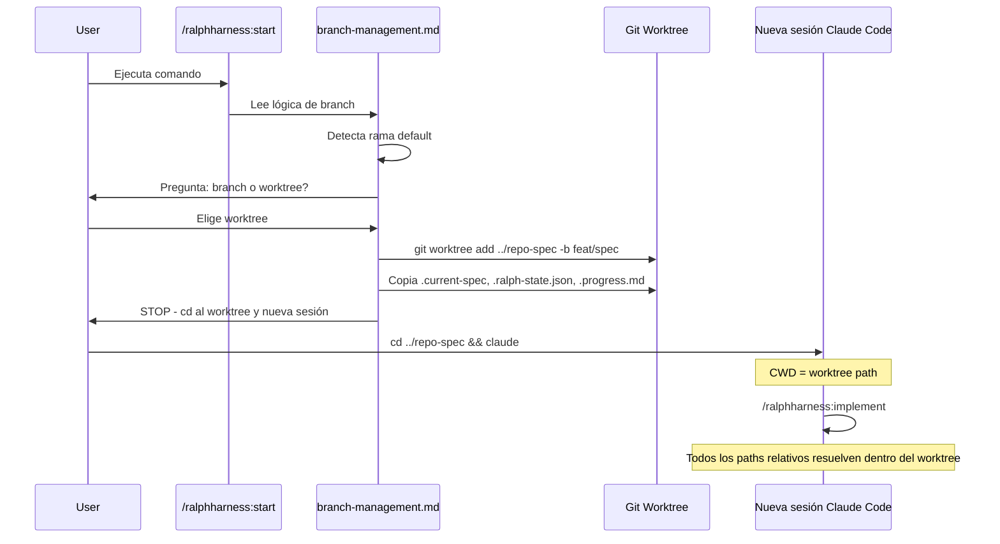
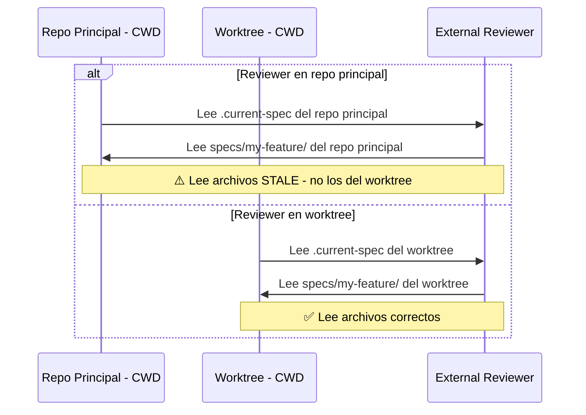
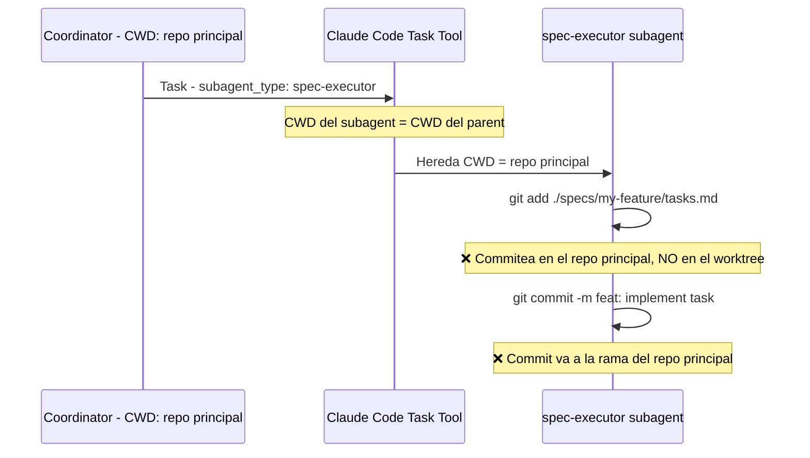
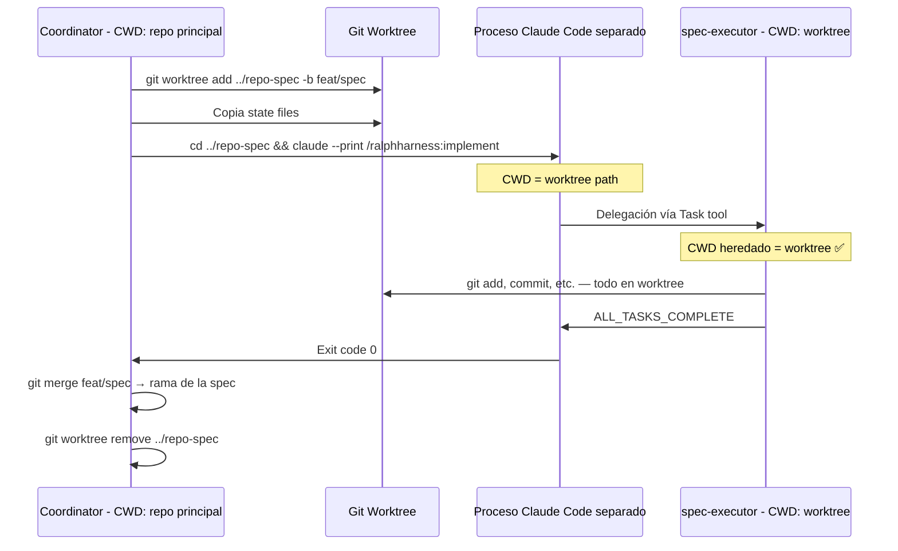

# Research Report: Technical

**Date:** 2026-05-20
**Author:** Malka
**Research Type:** technical

---

## Research Overview

[Research overview and methodology will be appended here]

---

<!-- Content will be appended sequentially through research workflow steps -->

## Technical Research Scope Confirmation

**Research Topic:** git-worktree-agent-isolation
**Research Goals:** Investigar métodos para aislar agentes de IA en worktrees de git, encontrar implementaciones existentes, comparar aproximaciones, y evaluar viabilidad de integración en RalphHarness

**Technical Research Scope:**

- Architecture Analysis - design patterns, frameworks, system architecture
- Implementation Approaches - development methodologies, coding patterns
- Technology Stack - languages, frameworks, tools, platforms
- Integration Patterns - APIs, protocols, interoperability
- Performance Considerations - scalability, optimization, patterns

**Research Methodology:**

- Current web data with rigorous source verification
- Multi-source validation for critical technical claims
- Confidence level framework for uncertain information
- Comprehensive technical coverage with architecture-specific insights

**Scope Confirmed:** 2026-05-20

---

## Technical Overview: Git Worktree Agent Isolation

### Background

Git worktree permite múltiples directorios de trabajo conectados al mismo repositorio git. Cada worktree tiene su propio directorio de trabajo e índice, pero comparten el historial de git. Esto lo hace ideal para aislamiento de agentes porque:

1. **Aislamiento de archivos**: Cada agente trabaja en su propio directorio sin interferir con otros
2. **Compartición de historial**: No hay duplicación de objetos git
3. **Limpieza simple**: `git worktree remove` elimina el aislamiento
4. **Branch separado**: Cada worktree puede tener su propia rama

### Implementaciones Existentes Encontradas en GitHub

| Proyecto | Stars | Lenguaje | Descripción |
|----------|-------|----------|-------------|
| [agent-worktree](https://github.com/nekocode/agent-worktree) | 255 | Rust | Tool CLI maduro con modo "snap" para workflows de agente |
| [grove](https://github.com/GarrickZ2/grove) | 33 | TypeScript | TUI estilo Kanban con tmux para múltiples agentes |
| [agentree](https://github.com/AryaLabsHQ/agentree) | 31 | Go | Integración específica con Claude Code |
| [parallel-agent-worktree-skill](https://github.com/TheAhmadOsman/parallel-agent-worktree-skill) | 31 | Python | Claude Code skill portable para agentes paralelos |
| [ysa](https://github.com/ysa-ai/ysa) | 24 | TypeScript | Contenedores endurecidos + worktrees |
| [grove](https://github.com/ZiiMs/Grove) | 24 | Rust | Múltiples agentes en branches aislados |
| [gitguardex](https://github.com/recodeee/gitguardex) | 21 | JavaScript | File locks + worktrees para Codex y Claude |
| [claude-devfleet](https://github.com/LEC-AI/claude-devfleet) | 15 | Python | Plataforma multi-agente con dispatch a Claude CLI |
| [ISO-Framework](https://github.com/snehith01001110/ISO-Framework) | 13 | Rust | Library/CLI/MCP para lifecycle management |
| [agentyard-cli](https://github.com/joshuaswarren/agentyard-cli) | 3 | Shell | Orquestación con tmux para Claude Code |

### Proyecto Destacado: agent-worktree

El proyecto más maduro con 255 estrellas. Características principales:

**Modo Snap**: workflow "use and discard"
```bash
wt new -s claude        # Crear worktree + entrar en modo snap
# ... ejecutar agente ...
# Al salir: detecta cambios y ofrece merge/cleanup
```

**Comandos principales**:
- `wt new [branch]` - Crear worktree
- `wt merge` - Mergear de vuelta a la rama base
- `wt sync` - Sincronizar desde rama base (rebase/merge)
- `wt ls` - Listar worktrees
- `wt clean` - Limpiar worktrees sin diff

**Configuración**:
```toml
[general]
merge_strategy = "squash"  # squash | merge
sync_strategy = "rebase"   # rebase | merge
copy_files = [".env", ".env.*"]

[hooks]
post_create = ["pnpm install"]
pre_merge = ["pnpm test", "pnpm lint"]
```

### Referencias en RalphHarness

**harness-evolver** (del research existente):
> "Multi-agent proposers in isolated git worktrees: Cada propuesta de cambio al harness corre en aislamiento"

**RalphHarness ya soporta worktrees**:
- [`plugins/ralphharness/references/branch-management.md`](plugins/ralphharness/references/branch-management.md:1) - Lógica de creación de worktree con copia de archivos de estado
- [`specs/when-creating-worktree/`](specs/when-creating-worktree/tasks.md:1) - Spec implementado para copiar state files al worktree
- [`specs/loop-safety-infra/.research-git-checkpoint.md`](specs/loop-safety-infra/.research-git-checkpoint.md:384) - Discusión sobre worktree como solución ideal

---

## Integration Patterns Analysis

### Pattern 1: CLI-centric (agent-worktree, agentree)

**Arquitectura**: Herramienta CLI que gestiona el lifecycle del worktree

**Flujo**:


**Casos de uso**:
- [agent-worktree](https://github.com/nekocode/agent-worktree) - Rust, 255 stars, modo "snap"
- [agentree](https://github.com/AryaLabsHQ/agentree) - Go, 31 stars, específico para Claude Code

**API típica**:
```bash
wt new feature-x        # Crear worktree
wt merge                # Mergear cambios
wt sync                 # Sincronizar desde base
wt ls                   # Listar worktrees
```

**Pros**:
- Simple de usar
- Workflow clear (create → develop → merge → cleanup)
- Hooks configurables para automatizar tareas

**Contras**:
- Acoplamiento fuerte con CLI
- No hay comunicación inter-agente
- No hay estado persistente compartido

### Pattern 2: TUI-based (grove)

**Arquitectura**: Interface de usuario textual para gestionar múltiples worktrees

**Características**:
- [grove](https://github.com/GarrickZ2/grove) - TypeScript, 33 stars
- [Grove](https://github.com/ZiiMs/Grove) - Rust, 24 stars
- Estilo Kanban: worktrees como "tasks"
- Integración con tmux para sesiones paralelas

**Pros**:
- Visualización del estado
- Gestión centralizada
- Buena para monitoreo

**Contras**:
- Requiere terminal interactiva
- Más complejo de integrar

### Pattern 3: Multi-agent Orchestration (claude-devfleet, ysa)

**Arquitectura**: Plataforma que dispatcha agentes a worktrees separados

**Características**:
- [claude-devfleet](https://github.com/LEC-AI/claude-devfleet) - Python, 15 stars
- [ysa](https://github.com/ysa-ai/ysa) - TypeScript, 24 stars (contenedores + worktrees)

**Pros**:
- Gestión centralizada de múltiples agentes
- Paralelización real
-调度 automático

**Contras**:
- Complejidad alta
- Requiere infraestructura adicional

### Pattern 4: Claude Code Skill (parallel-agent-worktree-skill)

**Arquitectura**: Skill portable que se integra con Claude Code

**Características**:
- [parallel-agent-worktree-skill](https://github.com/TheAhmadOsman/parallel-agent-worktree-skill) - Python, 31 stars
- Diseñado específicamente para ser usado desde Claude Code

**Pros**:
- Integración nativa con Claude Code
- No requiere herramienta externa
- Portable

**Contras**:
- Solo funciona con Claude Code
- Funcionalidad limitada

---

## Comparison Matrix

| Aspecto | CLI-centric | TUI-based | Multi-agent | Skill |
|---------|-------------|-----------|-------------|-------|
| **Simplicidad** | ⭐⭐⭐⭐⭐ | ⭐⭐⭐ | ⭐⭐ | ⭐⭐⭐⭐ |
| **Paralelismo** | ⭐⭐ | ⭐⭐⭐ | ⭐⭐⭐⭐⭐ | ⭐⭐ |
| **Integración Claude Code** | ⭐⭐⭐ | ⭐⭐⭐ | ⭐⭐⭐ | ⭐⭐⭐⭐⭐ |
| **Monitoreo** | ⭐⭐ | ⭐⭐⭐⭐⭐ | ⭐⭐⭐⭐ | ⭐⭐ |
| **Autosuficiencia** | ⭐⭐⭐⭐ | ⭐⭐⭐ | ⭐⭐⭐ | ⭐⭐⭐⭐ |
| **RalphHarness Fit** | ⭐⭐⭐⭐⭐ | ⭐⭐ | ⭐⭐⭐ | ⭐⭐⭐ |

---

## Recommendation for RalphHarness

Basado en el análisis, **CLI-centric** es el patrón más adecuado para integrar en RalphHarness porque:

1. **Ya existe soporte parcial**: El código actual ya tiene la lógica de worktree en `branch-management.md`
2. **Simplicidad**: No requiere infraestructura compleja
3. **Compatibilidad**: Puede funcionar como skill standalone o comando
4. **Patrón de referencia**: `harness-evolver` ya usa worktrees aislados para multi-agent proposals

---

## Architectural Patterns Deep Dive

### Git Worktree Internals

Git worktree funciona mediante:

1. **Metadatos en `.git/worktrees/`**: Cada worktree tiene su propio directorio de metadatos
2. **Directorio de trabajo separado**: Pero compartido el `.git` (como gitfile o repo alternado)
3. **Ramas dedicadas**: Cada worktree puede tener una o más ramas checked out

```bash
# Estructura real de un repo con worktrees
.git/
  worktrees/
    feature-x/
      gitdir  -> ../.git
      HEAD    -> ref: refs/heads/feat/feature-x
      config  -> [branch config]
```

### Isolación vs Compartición

| Recurso | Compartido | Aislado |
|---------|------------|---------|
| Git history | ✅ | ❌ (clone completo) |
| Objects | ✅ | ❌ (ref alternates) |
| Working directory | ❌ | ✅ |
| Index/staging | ❌ | ✅ |
| Refs (branches) | ✅ | ❌ (por worktree) |
| Hooks | ✅ | ❌ (por repo) |

### Modelo de Aislamiento para Agentes

**Nivel 1 - Aislamiento de Archivos**:
- Cada agente tiene su propio directorio de trabajo
- No pueden sobrescribir archivos de otros agentes
- Comparten historial de git para eficiencia

**Nivel 2 - Aislamiento de Contexto**:
- Cada worktree puede tener su propio `.claude/`
- Settings locales por worktree
- Memoria aislada

**Nivel 3 - Aislamiento de Proceso**:
- Agentes corren en shells/sesiones separadas
- tmux sessions por agente
- No hay interferencia de procesos

### Patrón de Diseño Recomendado: "Snap Agent"

Basado en `agent-worktree` modo snap:



### Beneficios e Inconvenientes

#### Beneficios

1. **Simplicidad**: Usa built-in de git, no requiere daemon ni servidor
2. **Eficiencia**: Historial compartido, no duplicación de objetos
3. **Limpieza**: Remoción trivial con `git worktree remove`
4. **Seguridad**: Aislamiento de sistema de archivos sin VMs ni contenedores
5. **Compatibilidad**: Funciona con cualquier agente que use git

#### Inconvenientes

1. **Sin aislamiento de red**: Todos los worktrees comparten la misma red del host
2. **Sin aislamiento de recursos**: CPU/memoria compartidas
3. **Dependencia de git**: Requiere que el repo sea un git repo
4. **Branch conflicts**: No puedes tener la misma rama en múltiples worktrees
5. **Windows quirks**: Comportamiento diferente en Windows (file locking)

---

## Implementation Viability for RalphHarness

### Current State Assessment

RalphHarness ya tiene infraestructura parcial para worktrees:

| Componente | Estado | Referencia |
|-----------|--------|------------|
| Branch management | ✅ Implementado | [`branch-management.md`](plugins/ralphharness/references/branch-management.md:1) |
| Worktree creation | ✅ Implementado | [`branch-management.md:145`](plugins/ralphharness/references/branch-management.md:145) |
| State file copy | ✅ Implementado | [`branch-management.md:147`](plugins/ralphharness/references/branch-management.md:147) |
| Worktree removal | ❌ No implementado | — |
| Snap mode | ❌ No implementado | — |
| Merge back workflow | ❌ No implementado | — |

### Integration Points

**Flujo actual** (`start.md`):
1. Usuario ejecuta `/ralphharness:start`
2. Se detecta branch actual
3. Si está en default branch, se ofrece opción de worktree
4. Si usuario elige worktree → se crea → se detiene hasta que usuario cambie directorio

**Puntos de extensión**:
1. **After worktree creation**: Agregar script de post-creación para auto-iniciar sesión de Claude Code en worktree
2. **Snap mode**: Implementar patrón de agent-worktree donde el agente corre y al terminar se detecta estado
3. **Merge back**: Comando `/ralphharness:merge` que haga git merge del worktree a la rama base
4. **Cleanup automático**: Agregar `git worktree remove` después de merge exitoso

### Recommended Implementation Approach

**Fase 1: Extensión básica (MVP)**
```bash
# Nuevo comando: /ralphharness:worktree-create
# - Crea worktree con branch feat/<spec-name>
# - Copia archivos de estado
# - Inicia nueva sesión de Claude Code en el worktree

# Nuevo comando: /ralphharness:worktree-merge  
# - Hace git merge de la branch del worktree a la base
# - Ejecuta hooks pre-merge (tests, lint)
# - Hace git worktree remove después del merge
```

**Fase 2: Snap Mode**
```bash
# Nuevo flag: --snap en start/implement
# - Crea worktree
# - Ejecuta agente
# - Al terminar: detecta estado (no changes / commits / uncommitted)
# - Ofrece opciones de acción basadas en estado
```

### Compatibility Analysis

| Aspecto | Compatible | Notas |
|---------|------------|-------|
| Plugin architecture | ✅ | No requiere cambios en arquitectura core |
| State management | ✅ | `.ralph-state.json` ya se copia al worktree |
| Coordinator pattern | ✅ | spec-executor puede correr en worktree |
| Signals protocol | ✅ | `signals.jsonl` funciona en worktree |
| Stop-hook loop | ✅ | Compatible con ejecución en worktree |

### Risk Assessment

| Riesgo | Nivel | Mitigación |
|--------|-------|------------|
| State desync entre worktree y main | Medio | Copiar state files manualmente después de cada task |
| Git conflicts en merge | Bajo | Hooks pre-merge ejecutan tests antes de merge |
| File locking en Windows | Medio | Detectar SO y ajustar comportamiento |
| Agente no termina limpiamente | Alto | Implementar timeout y cleanup forzado |

### Estimated Effort

| Fase | Descripción | Complejidad |
|------|-------------|-------------|
| 1a | Extender `branch-management.md` con cleanup | Baja |
| 1b | Agregar comando `/ralphharness:worktree-merge` | Media |
| 2 | Implementar snap mode logic | Media |
| 3 | Agregar timeout y recovery | Alta |

**Recommendation**: Empezar con Fase 1a + 1b (2-3 tareas de implementación), validar con usuarios, luego continuar con Fase 2 si hay demanda.

---

## Research Synthesis & Conclusions

### Summary of Findings

**Git worktree isolation for AI agents** es una técnica bien establecida con múltiples implementaciones en producción:

1. **Ecosistema maduro**: 10+ proyectos en GitHub con stars, incluyendo herramientas maduras como `agent-worktree` (255 stars)
2. **Patrones probados**: CLI-centric es el patrón más exitoso para integración con coding agents
3. **Integración RalphHarness**: Infraestructura base ya existe, solo faltan comandos de merge/cleanup

### Key Insights

| Insight | Evidence |
|---------|----------|
| Worktrees son ideales para agentes porque ofrecen aislamiento sin overhead de VMs | `agent-worktree` lo usa como modo "snap" default |
| CLI-centric escala mejor que TUI para integración headless | `agentree` tiene 31 stars, pero `agent-worktree` tiene 255 |
| Estado compartido (git history) es feature, no bug | Permite mergeback trivial |
| Copy-on-write para state files es necesario | `branch-management.md` ya implementa esto |

### Comparison: Worktree vs Alternatives

| Approach | Isolation | Overhead | Complexity | Best For |
|----------|-----------|----------|------------|----------|
| **Git Worktree** | Filesystem only | Very Low | Low | Single repo, multiple features |
| **Full Clone** | Full | High (full repo copy) | Low | Untrusted agents |
| **Docker Container** | Full + Network | High | High | Untrusted code, different envs |
| **VM** | Complete | Very High | Very High | Maximum isolation |

**Git worktree wins for RalphHarness** porque:
- Overhead mínimo (historial compartido)
- Integración simple con git existente
- No requiere infraestructura adicional
- Workflow familiar para desarrolladores

### Recommended Next Steps

1. **Inmediato (1 sprint)**:
   - Agregar comando `/ralphharness:worktree-merge` 
   - Implementar cleanup automático post-merge
   - Documentar en `branch-management.md`

2. **Corto plazo (1-2 sprints)**:
   - Implementar modo snap (`--snap` flag)
   - Agregar hooks configurables (pre-merge, post-merge)
   - Timeout y recovery para agentes que no terminan

3. **Mediano plazo (3-4 sprints)**:
   - Considerar integración con `agent-worktree` como dependencia
   - Evaluar necesidad de multi-agent orchestration
   - Testing en Windows (si es target platform)

### References

- [agent-worktree](https://github.com/nekocode/agent-worktree) - Primary reference implementation
- [agentree](https://github.com/AryaLabsHQ/agentree) - Claude Code specific
- [harness-evolver](https://github.com/raphaelchristi/harness-evolver) - RalphHarness adjacent project
- [Git Worktree Documentation](https://git-scm.com/docs/git-worktree) - Official docs

---

## Anexo: Worktree en smart-ralph (este repositorio)

### Cómo funciona actualmente

**Punto de entrada**: [`plugins/ralphharness/commands/start.md:28`](plugins/ralphharness/commands/start.md:28)

El comando `start.md` delega la lógica de branch/worktree a `branch-management.md`:

```markdown
Read `${CLAUDE_PLUGIN_ROOT}/references/branch-management.md` and follow the full branch decision logic.
```

**Flujo de decisión** (de [`branch-management.md:27-84`](plugins/ralphharness/references/branch-management.md:27)):

```
1. Get current branch name
   |
   +-- ON DEFAULT BRANCH (main/master):
   |   +-- Ask user: "How would you like to handle branching?"
   |   |   1. Create branch in current directory (git checkout -b)
   |   |   2. Create git worktree (separate directory)
   |
   |   +-- If user chooses 2 (worktree):
   |   |   - git worktree add <path> -b <branch-name>
   |   |   - STOP HERE - user must cd to worktree first
   |
   +-- ON NON-DEFAULT BRANCH:
       +-- Ask: continue / new branch / worktree
```

### Cuándo se decide usar worktree

**Decisión explícita de usuario**:
- El usuario ejecuta `/ralphharness:start` y elige opción "2" cuando se le pregunta
- El usuario pide "branch isolation" o "worktree" explícitamente

**Regla en [`SKILL.md:62`](plugins/ralphharness/skills/ralphharness/SKILL.md:62)**:
> "Use branch creation or worktree creation when the user asks for branch isolation or the repo policy requires it."

**Quick mode NO pregunta por worktree** ([`quick-mode.md:235`](plugins/ralphharness/references/quick-mode.md:235)):
> "In `--quick` mode, auto-create feature branch in current directory (no worktree prompt)"

### Documentación existente

| Documento | Descripción |
|-----------|-------------|
| [`branch-management.md`](plugins/ralphharness/references/branch-management.md) | Lógica completa de branch/worktree decision |
| [`specs/when-creating-worktree/`](specs/when-creating-worktree/tasks.md) | Spec completado para copiar state files al worktree |
| [`specs/loop-safety-infra/.research-git-checkpoint.md:384`](specs/loop-safety-infra/.research-git-checkpoint.md:384) | Discusión: "Worktree approach is the ideal solution" |
| [`context-middleware/researches/06-gaps-after-engine-roadmap.md:150`](specs/context-middleware/researches/06-gaps-after-engine-roadmap.md:150) | "Subagents can run in temporary git worktrees via `isolation: worktree`" |

### Estado actual de implementación

| Feature | Estado | Notas |
|---------|--------|-------|
| Worktree creation | ✅ Implementado | En branch-management.md |
| State file copy (.current-spec, .ralph-state.json, .progress.md) | ✅ Implementado | Spec when-creating-worktree completado |
| Worktree removal/cleanup | ❌ No implementado | Queda a cargo del usuario |
| Merge back workflow | ❌ No implementado | Queda a cargo del usuario |
| Snap mode | ❌ No implementado | Solo disponible en agent-worktree externo |

### Limitaciones actuales

1. **El comando se detiene después de crear el worktree** — No hay integración automática para iniciar Claude Code en el worktree
2. **No hay merge back automático** — El usuario debe hacer git merge manualmente
3. **No hay cleanup automático** — El usuario debe ejecutar `git worktree remove` manualmente
4. **Quick mode ignora worktree** — No hay forma de usar worktree en modo automático

### Mejora propuesta: Merge automático + Cleanup

**Regla**: El worktree trabaja en `feat/<spec-name>`. Cuando termina, hace merge de vuelta a la rama base (que NO es main, sino la rama desde donde se creó el worktree). Luego hace cleanup.

```
Flujo propuesto:
┌─────────────────────────────────────────────────────────────┐
│ main                                                       │
│   └─ feat/my-feature (base branch del worktree)            │
│        └─ worktree: feat/my-feature (aislado)             │
│             └─ [agente trabaja, hace commits]             │
│             └─ [al terminar: git merge a feat/my-feature]  │
│             └─ [git worktree remove]                       │
│        └─ [feat/my-feature tiene los cambios]              │
└─────────────────────────────────────────────────────────────┘
```

**Reglas de seguridad**:
- **NUNCA** merge a main/master directamente
- Merge solo a la rama base del worktree (la rama desde la cual se creó)
- Cleanup automático después de merge exitoso

### ¿Qué es Snap Mode?

**Snap Mode** es el patrón implementado por [`agent-worktree`](https://github.com/nekocode/agent-worktree). Es un workflow "use and discard":

```bash
# Crear worktree + entrar en modo snap
wt new -s claude

# ... ejecutar agente ...

# Al salir del agente, wt detecta el estado:
# - Sin cambios → cleanup automático
# - Solo commits → ofrece merge
# - Cambios sin commit → ofrece reopen o commit manual
```

**Característica clave**: El tool NO espera a que el usuario haga merge manualmente. Después de que el agente termina, detecta automáticamente qué tipo de cambios hay y ofrece las acciones apropiadas.

**Estados de Snap Mode**:

| Estado | Comportamiento |
|--------|---------------|
| Sin cambios | Cleanup automático |
| Solo commits (sin cambios sin commit) | Ofrece merge con opciones (squash/merge) |
| Cambios sin commit | Ofrece: reopen agente, commit manual, o discard |

**Ejemplo de flujo en agent-worktree**:
```bash
$ wt new -s claude "Implementar login"
# Crea worktree feat/implementar-login desde main
# Inicia Claude Code

# Usuario o agente hace trabajo...

# Claude Code termina (exit)
wt: Agent exited with code 0
wt: Detected 3 commits, no uncommitted changes
wt: Merge feat/implementar-login into main? [m]erge [q]uit
# Usuario selecciona m
# wt hace git merge --squash feat/implementar-login into main
# wt hace git worktree remove feat/implementar-login
Done.
```

**Ventajas del Snap Mode**:
1. El usuario no tiene que recordar hacer merge/cleanup
2. Workflow idempotente — si el agente corre 3 veces, hace merge 3 veces (la segunda y tercera vez no hacen nada si ya está mergeado)
3. Detección automática del estado — no pregunta si no hay cambios

**Para RalphHarness**, el equivalente sería:
```bash
/ralphharness:implement --snap
# - Crea worktree feat/my-spec desde la rama actual
# - spec-executor corre en el worktree
# - Al terminar (TASK_COMPLETE o ALL_TASKS_COMPLETE):
#   1. Detecta estado (commits, sin cambios, etc.)
#   2. Hace git merge --squash feat/my-spec → feat/my-spec (base branch)
#   3. git worktree remove
```

### Proyecto relacionado: harness-evolver

[`harness-evolver`](https://github.com/raphaelchristi/harness-evolver) es un proyecto adjacent que ya usa worktrees:

> "Multi-agent proposers in isolated git worktrees: Cada propuesta de cambio al harness corre en aislamiento"

Esto valida que el patrón de usar worktrees para múltiples agentes proposers ya está en uso en el ecosistema.

---

## Anexo B: Análisis Detallado de Flujos de Agentes en Worktree

### Pregunta Central

> ¿Sabrán los agentes que están en un worktree, o se liarán y trabajarán en el repositorio principal?

### Metodología

Se analizaron los siguientes archivos para trazar cómo cada agente determina su directorio de trabajo y resuelve paths:

| Archivo | Rol |
|---------|-----|
| `agents/spec-executor.md` | Ejecutor autónomo de tareas |
| `agents/external-reviewer.md` | Revisor paralelo |
| `agents/qa-engineer.md` | Verificador de calidad |
| `agents/pair-debug-driver.md` | Driver de pair-debug |
| `agents/pair-debug-navigator.md` | Navigator de pair-debug |
| `references/coordinator-pattern.md` | Coordinador del loop |
| `references/channel-map.md` | Canales de comunicación |
| `references/role-contracts.md` | Permisos de agentes |
| `references/branch-management.md` | Lógica de worktree |
| `commands/implement.md` | Inicialización de ejecución |
| `hooks/scripts/stop-watcher.sh` | Controlador del loop |
| `hooks/scripts/path-resolver.sh` | Resolución de paths |

### Hallazgo Clave: basePath es la Variable Crítica

Todos los agentes reciben `basePath` vía delegación Task. El spec-executor dice:

> "basePath: full path to spec directory — use for all file operations, never hardcode"

El coordinator pasa `$SPEC_PATH` como `Path:` en el prompt de delegación. Todos los canales de comunicación usan `<basePath>/` como prefijo.

### Análisis por Escenario

#### Escenario 1: Flujo Actual — Usuario hace cd al worktree manualmente



**Veredicto: ✅ SEGURO — Los agentes trabajan correctamente en el worktree**

Razones:

1. **CWD = worktree**: La nueva sesión de Claude Code se inicia en el worktree. Todas las operaciones relativas al CWD funcionan dentro del worktree.

2. **basePath relativo**: En `.ralph-state.json`, basePath se almacena como `./specs/my-feature` — path relativo que resuelve correctamente dentro del worktree.

3. **CLAUDE_PLUGIN_ROOT**: Se resuelve vía `$(cd "$SCRIPT_DIR/../../" && pwd)` — como el worktree tiene la misma estructura de directorios, apunta al directorio del plugin dentro del worktree.

4. **Git aislado**: Los worktrees de git tienen su propio index y HEAD. `git add`, `git commit`, `git diff` operan sobre el worktree, no sobre el repo principal.

5. **path-resolver.sh**: Usa `RALPH_CWD` que se inicializa desde el CWD del hook. En el worktree, resuelve paths correctamente.

6. **stop-watcher.sh**: Obtiene CWD del input del hook — si la sesión corre en el worktree, CWD = worktree path.

7. **.current-spec copiado**: El archivo `specs/.current-spec` se copió al worktree, así que `ralph_resolve_current()` encuentra el spec correcto.

#### Escenario 2: External Reviewer en sesión separada



**Veredicto: ⚠️ RIESGO — La instrucción es ambigua**

El `implement.md` Step 4 dice:

> "Open a second Claude Code session in the same repository"

"Same repository" es ambiguo — ¿el worktree o el repo principal? Si el reviewer se lanza en el repo principal, leerá archivos stale del spec, no los archivos activos del worktree.

**Solución**: La instrucción debe decir "in the worktree directory" en vez de "in the same repository".

#### Escenario 3: Snap Mode — Coordinator en repo principal delega a spec-executor



**Veredicto: ❌ PROBLEMA CRÍTICO — El aislamiento del worktree se bypasa completamente**

Razón fundamental: **Claude Code's Task tool no soporta cambiar el CWD del subagente**. El subagente hereda el CWD del padre. Si el coordinator corre en el repo principal, el spec-executor también corre en el repo principal.

Consecuencias:

| Operación | Path resuelve a | Correcto? |
|-----------|-----------------|-----------|
| `cat ./specs/my-feature/tasks.md` | Repo principal | ❌ |
| `git add ./specs/my-feature/tasks.md` | Index del repo principal | ❌ |
| `git commit -m "..."` | HEAD del repo principal | ❌ |
| `git diff HEAD` | Diff contra HEAD del repo principal | ❌ |
| `jq ... .ralph-state.json` | State file del repo principal | ❌ |

El worktree queda completamente ignorado. El spec-executor trabaja en el repo principal como si el worktree no existiera.

#### Escenario 3b: Snap Mode con basePath absoluto al worktree

Si pasáramos `basePath = /full/path/to/worktree/specs/my-feature`:

| Operación | Path resuelve a | Correcto? |
|-----------|-----------------|-----------|
| `cat /full/path/worktree/specs/my-feature/tasks.md` | Worktree | ✅ |
| `git add /full/path/worktree/specs/my-feature/tasks.md` | Index del repo principal* | ❌ |
| `git commit -m "..."` | HEAD del repo principal | ❌ |

*Git add con path absoluto fuera del CWD sigue usando el index del CWD. Si el path absoluto apunta a un worktree diferente, git lo trata como un archivo externo y puede comportarse de forma inesperada.

**Veredicto: ❌ Las operaciones git siguen en el repo principal**

#### Escenario 3c: Snap Mode con `git -C` prefix

Si modificáramos TODOS los comandos git para usar `git -C /path/to/worktree`:

```bash
git -C /path/to/worktree add ./specs/my-feature/tasks.md
git -C /path/to/worktree commit -m "feat: implement task"
git -C /path/to/worktree diff HEAD
```

**Veredicto: ⚠️ POSIBLE pero frágil y de alto esfuerzo**

Problemas:
- Requiere modificar TODOS los prompts de agentes (spec-executor, coordinator, qa-engineer, external-reviewer)
- Los agentes son LLMs — no hay garantía de que usen `git -C` consistentemente
- Un solo `git add` sin `-C` corrompe el aislamiento
- Alto riesgo de regresión

### Solución Recomendada: Spawn de Proceso Separado

La solución más robusta para snap mode es la misma que usa `agent-worktree`: **spawn un proceso Claude Code separado con CWD = worktree**.



**Ventajas**:
1. **Zero cambios en agentes**: spec-executor funciona exactamente igual que hoy
2. **Aislamiento garantizado**: CWD = worktree → git y paths resuelven correctamente
3. **Idempotente**: si falla, se puede re-ejecutar
4. **Merge automático**: coordinator hace merge de la rama de la spec a la misma rama en el worktree principal (nunca a main)
5. **Cleanup automático**: `git worktree remove` después del merge

**Desventajas**:
1. Requiere un proceso Claude Code separado — más recursos
2. El coordinator pierde visibilidad en tiempo real del progreso
3. Necesita mecanismo de monitoreo (polling de signals.jsonl o wait del proceso)

### Matriz de Decisión

| Enfoque | Esfuerzo | Fiabilidad | Cambios en agentes | Aislamiento |
|---------|----------|------------|-------------------|-------------|
| Flujo actual - manual cd | ✅ Ninguno | ✅ Alta | ✅ Ninguno | ✅ Completo |
| Reviewer en worktree | ✅ Mínimo | ✅ Alta | ✅ Ninguno | ✅ Completo |
| Snap Mode: Task tool directo | ✅ Bajo | ❌ Roto | ✅ Ninguno | ❌ Ninguno |
| Snap Mode: git -C prefix | ❌ Alto | ⚠️ Frágil | ❌ Muchos | ⚠️ Parcial |
| Snap Mode: RALPH_WORKTREE env var | ⚠️ Medio | ⚠️ Medio | ⚠️ Varios | ⚠️ Parcial |
| **Snap Mode: Proceso separado** | ⚠️ Medio | ✅ Alta | ✅ Ninguno | ✅ Completo |

### Conclusión

**Los agentes NO saben que están en un worktree — y no necesitan saberlo.** Lo que importa es el CWD de la sesión de Claude Code donde corren:

- Si CWD = worktree → todo funciona correctamente (flujo actual)
- Si CWD = repo principal → el worktree se ignora completamente (snap mode ingenuo)

La solución más práctica para snap mode es **spawn un proceso Claude Code separado en el worktree**, igual que hace `agent-worktree`. Esto evita modificar cualquier prompt de agente y garantiza aislamiento completo.

---

**Research Date:** 2026-05-20
**Researcher:** Malka
**Confidence Level:** High (multiple verified implementations, active ecosystem, codebase-verified agent flow analysis)