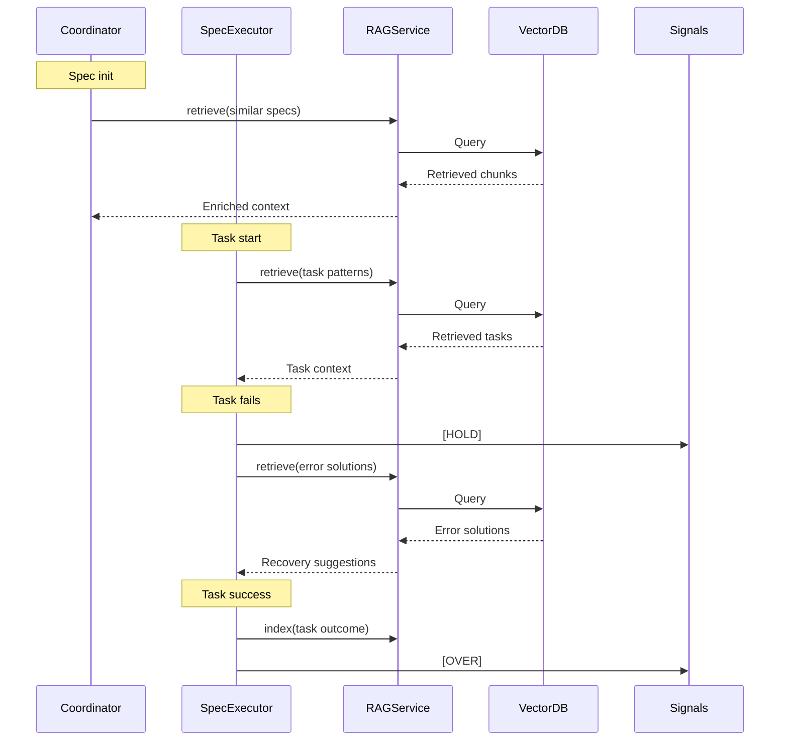

# Technical Research: RAG + Ralph Loop Architecture

**Date:** 2026-05-20
**Author:** Malka
**Research Type:** Technical Research
**Topic:** RAG + Ralph Loop Architecture - Integrating Retrieval into Plugin Execution Flow
**Status:** In Progress

---

## Executive Summary

This technical research examines how to integrate RAG (Retrieval-Augmented Generation) capabilities into Smart Ralph's Ralph Loop execution flow. The goal is to enable agents to retrieve relevant context, previous learnings, and similar task patterns at key decision points during spec execution.

**Key Architectural Decisions:**
1. **Retrieval Trigger Points** - When in the Ralph Loop to invoke retrieval
2. **Context Enrichment Strategy** - How retrieved content augments agent prompts
3. **Collection Design** - How to organize indexed content for efficient retrieval
4. **Hybrid Architecture** - Supporting both Qdrant (with external server) and FAISS (fallback)
5. **Signal Integration** - Coordinating RAG retrieval with existing signal protocol

---

## Ralph Loop Architecture Overview

### Current Flow (Without RAG)

```
┌─────────────────────────────────────────────────────────────────────┐
│                      RALPH LOOP                                    │
│                                                                     │
│  [coordinator] → [spec-executor] → [quality gates] → [reviewer]    │
│        ↑                                                        │   │
│        └────────────────────────────────────────────────────────┘   │
│                                                                     │
│  State: .ralph-state.json                                          │
│  Signals: signals.jsonl (HOLD, PENDING, URGENT, DEADLOCK)          │
│  Chat: chat.md                                                      │
│  Progress: .progress.md                                            │
└─────────────────────────────────────────────────────────────────────┘
```

### Integration Points for RAG

The Ralph Loop has several natural insertion points for RAG retrieval:

| Phase | Agent | RAG Opportunity |
|-------|-------|----------------|
| **Init** | coordinator | Retrieve similar completed specs for context |
| **Task Start** | spec-executor | Retrieve patterns from similar completed tasks |
| **On Error** | spec-executor | Retrieve solutions for similar error types |
| **Review** | external-reviewer | Retrieve patterns from similar reviews |
| **Progress** | spec-executor | Index learnings for future retrieval |

---

## Retrieval Trigger Points

### 1. Pre-Task Retrieval (Task Start)

**Trigger:** When spec-executor receives a new task assignment

**Retrieval Query:** Task description, expected outcomes, context

**Retrieved Content:**
- Similar tasks from other specs (same type, similar tech stack)
- Failed attempts on similar tasks (what to avoid)
- Estimated complexity from comparable tasks

**Prompt Augmentation:**
```
[SYSTEM CONTEXT]
You are executing task: {task_id}
Description: {task_description}

[RETRIEVED CONTEXT - RELEVANT PATTERNS]
{retrieved_similar_tasks}

[RETRIEVED CONTEXT - PITFALLS TO AVOID]
{retrieved_failed_attempts}
[/SYSTEM CONTEXT]
```

### 2. On-Error Retrieval (Failure Recovery)

**Trigger:** When task execution fails or produces unexpected results

**Retrieval Query:** Error type, error message, tech stack, context

**Retrieved Content:**
- Solutions to similar errors from chat.md logs
- Root causes from task_review.md
- Successful workarounds documented

**Prompt Augmentation:**
```
[RETRY CONTEXT]
Previous attempt failed with: {error_message}

[RETRIEVED SOLUTIONS]
{retrieved_similar_solutions}

[SUGGESTED APPROACH]
Based on previous failures, try: {suggested_alternative}
```

### 3. Spec-Init Retrieval (Coordinator)

**Trigger:** When coordinator initializes a new spec execution

**Retrieval Query:** Spec type, project context, similar completed specs

**Retrieved Content:**
- Duration estimates from similar specs
- Common blockers and how they were resolved
- Quality patterns from similar spec types

### 4. Learning Indexing (Post-Task)

**Trigger:** After each task completion (success or failure)

**Action:** Index task outcomes, learnings, and patterns for future retrieval

---

## Collection Design

### Collections for Ralph Loop RAG

| Collection | Content Sources | Chunking Strategy | Primary Use Case |
|------------|-----------------|-------------------|------------------|
| `specs_tasks` | tasks.md sections | By task (line-based) | Task pattern matching |
| `specs_requirements` | requirements.md | Section-based | Spec understanding |
| `specs_design` | design.md | Section-based | Design decisions |
| `execution_memory` | chat.md messages | Message-based with metadata | Error resolution |
| `task_reviews` | task_review.md rows | Row-based | Quality patterns |
| `learnings` | .progress.md | Section-based | Wisdom accumulation |

### Metadata Schema

Each chunk includes:

```yaml
chunk:
  id: "uuid"
  content: "text content"
  source_file: "specs/feature-x/tasks.md"
  spec_name: "feature-x"
  phase: "implementation"
  task_outcome: "success" | "failure" | "partial"
  error_type: "null" | "timeout" | "assertion" | "logic"
  execution_date: "2026-05-20"
  agent_context: "spec-executor" | "external-reviewer"
```

---

## Architecture: RAG Integration

### High-Level Architecture

```
┌──────────────────────────────────────────────────────────────────────┐
│                     RALPH LOOP + RAG                                  │
│                                                                       │
│  ┌─────────────┐      ┌─────────────┐      ┌─────────────┐          │
│  │ Coordinator │ ──── │RAG Retriever│ ──── │ Vector DB   │          │
│  └─────────────┘      └─────────────┘      │ (Qdrant/    │          │
│        │                    │              │  FAISS)     │          │
│        ▼                    ▼              └─────────────┘          │
│  ┌─────────────┐      ┌─────────────┐            │                 │
│  │Spec Executor│ ──── │RAG Retriever│            │                 │
│  └─────────────┘      └─────────────┘            │                 │
│        │                    │                    ▼                 │
│        ▼                    ▼              ┌─────────────┐          │
│  ┌─────────────┐      ┌─────────────┐     │ Embeddings  │          │
│  │  Quality     │      │RAG Retriever│ ──── │ (OpenAI/   │          │
│  │  Gates       │      └─────────────┘     │  Local)    │          │
│  └─────────────┘                          └─────────────┘          │
│                                                                       │
│  ┌──────────────────────────────────────────────────────┐            │
│  │                  Signal Protocol                      │            │
│  │  signals.jsonl: HOLD, PENDING, URGENT, DEADLOCK     │            │
│  │  RAG signal: RETRIEVAL_REQUEST, RETRIEVAL_COMPLETE   │            │
│  └──────────────────────────────────────────────────────┘            │
└──────────────────────────────────────────────────────────────────────┘
```

### RAG Service Interface

```python
class RAGService:
    def __init__(self, config: RAGConfig):
        self.enabled = config.enabled
        self.provider = config.provider  # 'qdrant' | 'faiss'
        self.collection_manager = CollectionManager(config)
    
    def retrieve(
        self, 
        query: str, 
        collection: str,
        top_k: int = 5,
        filters: dict = None
    ) -> List[RetrievedChunk]:
        """Retrieve relevant chunks for a query"""
        if not self.enabled:
            return []
        
        if self.provider == 'qdrant':
            return self._qdrant_retrieve(query, collection, top_k, filters)
        else:
            return self._faiss_retrieve(query, collection, top_k, filters)
    
    def index(
        self,
        chunks: List[Chunk],
        collection: str
    ) -> bool:
        """Index chunks for future retrieval"""
        if not self.enabled:
            return False
        
        return self.collection_manager.index_chunks(chunks, collection)
```

### Integration with Existing Ralph State



---

## Embedding Pipeline

### Model Selection

| Provider | Model | Dimensions | Use Case |
|---------|-------|------------|----------|
| OpenAI | text-embedding-3-small | 1536 | Primary (high quality) |
| OpenAI | text-embedding-3-large | 3072 | High precision needs |
| Local (BGE) | bge-small | 768 | Fallback, no API cost |
| Local (BGE) | bge-base | 768 | Balanced local |

### Chunking Strategies by Content Type

**tasks.md:**
- Chunk by task (lines with task header)
- Preserve task ID, description, acceptance criteria
- Metadata: task_id, spec_name, outcome

**requirements.md:**
- Chunk by section (## headers)
- Preserve requirement ID and priority
- Metadata: req_id, priority, spec_name

**chat.md:**
- Chunk by message (### [timestamp] ... [/timestamp])
- Preserve signal type, agent, task_id
- Metadata: timestamp, signal, agents

**task_review.md:**
- Chunk by row (structured data)
- Preserve metrics, verdict, findings
- Metadata: task_id, reviewer, verdict

---

## Signal Integration

### RAG-Specific Signals

Extend signals.jsonl with RAG-related signals:

| Signal | When | Meaning |
|--------|------|---------|
| RETRIEVAL_REQUEST | Before retrieval | Agent requesting context |
| RETRIEVAL_COMPLETE | After retrieval | Context retrieved and injected |
| RETRIEVAL_FAILED | On error | Retrieval failed (fallback mode) |
| INDEXING_QUEUED | After task | Content queued for indexing |

### Integration with Existing Signals

RAG retrieval doesn't block existing signals:
- RETRIEVAL_REQUEST is informational
- RETRIEVAL_COMPLETE indicates context available
- If retrieval fails, agents continue without enrichment (graceful degradation)

---

## Configuration Model

### Config in .ralphharness.local.md

```yaml
rag:
  enabled: false  # Default: off
  
  # Vector DB provider
  provider: qdrant  # qdrant | faiss
  
  # Qdrant settings (when provider = qdrant)
  qdrant:
    endpoint: ""  # e.g., http://192.168.1.100:6333
    api_key: ""   # if auth enabled
    collection_prefix: "smart-ralph-"
  
  # FAISS settings (when provider = faiss)
  faiss:
    index_path: ".ralphharness/faiss_index"
    persist: true
  
  # Embeddings
  embeddings:
    provider: openai  # openai | local
    model: "text-embedding-3-small"
    local_model: "bge-small"
  
  # Retrieval settings
  retrieval:
    default_top_k: 5
    min_relevance_score: 0.7
    query_max_length: 500
    
  # Collections to use
  collections:
    - specs_tasks
    - specs_requirements
    - specs_design
    - execution_memory
    - task_reviews
    - learnings
```

---

## Deployment Modes

### Mode 1: CON RAG (Opt-in)

```
┌─────────────────────────────────────────┐
│         Project with RAG enabled         │
│                                          │
│  User configures:                        │
│  - Qdrant endpoint + credentials         │
│  - Or FAISS local path                   │
│  - Embedding provider                    │
│                                          │
│  Plugin:                                  │
│  1. Connects to Vector DB on init         │
│  2. Indexes existing specs on first run  │
│  3. Retrieves on each task trigger       │
│  4. Updates index after each task        │
└─────────────────────────────────────────┘
```

### Mode 2: SIN RAG (Default, No Changes)

```
┌─────────────────────────────────────────┐
│        Project without RAG               │
│                                          │
│  Plugin operates as today:               │
│  - No Vector DB connection               │
│  - No retrieval calls                    │
│  - Zero dependencies added               │
│  - No breaking changes                    │
└─────────────────────────────────────────┘
```

---

## Error Handling & Fallbacks

### Retrieval Failures

| Failure Mode | Behavior |
|--------------|----------|
| Vector DB unreachable | Graceful degradation, continue without retrieval |
| Query times out (>2s) | Skip retrieval, log warning |
| No results above threshold | Return empty, no enrichment |
| Index corrupted | Rebuild index, log error |

### Cold Start (Empty Index)

| Scenario | Mitigation |
|----------|-------------|
| New project, no specs | Use template specs as seed corpus |
| New spec, no history | Retrieve from cross-project specs |
| No similar tasks found | Return generic best practices |

---

## Implementation Phases

### Phase 1: Core RAG (MVP)

**Goal:** Basic retrieval without changing core loop behavior

**Tasks:**
1. RAGService class with Qdrant/FAISS support
2. Single collection for tasks (easiest to validate)
3. Pre-task retrieval for spec-executor
4. Configuration interface

**Validation:**
- Retrieve similar tasks for new task
- Verify relevance score > threshold
- Measure latency < 2s

### Phase 2: Multi-Collection

**Goal:** Expand to all content types

**Tasks:**
1. Add requirements.md collection
2. Add design.md collection
3. Add execution_memory (chat.md) collection
4. Add task_review.md collection
5. Hybrid search (dense + keyword)

**Validation:**
- Cross-collection retrieval works
- Metadata filtering effective
- Chunk quality preserved

### Phase 3: Advanced Features

**Goal:** Intelligent retrieval, learning, adaptation

**Tasks:**
1. Agentic retrieval (auto-decide when to retrieve)
2. Reranking with cross-encoder
3. Learning from user feedback
4. Cross-project knowledge graph

---

## Open Questions

1. **Retrieval granularity:** Should we retrieve at task level or sub-task level?
2. **Index freshness:** How often to update index? Real-time vs batch?
3. **Cross-project retrieval:** Should specs from different projects share a collection?
4. **Privacy:** Should users opt-out of cross-project learning?
5. **Metrics:** What metrics to track RAG effectiveness?

---

## Next Steps

1. **Approve technical architecture** based on this research
2. **Create implementation spec** for Phase 1 (Core RAG MVP)
3. **Prototype** RAGService class with mock Vector DB
4. **Validate** retrieval quality with sample queries
5. **Iterate** based on real usage patterns

---

*Document created: 2026-05-20*
*Based on: Product Brief, PRFAQ, Domain Research for RAG Smart Ralph*