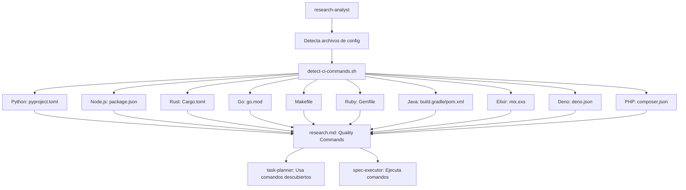

# Plan: Soporte Multi-Lenguaje en RalphHarness

> ⚠️ **SUPERADO (2026-05-22).** Este plan tiene deficiencias técnicas confirmadas
> (comandos `vendor/bin/...` y `./gradlew` que el filtro `command -v` descarta;
> afirmación falsa de "+6 filas" en quality-commands.md cuando ya existen 4; ruta
> incorrecta del `.bats`; modelo de hardcodeo en vez de descubrimiento de scripts).
> La fuente de verdad ahora es **`specs/multi-language-support/research.md`**, que
> rectifica estos puntos. Conservado solo como referencia histórica.

## Contexto

El usuario quiere usar RalphHarness (plugin de Claude Code) en proyectos de múltiples lenguajes de programación. Hasta ahora solo lo ha probado en proyectos Python. Este documento rastrea los cambios necesarios para hacer el plugin compatible con PHP, Ruby, Java/Kotlin, Elixir y Deno — además de los lenguajes ya soportados (Python, Node.js, Rust, Go).

---

## Estado Actual del Soporte de Lenguajes

### Lenguajes Soportados

| Lenguaje | Archivo de Config | Comandos Detectados |
|----------|-------------------|---------------------|
| Python | `pyproject.toml` | `pytest`, `ruff check`, `ruff format`, `mypy` |
| Node.js | `package.json` | Scripts npm/pnpm/yarn |
| Rust | `Cargo.toml` | `cargo clippy`, `cargo fmt`, `cargo test` |
| Go | `go.mod` | `go vet`, `go test` |
| Makefile | `Makefile` | Targets lint/test/check/build |

### Lenguajes NO Soportados (Gap)

| Lenguaje | Archivo de Config | Herramientas Típicas |
|----------|-------------------|---------------------|
| **PHP** | `composer.json` | PHPUnit, PHPStan, PHPCS, PHP-CS-Fixer |
| **Ruby** | `Gemfile` | RSpec, RuboCop, Rake |
| **Java/Kotlin** | `build.gradle` / `pom.xml` | Gradle, Maven, JUnit |
| **Elixir** | `mix.exs` | Mix, ExUnit, Credo |
| **Deno** | `deno.json` | Deno test, deno lint, deno check |

---

## Investigación Web: Ecosistema Multi-Lenguaje 2024

### PHP — Herramientas de Calidad

| Herramienta | Propósito | Comando típico |
|-------------|-----------|-----------------|
| **PHPUnit** | Testing | `vendor/bin/phpunit` |
| **PHPStan** | Static analysis | `vendor/bin/phpstan analyse` |
| **PHPCS** | Coding standards | `vendor/bin/phpcs --standard=PSR12` |
| **PHP-CS-Fixer** | Auto-fix | `vendor/bin/php-cs-fixer fix --diff` |

### Ruby — Herramientas de Calidad

| Herramienta | Propósito | Comando típico |
|-------------|-----------|-----------------|
| **RSpec** | Testing | `bundle exec rspec` |
| **RuboCop** | Linting | `bundle exec rubocop` |
| **Rake** | Build/task | `bundle exec rake build` |

### Java/Kotlin — Herramientas de Calidad

| Herramienta | Propósito | Comando típico |
|-------------|-----------|-----------------|
| **JUnit** | Testing | `./gradlew test` / `mvn test` |
| **Gradle** | Build/check | `./gradlew check` |
| **Maven** | Build/verify | `mvn verify` |

### Elixir — Herramientas de Calidad

| Herramienta | Propósito | Comando típico |
|-------------|-----------|-----------------|
| **ExUnit** | Testing | `mix test` |
| **Credo** | Linting | `mix credo` |
| **Mix** | Build/compile | `mix compile` |

### Deno — Herramientas de Calidad

| Herramienta | Propósito | Comando típico |
|-------------|-----------|-----------------|
| **Deno test** | Testing | `deno test` |
| **Deno lint** | Linting | `deno lint` |
| **Deno check** | Type checking | `deno check` |

---

## Inventario de Componentes a Modificar

### 1. `detect-ci-commands.sh` (CRÍTICO)

**Ubicación**: `plugins/ralphharness/hooks/scripts/detect-ci-commands.sh`

**Estado actual**: 5 detectores (Python, Node, Rust, Go, Makefile)

**Nuevos detectores requeridos**:

```bash
# Ruby
detect_gemfile() {
  local base="$1"
  [[ -f "$base/Gemfile" ]] || return 0
  ENTRIES+=('{"command":"bundle exec rspec","category":"test"}')
  ENTRIES+=('{"command":"bundle exec rubocop","category":"lint"}')
  ENTRIES+=('{"command":"bundle exec rake build","category":"build"}')
}

# Java/Kotlin (Gradle)
detect_gradle() {
  local base="$1"
  [[ -f "$base/build.gradle" ]] || return 0
  ENTRIES+=('{"command":"./gradlew test","category":"test"}')
  ENTRIES+=('{"command":"./gradlew check","category":"typecheck"}')
  ENTRIES+=('{"command":"./gradlew build","category":"build"}')
}

# Java/Kotlin (Maven)
detect_maven() {
  local base="$1"
  [[ -f "$base/pom.xml" ]] || return 0
  ENTRIES+=('{"command":"mvn test","category":"test"}')
  ENTRIES+=('{"command":"mvn verify","category":"typecheck"}')
  ENTRIES+=('{"command":"mvn package","category":"build"}')
}

# Elixir
detect_mix() {
  local base="$1"
  [[ -f "$base/mix.exs" ]] || return 0
  ENTRIES+=('{"command":"mix test","category":"test"}')
  ENTRIES+=('{"command":"mix credo","category":"lint"}')
  ENTRIES+=('{"command":"mix compile","category":"build"}')
}

# Deno
detect_deno() {
  local base="$1"
  [[ -f "$base/deno.json" ]] || return 0
  ENTRIES+=('{"command":"deno test","category":"test"}')
  ENTRIES+=('{"command":"deno lint","category":"lint"}')
  ENTRIES+=('{"command":"deno check","category":"typecheck"}')
}

# PHP
detect_composer() {
  local base="$1"
  [[ -f "$base/composer.json" ]] || return 0
  ENTRIES+=('{"command":"vendor/bin/phpunit","category":"test"}')
  ENTRIES+=('{"command":"vendor/bin/phpstan analyse src/","category":"typecheck"}')
  ENTRIES+=('{"command":"vendor/bin/phpcs --standard=PSR12 src/","category":"lint"}')
  # PHP-CS-Fixer opcional
  if command -v php-cs-fixer >/dev/null 2>&1; then
    ENTRIES+=('{"command":"vendor/bin/php-cs-fixer fix --diff src/","category":"lint"}')
  fi
}
```

### 2. `quality-commands.md` (CRÍTICO)

**Ubicación**: `plugins/ralphharness/references/quality-commands.md`

**Actualizar tabla de configuraciones**:

```markdown
| Config File | Language/Ecosystem | Commands to Try |
|------------|-------------------|-----------------|
| `pyproject.toml` | Python | `pytest`, `ruff check .`, `mypy .`, `python -m build` |
| `package.json` | Node.js | `pnpm run lint`, `pnpm run check-types`, `pnpm test` |
| `Cargo.toml` | Rust | `cargo test`, `cargo clippy`, `cargo build` |
| `go.mod` | Go | `go test ./...`, `golangci-lint run`, `go build ./...` |
| `Gemfile` | Ruby | `bundle exec rspec`, `bundle exec rubocop`, `bundle exec rake build` |
| `build.gradle` | Java/Kotlin | `./gradlew test`, `./gradlew check`, `./gradlew build` |
| `pom.xml` | Java/Kotlin | `mvn test`, `mvn verify`, `mvn package` |
| `mix.exs` | Elixir | `mix test`, `mix credo`, `mix compile` |
| `deno.json` | Deno | `deno test`, `deno lint`, `deno check` |
| `composer.json` | PHP | `vendor/bin/phpunit`, `vendor/bin/phpcs --standard=PSR12`, `vendor/bin/phpstan analyse` |
```

---

## Componentes que NO Requieren Cambios

| Componente | Razón |
|-----------|-------|
| Scripts RAG (`rag/service.py`, `rag/providers/qdrant.py`) | Son para el plugin mismo, no para proyectos de usuario |
| Hooks de coordinación (`stop-watcher.sh`, `load-spec-context.sh`) | Son agnósticos del lenguaje |
| Templates (`research.md`, `requirements.md`, `design.md`) | Son genéricos |
| Agentes (`task-planner.md`, `architect-reviewer.md`, `research-analyst.md`) | Leen comandos de `research.md` — agnósticos del lenguaje |

---

## Arquitectura del Sistema de Detección



---

## Cambios Requeridos — Resumen

| # | Componente | Cambio | LOC Estimado |
|---|-----------|--------|-------------|
| 1 | `hooks/scripts/detect-ci-commands.sh` | Agregar 6 detectores (Ruby, Gradle, Maven, Elixir, Deno, PHP) | ~50 |
| 2 | `references/quality-commands.md` | Agregar 6 filas a tabla de configuraciones | ~15 |

**Total estimado**: ~65 líneas de código

---

## Complejidad: BAJA

El sistema `detect-ci-commands.sh` está diseñado para ser extensible:

1. **Patrón consistente**: cada detector sigue el mismo formato
2. **Sin lógica nueva**: solo más casos del mismo patrón
3. **Tests existentes**: `tests/ci-autodetect.bats` con 17 tests ya cubre el patrón
4. **Sin cambios en agentes**: la lógica de task-planner es agnóstica del lenguaje
5. **Sin cambios en hooks**: solo archivos específicos

---

## Comparación con Otros Proyectos

| Proyecto | Enfoque | Complejidad |
|----------|---------|-------------|
| ESLint | Plugin system con parser, AST | ALTA |
| Prettier | Plugin system con formateadores | ALTA |
| **detect-ci-commands.sh** | Marker-based, stateless | **BAJA** |
| OpenHands SDK | Auto-detecta skills de markers | MEDIA |

El enfoque de RalphHarness (marker-based) es el más simple posible — no intenta parsear código, solo detecta archivos de config y extrae comandos.

---

## Plan de Implementación

### Fase 1: detect-ci-commands.sh

1. Agregar `detect_gemfile()` — Ruby
2. Agregar `detect_gradle()` — Java/Kotlin (Gradle)
3. Agregar `detect_maven()` — Java/Kotlin (Maven)
4. Agregar `detect_mix()` — Elixir
5. Agregar `detect_deno()` — Deno
6. Agregar `detect_composer()` — PHP
7. Actualizar called functions en el script principal

### Fase 2: quality-commands.md

1. Agregar 6 filas a la tabla de configuraciones
2. Verificar que todas las referencias sean correctas

### Fase 3: Testing

1. Ejecutar `tests/ci-autodetect.bats` para verificar que no hay regresiones
2. Agregar tests para los nuevos detectores si es necesario

---

## Opciones de Implementación

1. **Implementar ahora** — Aplicar los cambios directamente
2. **Crear spec formal** — Generar epic estructurado con `/ralphharness:triage multi-language-support`
3. **Solo PHP primero** — Reducir alcance inicialmente