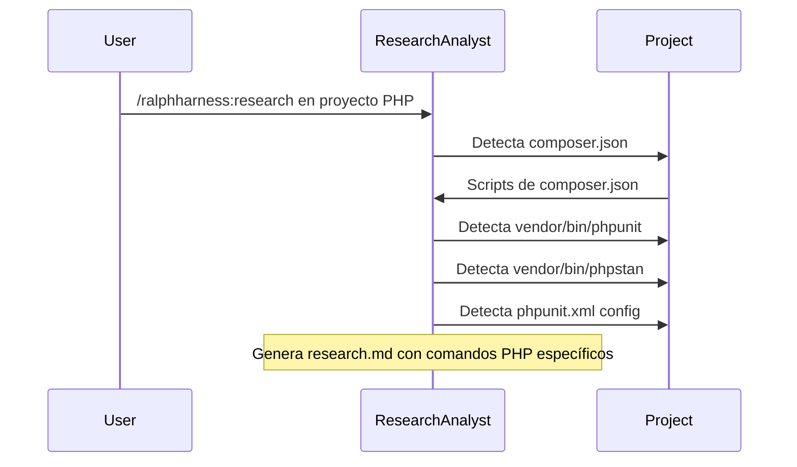

# Plan de Investigación: Soporte PHP en RalphHarness

## Contexto

El usuario quiere usar RalphHarness (plugin de Claude Code) en proyectos PHP. Hasta ahora solo lo ha probado en proyectos Python. Este documento rastrea los cambios necesarios para hacer el plugin compatible con proyectos PHP.

---

## Hallazgos de Investigación Web

### Ecosistema PHP 2024 — Herramientas de Calidad

| Herramienta | Propósito | Comando típico | Estado del ecosistema |
|-------------|-----------|-----------------|----------------------|
| **PHPUnit** | Testing | `vendor/bin/phpunit` | Estándar de facto (~95% proyectos) |
| **PHPStan** | Static analysis | `vendor/bin/phpstan analyse` | Recomendado para type safety |
| **Psalm** | Static analysis | `vendor/bin/psalm` | Alternativa a PHPStan |
| **PHPCS** | Coding standards | `vendor/bin/phpcs --standard=PSR12` | Común en proyectos legacy |
| **PHP-CS-Fixer** | Auto-fix | `vendor/bin/php-cs-fixer fix --diff` | Común, usa reglas PHP-CS |
| **PHP-CodeSniffer** | Linting | `vendor/bin/phpcbf` | Auto-fix para PHPCS |
| **Rector** | Automated refactoring | `vendor/bin/rector process` | Tendencia 2024 para migrations |

### Compositor Scripts — Convenciones Comunes

```json
{
  "scripts": {
    "test": "php vendor/bin/phpunit",
    "test:coverage": "XDEBUG_MODE=coverage php vendor/bin/phpunit --coverage-html coverage",
    "lint": "php vendor/bin/phpcs --standard=PSR12 src/",
    "lint:fix": "php vendor/bin/php-cs-fixer fix --diff src/",
    "analyse": "php vendor/bin/phpstan analyse",
    "analyse:baseline": "php vendor/bin/phpstan analyse --generate-baseline",
    "check": [
      "@lint",
      "@analyse",
      "@test"
    ]
  }
}
```

### Frameworks Laravel — Testing Externo

Laravel tiene abstracciones que complican testing:
- `php artisan test` — usa Laravel Dusk para browser tests
- `phpunit.xml` tiene configuración específica de Laravel
- factories, seeders, database migrations para tests

### Frameworks Symfony

- `php bin/phpunit` — configura desde `phpunit.xml.dist`
- `symfony/phpunit-bridge` para warnings deprecation
- `simple-phpunit` (versions bridgeadas)

---

## Inventario de Componentes PHP-Naive

### 1. `detect-ci-commands.sh` (CRÍTICO)

**Ubicación**: `plugins/ralphharness/hooks/scripts/detect-ci-commands.sh`

**Estado actual**: Detecta Python (`pyproject.toml`), Node (`package.json`), Rust (`Cargo.toml`), Go (`go.mod`), Makefile.

**Falta para PHP**:
```bash
detect_composer() {
  local base="$1"
  [[ -f "$base/composer.json" ]] || return 0

  # Parse scripts de composer.json para detectar comandos disponibles
  # Generar entradas basadas en scripts declarados o defaults comunes
  ENTRIES+=('{"command":"php -l src/","category":"lint"}')        # Syntax check
  ENTRIES+=('{"command":"vendor/bin/phpunit","category":"test"}')
  ENTRIES+=('{"command":"vendor/bin/phpcs --standard=PSR12 src/","category":"lint"}')
  ENTRIES+=('{"command":"vendor/bin/phpstan analyse src/","category":"typecheck"}')
}
```

**Estrategia de Detección:**
1. Detectar `composer.json` → generar comandos base
2. Si existe `vendor/bin/phpunit` → agregar a test
3. Si existe `vendor/bin/phpstan` → agregar a typecheck
4. Si existe `vendor/bin/phpcs` o `vendor/bin/php-cs-fixer` → agregar a lint
5. Detectar `phpunit.xml` para configuración de tests

### 2. `quality-commands.md` (CRÍTICO)

**Ubicación**: `plugins/ralphharness/references/quality-commands.md`

**Falta en la tabla de configuraciones**:
```markdown
| `composer.json` | PHP | `vendor/bin/phpunit`, `vendor/bin/phpcs --standard=PSR12`, `vendor/bin/phpstan analyse`, `vendor/bin/php-cs-fixer fix --diff` |
```

---

## Componentes con Referencias Implícitas a Python/Node

### 3. Agente `task-planner.md`

**Estado actual**: Menciona `pnpm test`, `pnpm lint`, `ruff check`, `mypy .` en ejemplos de Quality Checkpoints.

**Necesario**:
- Mantener ejemplos genéricos que leen comandos de `research.md` (donde el research-agent los descubre)
- Asegurar que las Quality Checkpoints sean _agnósticas_ del lenguaje

### 4. Agente `architect-reviewer.md`

**Estado actual**: Testing Discovery Checklist usa `npm test` como ejemplo.

**Necesario**:
- Actualizar ejemplos para incluir `vendor/bin/phpunit` o `composer test`
- Agregar referencia a `phpunit.xml` para configuración

### 5. Agente `research-analyst.md`

**Estado actual**: No tiene sesgo de lenguaje específico.

**Verificar**: Que la sección "## Verification Tooling" pueda acomodar cualquier lenguaje.

---

## Componentes que NO Requieren Cambios

| Componente | Razón |
|-----------|-------|
| Scripts RAG (`rag/service.py`, `rag/providers/qdrant.py`) | Son para el plugin mismo, no para proyectos de usuario |
| Hooks de coordinación (`stop-watcher.sh`, `load-spec-context.sh`) | Son agnósticos del lenguaje |
| Templates (`research.md`, `requirements.md`, `design.md`) | Son genéricos |

---

## Flujo de Investigación en Proyectos PHP



---

## Cambios Requeridos — Resumen Final

| # | Componente | Cambio | Prioridad |
|---|-----------|--------|-----------|
| 1 | `hooks/scripts/detect-ci-commands.sh` | Agregar `detect_composer()` con detección de PHPUnit/PHPStan/PHPCS | CRÍTICA |
| 2 | `references/quality-commands.md` | Agregar `composer.json` a tabla de configuraciones PHP | CRÍTICA |
| 3 | `agents/task-planner.md` | Actualizar ejemplos en Quality Checkpoints para PHP | MEDIA |
| 4 | `agents/architect-reviewer.md` | Actualizar Testing Discovery Checklist para PHP | MEDIA |
| 5 | `agents/research-analyst.md` | Verificar que detección de tooling sea agnóstica | BAJA |

---

## Opciones de Implementación

### Opción A: PHP Solo (Mínimo Esfuerzo)

Solo agregar `detect_composer()` a `detect-ci-commands.sh` y actualizar `quality-commands.md`.

| # | Componente | Cambio |
|---|-----------|--------|
| 1 | `hooks/scripts/detect-ci-commands.sh` | Agregar `detect_composer()` |
| 2 | `references/quality-commands.md` | Agregar `composer.json` a tabla |

### Opción B: Multi-Lenguaje Completo

Extensión directa del patrón existente — agregar detectores para Ruby, Java/Kotlin, Elixir, Deno.

| # | Componente | Cambio |
|---|-----------|--------|
| 1 | `hooks/scripts/detect-ci-commands.sh` | Agregar 5 detectores más |
| 2 | `references/quality-commands.md` | Agregar 5 filas a tabla |

---

## Evaluación de Complejidad Multi-Lenguaje

### ¿Qué tan complicado es?

**Respuesta corta: NO es complicado.** El sistema está diseñado para ser extensible.

### Arquitectura Actual (detect-ci-commands.sh)

```
detect_pyproject()     → Python (pytest, ruff, mypy)
detect_package_json()  → Node.js (pnpm/yarn/npm scripts)
detect_makefile()      → Makefiles genéricos
detect_cargo()         → Rust (cargo clippy, cargo test)
detect_go_mod()        → Go (go vet, go test)
```

**Patrón**: cada detector es una función simple que:
1. Detecta archivo de config (`[[ -f "$base/archivo" ]] || return 0`)
2. Agrega entries al array `ENTRIES`
3. Clasifica por categoría (`lint`, `test`, `typecheck`, `build`)

### Extensión Requerida (5 lenguajes)

```bash
# Ruby
detect_gemfile() {
  [[ -f "$base/Gemfile" ]] || return 0
  ENTRIES+=('{"command":"bundle exec rspec","category":"test"}')
  ENTRIES+=('{"command":"bundle exec rubocop","category":"lint"}')
}

# Java/Kotlin
detect_gradle() {
  [[ -f "$base/build.gradle" ]] || return 0
  ENTRIES+=('{"command":"./gradlew test","category":"test"}')
  ENTRIES+=('{"command":"./gradlew check","category":"typecheck"}')
}

# Elixir
detect_mix() {
  [[ -f "$base/mix.exs" ]] || return 0
  ENTRIES+=('{"command":"mix test","category":"test"}')
  ENTRIES+=('{"command":"mix credo","category":"lint"}')
}

# Deno
detect_deno() {
  [[ -f "$base/deno.json" ]] || return 0
  ENTRIES+=('{"command":"deno test","category":"test"}')
  ENTRIES+=('{"command":"deno lint","category":"lint"}')
}

# PHP (composer.json ya detallada arriba)
detect_composer() {
  [[ -f "$base/composer.json" ]] || return 0
  # PHPUnit, PHPStan, PHPCS
}
```

### Línea de Código Estimada

| Lenguaje | LOC estimado |
|----------|-------------|
| Ruby | ~8 líneas |
| Java/Kotlin | ~8 líneas |
| Elixir | ~6 líneas |
| Deno | ~6 líneas |
| PHP | ~12 líneas |
| **Total** | **~40 líneas** |

### Complejidad Real: BAJA

1. **No hay lógica nueva** — solo más casos del mismo patrón
2. **Tests ya existen** — `tests/ci-autodetect.bats` con 17 tests
3. **No hay dependencias nuevas** — solo archivos de config
4. **Sin cambios en agentes** — la lógica de task-planner es agnóstica
5. **Sin cambios en hooks** — solo `detect-ci-commands.sh` y `quality-commands.md`

---

## Comparación con Otros Proyectos

| Proyecto | Enfoque | Complejidad |
|----------|---------|-------------|
| ESLint | Plugin system para múltiples lenguajes | ALTA (parser, AST) |
| Prettier | Plugin system con formateadores | ALTA |
| detect-ci-commands.sh | Marker-based, stateless | **BAJA** ← Nosotros |
| OpenHands SDK | Auto-detecta skills de markers | MEDIA |

El enfoque de RalphHarness (marker-based) es el más simple posible — no intenta parsear código, solo detecta archivos de config y extrae comandos.

---

## Recomendación

**Opción B: Multi-Lenguaje Completo**

El esfuerzo adicional vs PHP solo es mínimo (~30 líneas extra), y la recompensa es un plugin que funciona con cualquier lenguaje de los principales.

**ROI**: +5 lenguajes por ~30 líneas de código = ~6 lenguajes por el precio de 1.

---

## Opciones de Implementación

El usuario debe elegir entre:

1. **Implementación PHP solo** — Mínimo esfuerzo, satisface necesidad inmediata
2. **Implementación multi-lenguaje** — Extensión completa del mismo patrón (recomendado)
3. **Spec formal** — Crear `/ralphharness:triage php-support` para un epic estructurado
4. **Research adicional** — Hacer más investigación sobre ecosistema PHP específico (Laravel, Symfony, etc.)