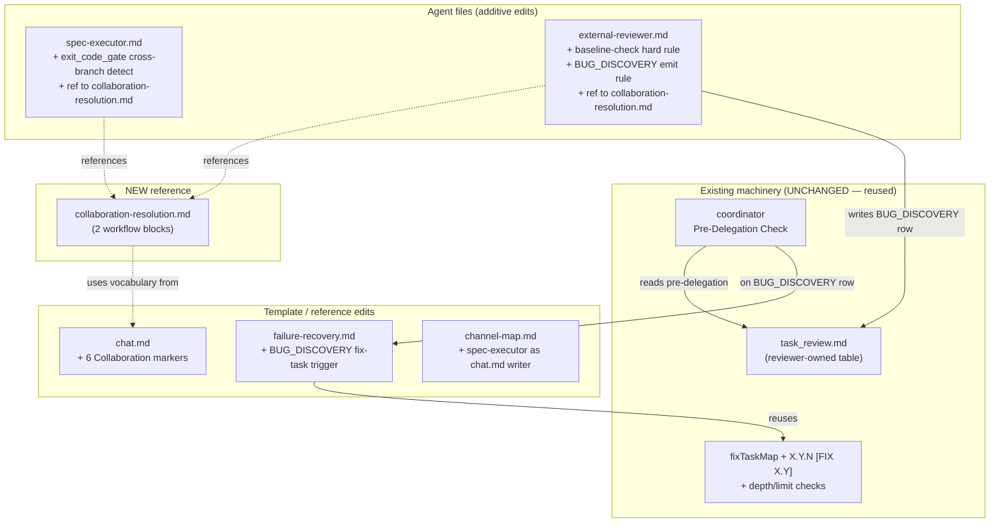
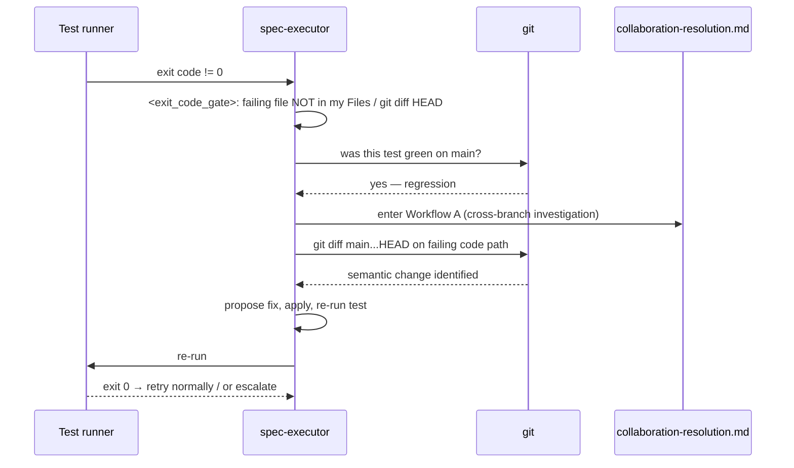
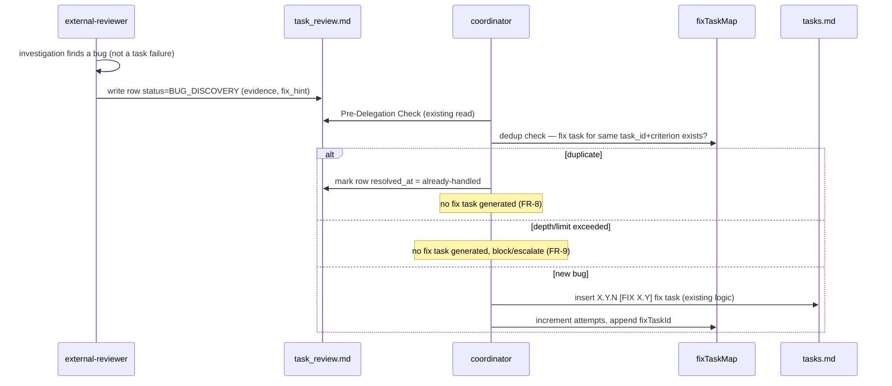

# Design: collaboration-resolution

## Overview

Spec 7 codifies an already-working ad-hoc agent collaboration pattern — cross-branch regression
investigation and experiment-propose-validate debugging — into explicit rules. It is LOW
complexity: one NEW markdown reference file plus four ADDITIVE edits to existing markdown files.
No new infrastructure, no agent types, no coordinator core-loop change, no schema change. The
`BUG_DISCOVERY` fix-task trigger rides entirely on the existing `failure-recovery.md` machinery
(`fixTaskMap`, `X.Y.N [FIX X.Y]` format, depth/limit checks, `tasks.md` insertion); only the
trigger source is new.

## Architecture

### Component Diagram



### Components

#### C1 — `references/collaboration-resolution.md` (NEW)
**Purpose**: Single source of truth for the two named collaboration workflows. Referenced by
agents, never duplicated into them.
**Responsibilities**:
- Workflow block A: **Cross-branch regression investigation** (FR-1, FR-2). Entry condition =
  ANY regression (test green on `main`, red on `HEAD`, neither test nor fixture changed).
  Steps: (a) `git diff main...HEAD` on the failing code path, (b) identify the semantic change,
  (c) propose a fix, (d) run the test to verify. Exit condition = test green or escalation.
- Workflow block B: **Experiment-propose-validate** (FR-4). Loop: reviewer emits `HYPOTHESIS`
  → executor emits `EXPERIMENT` → both emit `FINDING` → converge on `ROOT_CAUSE` → emit
  `FIX_PROPOSAL`. Names which agent typically emits each signal.
- States the trigger surface explicitly covers non-E2E unit-test regressions (FR-2), pointing
  at the executor `<exit_code_gate>` as the general detection point (FR-3).
- Records the ambiguous-baseline rule for cross-reference from `external-reviewer.md` (FR-12).
- Written as workflows (steps + entry/exit conditions), not micro-rules (AC-1.3).

#### C2 — `templates/chat.md` Collaboration markers table (MODIFY, additive)
**Purpose**: Declare the 6 new collaboration signals as `chat.md` vocabulary.
**Responsibilities**:
- Append 6 rows to the existing **Collaboration markers (→ chat.md)** table: `HYPOTHESIS`,
  `EXPERIMENT`, `FINDING`, `ROOT_CAUSE`, `FIX_PROPOSAL`, `BUG_DISCOVERY` (FR-5).
- Each row: one-line meaning + which agent typically emits it (AC-2.4).
- Control signals table and `signals.jsonl` are NOT touched (FR-5, NFR-5).

#### C3 — `references/failure-recovery.md` BUG_DISCOVERY trigger (MODIFY, additive)
**Purpose**: Add a second fix-task trigger alongside the existing executor-non-completion trigger.
**Responsibilities**:
- New section "BUG_DISCOVERY Fix-Task Trigger": a `task_review.md` row with `status:
  BUG_DISCOVERY` makes the coordinator generate a fix task (FR-6).
- Reuses the existing `X.Y.N [FIX X.Y]` format, `fixTaskMap`, depth/limit checks, and
  `tasks.md` insertion verbatim — only the trigger and the failure-object source differ (FR-6).
- Maps `task_review.md` columns onto the existing failure object: `task_id` → `taskId`,
  `evidence` → `failure.error`, `fix_hint` → `failure.attemptedFix`, `fix_type:bug_discovery`.
- Dedup rule (FR-8): before generating, check `fixTaskMap[task_id]` for an existing fix task
  whose `lastError` matches this `criterion_failed` + `evidence`; if found, skip generation and
  mark the duplicate row `resolved_at` as already-handled.
- Depth/limit rule (FR-9): the new trigger runs the existing "Check Fix Task Limits" and
  "Check Fix Task Depth" steps unchanged; on limit/depth exceeded, no fix task is generated and
  the existing block/escalate handling applies.
- States the reviewer gains no new write permission and the coordinator inserts the fix task
  (FR-7).

#### C4 — `agents/spec-executor.md` (MODIFY, additive)
**Purpose**: Make the executor follow the cross-branch workflow during regression investigation.
**Responsibilities**:
- Extend `<exit_code_gate>` step 4 (the "error is in code I did not touch" branch) with a
  cross-branch detection sub-step: when the failing test was green on `main`, run `git diff
  main...HEAD` on the failing code path and follow `collaboration-resolution.md` Workflow A
  (FR-3). This is the general non-E2E detection point, distinct from the VE/E2E-only
  `progress-regression` FAIL.
- Append a one-line reference to `references/collaboration-resolution.md`, positioned adjacent
  to `<exit_code_gate>` (FR-10, AC-4.2).
- Both changes are additive; no existing `<exit_code_gate>` line is removed (NFR-1, AC-4.3).

#### C5 — `agents/external-reviewer.md` (MODIFY, additive)
**Purpose**: Prevent the reviewer from masking a backend regression by editing a test, and let
it record discovered bugs.
**Responsibilities**:
- New hard-rule block "Baseline Check Before Modifying a Test" (FR-11): before suggesting any
  edit to a test that passed on `main`, verify 3 conditions via `git diff main...HEAD` —
  (a) test file unchanged, (b) fixture/environment unchanged, (c) backend code path differs. If
  all 3 hold → backend/environmental regression → MUST NOT modify the test.
- Ambiguous-case rule (FR-12): if any of the 3 conditions is ambiguous (e.g. cosmetic-only test
  change), treat the baseline check as NOT satisfied (do not modify the test) and record the
  ambiguity via a `chat.md` `FINDING` marker so investigation continues.
- New rule "Recording a Discovered Bug": when the reviewer finds a bug via investigation (not
  via task failure), write a `status: BUG_DISCOVERY` row to `task_review.md` carrying evidence
  and fix_hint (FR-6, FR-7). No new write permission — `task_review.md` is reviewer-owned.
- Append a one-line reference to `references/collaboration-resolution.md` (FR-11, AC-5.2).
- All changes additive (NFR-1, AC-5.3).

#### C6 — `references/channel-map.md` (MODIFY, additive) — FR-13b
**Purpose**: Reconcile the Channel Registry with code reality.
**Responsibilities**:
- Add `spec-executor` to the `chat.md` Writer(s) column (see Technical Decision D2).
- The `chat.md` Risk Register entry and `flock -e 200` mitigation already cover concurrent
  writers — additive note only, no mitigation change.

### Data Flow

#### Flow 1 — Cross-branch regression investigation (executor)



#### Flow 2 — BUG_DISCOVERY → fix task (reviewer + coordinator)



## Technical Decisions

| Decision | Options Considered | Choice | Rationale |
|----------|-------------------|--------|-----------|
| **D1 (FR-13a)** — BUG_DISCOVERY entry shape in `task_review.md` | (a) new `status: BUG_DISCOVERY` value in the EXISTING table schema; (b) a separate documented row/section format | **(a)** | The `task_review.md` table columns `task_id` / `criterion_failed` / `evidence` / `fix_hint` already carry exactly what the failure object needs (`taskId`, error description, fix direction). The coordinator's Pre-Delegation Check (`coordinator-pattern.md` §Pre-Delegation Check) already parses this table row-by-row by `status`; adding a `BUG_DISCOVERY` value is parsed by the same mechanical path as `FAIL`/`WARNING`/`PASS`/`PENDING` — no parser change, no schema change, no coordinator core-loop change (NFR-2). Option (b) was rejected: a separate section would force the coordinator to learn a second parse path, the reviewer to learn a second write format, and would risk a schema-change escalation — all complexity the table genuinely does not need. The table carries every required field, so the LOW-complexity option is correct. |
| **D2 (FR-13b)** — `channel-map.md` spec-executor `chat.md`-writer reconciliation | (i) add `spec-executor` as a `chat.md` writer in the Channel Registry; (ii) document why the registry omits it | **(i)** | `spec-executor.md` `<chat>` already writes to `chat.md` via `flock -x 200` on `chat.md.lock` — the registry omitting `spec-executor` is a stale registry, not an intentional restriction. Spec 7 formalizes executor↔reviewer collaboration (Workflow B), making the executor a first-class `chat.md` writer. The registry MUST reflect code reality (its own "Adding a New Agent" step 2 mandates this). The `chat.md` Risk Register entry and the `flock -e 200` mitigation already cover N concurrent writers, so adding a third writer needs no new mitigation — a purely additive registry correction. Option (ii) was rejected: documenting the omission would entrench a false contract and contradict the executor's actual `<chat>` behavior. |
| **D3** — Detection point for non-E2E regressions | extend `<exit_code_gate>`; vs extend `progress-regression`; vs new coordinator hook | **extend `<exit_code_gate>`** | FR-3 mandates it. `<exit_code_gate>` already attributes failures with `git diff --name-only HEAD`; extending to `git diff main...HEAD` is idiomatic and small. `progress-regression` is VE/E2E-only (§3b Step 6) so it cannot be the general detector. A coordinator hook would violate NFR-2 (no core-loop change). |
| **D4** — Reuse vs re-implement fix-task generation | reuse existing `failure-recovery.md` machinery; vs new BUG_DISCOVERY-specific generator | **reuse** | FR-6/FR-7 mandate reuse. BUG_DISCOVERY only needs a new trigger and a column→failure-object mapping; format, `fixTaskMap`, depth/limit, and `tasks.md` insertion are all unchanged. Re-implementation would duplicate logic and risk divergence (Risk register). |

## File Structure

| File | Action | Purpose |
|------|--------|---------|
| `plugins/ralphharness/references/collaboration-resolution.md` | Create | Two named workflow blocks: cross-branch regression investigation + experiment-propose-validate |
| `plugins/ralphharness/templates/chat.md` | Modify (additive) | Append 6 rows to the Collaboration markers table |
| `plugins/ralphharness/references/failure-recovery.md` | Modify (additive) | New "BUG_DISCOVERY Fix-Task Trigger" section reusing existing machinery |
| `plugins/ralphharness/agents/spec-executor.md` | Modify (additive) | Extend `<exit_code_gate>` with cross-branch detection + reference to `collaboration-resolution.md` |
| `plugins/ralphharness/agents/external-reviewer.md` | Modify (additive) | Baseline-check hard rule + ambiguous-case rule + BUG_DISCOVERY emit rule + reference |
| `plugins/ralphharness/references/channel-map.md` | Modify (additive) | Add `spec-executor` to `chat.md` Writer(s) column |

> Note: `channel-map.md` is a 6th touched file beyond the roadmap's 5-row table. It is an
> additive one-cell correction mandated by FR-13b — not a new deliverable, a reconciliation.
> Plugin version bump required (BOTH `plugin.json` and `marketplace.json`).

## Interfaces

These are markdown data shapes, not code interfaces.

### BUG_DISCOVERY row in `task_review.md` (existing table, new `status` value)

```text
| status        | severity | reviewed_at        | task_id | criterion_failed        | evidence                              | fix_hint                          | resolved_at |
|---------------|----------|--------------------|---------|-------------------------|---------------------------------------|------------------------------------|-------------|
| BUG_DISCOVERY | major    | 2026-05-15T10:00Z  | 3.2     | cache not populated     | renamed method dropped cache.set call | restore cache.set in loadConfig()  |             |
```

Field mapping to the existing failure object consumed by `failure-recovery.md`:

```text
task_id          -> failure.taskId
evidence         -> failure.error
fix_hint         -> failure.attemptedFix  (fix direction)
criterion_failed -> dedup key component
(implicit)       -> fixType = "bug_discovery"
```

### 6 new Collaboration markers (rows appended to `chat.md` table)

```text
| HYPOTHESIS   | Proposed root-cause theory for a regression (typically reviewer)        |
| EXPERIMENT   | A test/probe run to validate a hypothesis (typically executor)          |
| FINDING      | Observed result of an experiment, or recorded investigation note        |
| ROOT_CAUSE   | Confirmed underlying defect, agreed by both agents                      |
| FIX_PROPOSAL | A concrete suggested fix derived from the root cause                    |
| BUG_DISCOVERY| A bug found via investigation; mirrored as a task_review.md row by reviewer |
```

## Error Handling

| Error Scenario | Handling Strategy | User Impact |
|----------------|-------------------|-------------|
| Duplicate `BUG_DISCOVERY` for the same bug | `failure-recovery.md` dedup check vs `fixTaskMap[task_id]` matching `criterion_failed`+`evidence`; if matched, skip generation, mark row `resolved_at` = already-handled | No second fix task; duplicate recorded, not silently dropped |
| `BUG_DISCOVERY` at/over fix-task depth or limit | Existing "Check Fix Task Limits" / "Check Fix Task Depth" steps run unchanged; on exceed, no fix task generated, existing block/escalate handling fires | No runaway fix-task chain; existing limit error shown |
| Ambiguous baseline check (test changed only cosmetically) | Reviewer treats the 3-condition check as NOT satisfied → does not modify the test; records ambiguity via `chat.md` `FINDING` marker | Investigation continues rather than masking or stalling |
| Cross-branch test was never green on `main` (new test, genuine failure) | `<exit_code_gate>` entry condition not met → Workflow A not entered → normal failure handling applies | Genuine new-test failures still fixed via standard path |
| `task_review.md` does not exist | Coordinator Pre-Delegation Check skips silently (existing behavior) | No effect; BUG_DISCOVERY simply unavailable until file exists |
| `BUG_DISCOVERY` row malformed (missing `evidence`/`fix_hint`) | Coordinator falls back to existing failure-object defaults ("Task execution failed" / "No fix attempted") | Fix task still generated with generic content |

## Edge Cases

- **Duplicate BUG_DISCOVERY (FR-8/US-7)**: dedup against `fixTaskMap` before generation; recorded as handled.
- **Depth/limit reached (FR-9/US-8)**: existing depth/limit checks apply; zero fix tasks past the limit.
- **Ambiguous baseline (FR-12/US-9)**: treat as NOT satisfied; do not modify the test; record via `FINDING`.
- **Non-E2E unit regression**: detected at `<exit_code_gate>`, not `progress-regression` (FR-3).
- **Regression where the test itself changed**: baseline check fails condition (a) → not a cross-branch regression → normal handling.
- **Merge order with Spec 3**: changes are additive in different sections of the two shared agent files; Spec 7 lands after Spec 3.

## Dependencies

| Package | Version | Purpose |
|---------|---------|---------|
| Spec 6 `signal-log-and-ci-autodetect` | completed (PR #17) | Provides the `signals.jsonl`/`chat.md` split the 6 markers rely on |
| Spec 3 `role-boundaries` | land before Spec 7 | Shares `spec-executor.md` / `external-reviewer.md` (different sections) |
| `failure-recovery.md` fix-task machinery | existing | `fixTaskMap`, `X.Y.N [FIX X.Y]`, depth/limit, `tasks.md` insertion |
| `task_review.md` reviewer-owned channel | existing | Carries the BUG_DISCOVERY row |
| `git` | available (context audit) | `git diff main...HEAD` for cross-branch comparison |

## Security Considerations

- No new write permission granted to any agent. The reviewer writes `BUG_DISCOVERY` to
  `task_review.md`, a file it already owns. The coordinator (not the reviewer) inserts the fix
  task into `tasks.md` (FR-7, hard invariant).
- No new channel, agent type, or executable is introduced (NFR-2).

## Performance Considerations

- `git diff main...HEAD` scoped to the failing code path is a fast, bounded operation; invoked
  only when `<exit_code_gate>` already attributes a failure to non-modified code.
- No measurable runtime cost: all changes are static markdown read by agents at prompt time.

## Concurrency & Ordering Risks

| Operation | Required Order | Risk if Inverted |
|---|---|---|
| Reviewer writes `BUG_DISCOVERY` row → coordinator reads `task_review.md` Pre-Delegation | Reviewer write must complete (under `flock -e 201` on `tasks.md.lock` is N/A; `task_review.md` is single-writer, no lock) before the coordinator's pre-delegation read | Coordinator reads a partial row → falls back to generic failure-object defaults (degraded, not broken) |
| Dedup check vs `fixTaskMap` → fix-task generation | Dedup check MUST run before `fixTaskMap[task_id].attempts` is incremented | Duplicate fix task generated (FR-8 violation) |
| Depth/limit check → fix-task generation | Limit/depth check MUST run before generation, same as the executor-failure trigger | Runaway fix-task chain (FR-9 violation) |
| `spec-executor` and `reviewer` concurrent `chat.md` writes | Both use `flock -e 200` on `chat.md.lock` (existing mitigation) | Interleaved bytes — already mitigated; D2 adds the executor to the registry but no new mitigation needed |

## Test Strategy

> RalphHarness is a markdown-only plugin (project type: library). "Tests" here are
> structural/behavioral assertions against markdown files and the documented coordinator
> behavior. There is no application runtime — verification is `grep`/`bats`-based.

### Test Double Policy

| Type | What it does | When to use |
|---|---|---|
| **Stub** | Returns predefined data, no behavior | Not used — no I/O code in this spec |
| **Fake** | Simplified real implementation | Use a real temp spec workspace (real `tasks.md`/`task_review.md`/`.ralph-state.json`) for the BUG_DISCOVERY trigger behavior — a fake workspace, not a mock |
| **Mock** | Verifies interactions | Not used — no interaction is the observable outcome here |
| **Fixture** | Predefined data state | Seed `task_review.md` rows, `fixTaskMap` JSON, and a git history with a green-on-main/red-on-HEAD test |

> All deliverables are markdown. The "SUT" is the documented behavior — assert the markdown
> content and the coordinator's documented response, not stubbed code paths.

### Mock Boundary

| Component (from this design) | Unit test | Integration test | Rationale |
|---|---|---|---|
| C1 `collaboration-resolution.md` | none (grep content) | none | Static markdown — assert the two workflow blocks exist with the prescribed steps |
| C2 `chat.md` Collaboration markers | none (grep content) | none | Static markdown — assert the 6 rows present in the correct table |
| C3 `failure-recovery.md` BUG_DISCOVERY trigger | none (grep content) | fake (real temp workspace) | Content assertion + behavioral: a seeded BUG_DISCOVERY row yields exactly one fix task |
| C4 `spec-executor.md` cross-branch extension | none (grep content) | none | Static markdown — assert `<exit_code_gate>` references `git diff main...HEAD` + the new reference |
| C5 `external-reviewer.md` baseline rule | none (grep content) | none | Static markdown — assert the 3-condition rule, ambiguous-case rule, BUG_DISCOVERY emit rule, reference |
| C6 `channel-map.md` writer reconciliation | none (grep content) | none | Static markdown — assert `spec-executor` present in the `chat.md` Writer(s) cell |

### Fixtures & Test Data

| Component | Required state | Form |
|---|---|---|
| C3 BUG_DISCOVERY trigger (new bug) | A temp spec workspace with `tasks.md` (one task `3.2`), empty `task_review.md`, `.ralph-state.json` with `fixTaskMap: {}` | Seed script / fixture directory |
| C3 BUG_DISCOVERY trigger (duplicate) | Same workspace but `fixTaskMap` already has `{"3.2": {attempts:1, fixTaskIds:["3.2.1"], lastError:"<matching criterion+evidence>"}}` and a `BUG_DISCOVERY` row for the same bug | Fixture JSON + `task_review.md` row |
| C3 BUG_DISCOVERY trigger (depth limit) | Workspace with `fixTaskMap["3.2"].attempts == maxFixTasksPerOriginal` | Fixture JSON |
| C1/C4 cross-branch workflow | A git repo where a named test is green on `main`, red on `HEAD`, with the test file unchanged between branches | Git fixture (seed commits) |

### Test Coverage Table

| Component / Function | Test type | What to assert | Test double |
|---|---|---|---|
| C1 `collaboration-resolution.md` exists | unit | File exists; contains a "Cross-branch regression investigation" block with the 4 prescribed steps and an explicit ANY-regression entry condition; contains an "Experiment-propose-validate" block naming the 5-signal loop and the emitting agent | none |
| C2 `chat.md` Collaboration markers | unit | The Collaboration markers table contains all 6 rows (`HYPOTHESIS`/`EXPERIMENT`/`FINDING`/`ROOT_CAUSE`/`FIX_PROPOSAL`/`BUG_DISCOVERY`), each with a meaning + emitting agent; the Control signals table and `signals.jsonl` are unchanged | none |
| C3 `failure-recovery.md` documents BUG_DISCOVERY trigger | unit | A "BUG_DISCOVERY Fix-Task Trigger" section exists; states reuse of `X.Y.N [FIX X.Y]`, `fixTaskMap`, depth/limit, `tasks.md` insertion; documents the column→failure-object mapping; documents dedup and depth/limit reuse | none |
| C3 single BUG_DISCOVERY → one fix task | integration | Seed a workspace + one BUG_DISCOVERY row; following the documented coordinator behavior yields exactly one `X.Y.N [FIX X.Y]` task in `tasks.md` and one `fixTaskMap` entry | fake (real temp workspace) |
| C3 duplicate BUG_DISCOVERY → zero fix tasks | integration | Seed a workspace with a matching `fixTaskMap` entry; a duplicate BUG_DISCOVERY row yields zero new fix tasks and the row is marked `resolved_at` already-handled | fake (real temp workspace) |
| C3 depth-limit BUG_DISCOVERY → zero fix tasks | integration | Seed `fixTaskMap` at the limit; a BUG_DISCOVERY row yields zero new fix tasks and the existing limit error fires | fake (real temp workspace) |
| C4 `spec-executor.md` cross-branch detection | unit | `<exit_code_gate>` (or adjacent block) references `git diff main...HEAD` cross-branch detection and `collaboration-resolution.md`; no existing `<exit_code_gate>` line removed | none |
| C5 `external-reviewer.md` baseline rule | unit | A hard-rule block states the 3-condition check on `git diff main...HEAD`; documents the ambiguous-case = NOT-satisfied behavior; documents the BUG_DISCOVERY emit rule; contains a `collaboration-resolution.md` reference; no existing section removed | none |
| C6 `channel-map.md` writer | unit | The `chat.md` row Writer(s) cell contains `spec-executor` alongside `coordinator, reviewer` | none |
| Additivity invariant (NFR-1) | unit | `git diff main...HEAD` on the 4 modified existing files shows only additions, zero deletions of existing content | none |

### Skip Policy

Tests marked `.skip` / `xit` are FORBIDDEN unless the functionality is not yet implemented and a
GitHub issue reference is in the skip reason.

### Test File Conventions

- Test runner: `bats` (Bash Automated Testing System — confirmed available in context audit;
  smoke run of `tests/signal-log.bats` passed clean)
- Test file location: repo-root `tests/` — one `*.bats` file per concern (existing convention,
  e.g. `tests/signal-log.bats`, `tests/ci-autodetect.bats`). Create `tests/collaboration-resolution.bats`
- Run command: `bats tests/collaboration-resolution.bats` (existing: `bats tests/<file>.bats`)
- Integration test pattern: same `*.bats` file, exercising a real temp spec workspace via `mktemp -d`
- E2E test pattern: not applicable — no UI, no application runtime
- Mock cleanup: `teardown()` removes the temp workspace
- Fixture/factory location: `tests/fixtures/` (existing, e.g. `state-execution-midway.json`);
  shared setup in `tests/helpers/setup.bash`. Add new seed fixtures (`task_review.md` rows,
  `fixTaskMap` JSON, git fixture) under `tests/fixtures/`

### Test types:

#### Unit Tests
- Content assertions (`grep`/`bats`) on all 6 deliverable files per the Coverage Table.
- Mock requirements: none — static markdown.

### Integration Tests
- BUG_DISCOVERY trigger behavior in a real temp spec workspace: single → one fix task,
  duplicate → zero, depth-limit → zero.

#### E2E Tests (if UI)
- None — RalphHarness has no UI.

## Existing Patterns to Follow

Based on codebase analysis:
- **Reference-file pattern**: workflows live in `references/*.md` and are referenced by agents,
  never inlined — follow `failure-recovery.md` / `channel-map.md` precedent.
- **Additive edits**: append a rule block or a table row; never rewrite a section (NFR-1).
- **Table-based reviewer channel**: `task_review.md` is a single markdown table parsed by
  `status` — extend it with a new `status` value, not a parallel format (D1).
- **`fixTaskMap` reuse**: `failure-recovery.md` already centralizes fix-task format, depth/limit,
  and `tasks.md` insertion — the BUG_DISCOVERY trigger calls into it, adds nothing.
- **Collaboration vs Control split** (Spec 6): collaboration signals live in `chat.md`, control
  signals in `signals.jsonl` — the 6 new signals are collaboration markers (NFR-5).
- **`flock`-based `chat.md` writes** (fd 200): the executor already uses this; D2 just records it
  in the registry.

## Unresolved Questions

None. Both FR-13 design decisions are resolved above (D1: new `status: BUG_DISCOVERY` value in
the existing table schema; D2: add `spec-executor` as a `chat.md` writer in `channel-map.md`).

## Implementation Steps

1. Create `plugins/ralphharness/references/collaboration-resolution.md` with the two named
   workflow blocks (cross-branch regression investigation; experiment-propose-validate),
   including the ANY-regression entry condition and the ambiguous-baseline cross-reference.
2. Append the 6 collaboration-marker rows to the Collaboration markers table in
   `plugins/ralphharness/templates/chat.md`.
3. Extend `plugins/ralphharness/references/failure-recovery.md` with a "BUG_DISCOVERY Fix-Task
   Trigger" section: column→failure-object mapping, dedup rule, depth/limit reuse, reviewer
   write-boundary note.
4. Extend `<exit_code_gate>` in `plugins/ralphharness/agents/spec-executor.md` with cross-branch
   (`git diff main...HEAD`) detection and append a reference to `collaboration-resolution.md`.
5. Add to `plugins/ralphharness/agents/external-reviewer.md` the 3-condition baseline-check hard
   rule, the ambiguous-case rule, the BUG_DISCOVERY emit rule, and a `collaboration-resolution.md`
   reference.
6. Add `spec-executor` to the `chat.md` Writer(s) cell in
   `plugins/ralphharness/references/channel-map.md`.
7. Bump plugin version in `plugins/ralphharness/.claude-plugin/plugin.json` and
   `.claude-plugin/marketplace.json` (minor bump — additive feature).
8. Write tests per the Test Strategy: `bats` content assertions for all 6 files + the 3
   BUG_DISCOVERY behavioral integration tests + the additivity invariant check.
