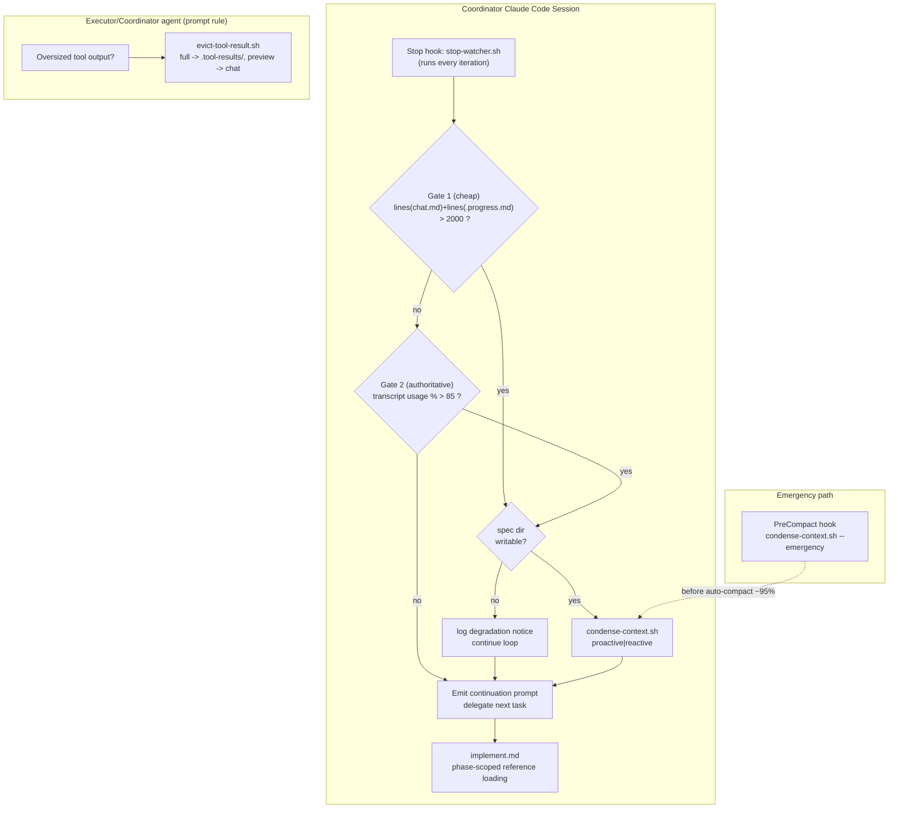
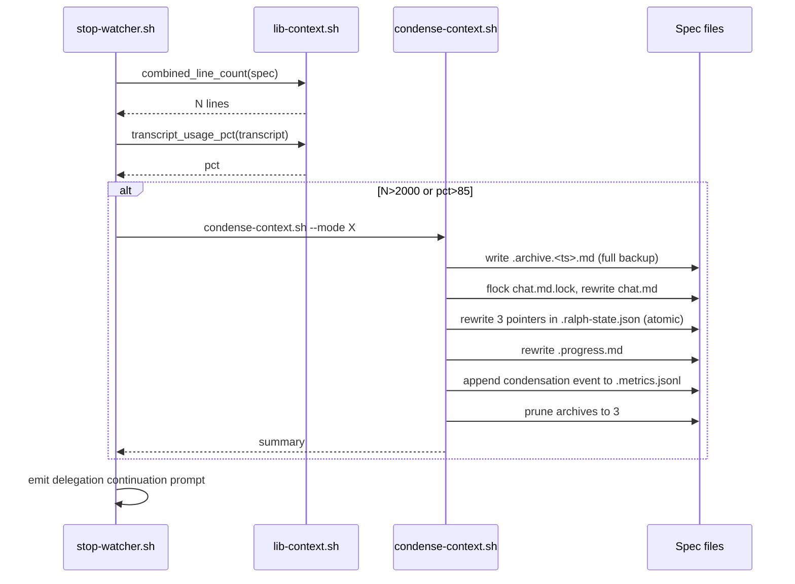

# Design: Context Middleware (Spec 10)

## Overview

Always-on, file-level context management middleware for the Smart Ralph coordinator session. It runs as shell scripts + hooks + prompt rules that execute before each coordinator delegation to keep the context window bounded, replacing cancelled Spec 2 (prompt-diet-refactor) with an additive, non-disruptive approach.

The middleware has four functions: (1) **proactive condensation** of `chat.md`/`.progress.md` when their combined line count exceeds 2,000; (2) **reactive condensation** triggered by a real transcript-JSONL token measurement above ~85% of the context window, with a `PreCompact` hook as last-resort emergency fallback; (3) **tool-result eviction** realized as an agent prompt-rule that routes oversized output through a helper script; (4) **phase-based reference scoping** in `implement.md` keyed off a new finer `executionPhase` field.

Condensation is **in-place**: a full backup is written to `.archive.<timestamp>.md` first, then `chat.md`/`.progress.md` are rewritten with condensed content that the coordinator reads directly. The middleware runs ONLY in the coordinator's Claude Code session; the separate executor/reviewer sessions (incl. a non-Claude reviewer) are not context-managed — the only cross-session guarantee is filesystem-format and read-pointer correctness of `chat.md` / `signals.jsonl` / `.ralph-state.json`.

## Architecture



## Components

### `condense-context.sh` (NEW)
**Purpose**: Perform one condensation pass on `chat.md` + `.progress.md`.
**Responsibilities**:
- Compute combined line count (Gate 1 helper, also callable standalone).
- Acquire `flock` on `chat.md.lock` (fd 200) before touching `chat.md`.
- Write `.archive.<timestamp>.md` BEFORE any mutation.
- Condense `chat.md` (last 15 messages + all preserved signals/markers, only prefix older than `min()` of the 3 read pointers) and `.progress.md` (stable Goal/Learnings + last 3 task entries).
- Atomically rewrite `chat.md` and all three `.ralph-state.json` pointers.
- Append a `condensation` event to `.metrics.jsonl`.
- Prune archives to max 3.
- Graceful-degradation: detect non-writable spec dir, skip + log, exit 0.

**Interface**:
```text
condense-context.sh <spec_path> --mode <proactive|reactive|emergency>
  exit 0  = condensed OR skipped-as-noop OR degraded-gracefully
  exit !0 = unexpected internal error (caller still continues loop)
stdout: one-line summary  e.g.  "condensed: chat 1840->210, progress 430->95"
```

### `lib-context.sh` (NEW)
**Purpose**: Shared context helper functions sourced by `stop-watcher.sh`, `condense-context.sh`, and the `PreCompact` hook. New file (parallel to `lib-signals.sh`) — keeps `lib-signals.sh` single-responsibility.
**Functions**:
- `combined_line_count <spec_path>` → echoes `lines(chat.md) + lines(.progress.md)`.
- `transcript_usage_pct <transcript_path>` → echoes integer 0-100 (see algorithm below).
- `spec_dir_writable <spec_path>` → return 0/1.
- `context_window_size` → echoes the window constant (single source of truth, see Open Question).
- `write_condensation_metric <spec_path> <mode> <linesBefore> <linesAfter> <tokensBeforePct> <archivePath>` → appends a `condensation` event to `.metrics.jsonl` using **fd 201** for `.metrics.lock` (avoids collision with the `chat.md.lock` fd 200 held during condensation). Must be called AFTER the fd-200 chat-lock subshell in step 5 has closed.

### `evict-tool-result.sh` (NEW)
**Purpose**: Agent-invoked helper that writes oversized tool output to disk and emits a preview. NOT interception — invoked by the agent per a prompt-rule.
**Interface**:
```text
echo "<tool output>" | evict-tool-result.sh <spec_path> <tool_kind>
  tool_kind in: grep | gitdiff | fileread | lsfind
stdout: first 50 lines + summary line:
        "[evicted] <N> lines total, full output: .tool-results/<kind>-<ts>.txt"
```
Behavior: if input line count ≤ threshold for `tool_kind` (grep 100 / gitdiff 200 / fileread 500 / lsfind 300) → pass input through unchanged (no file written). Else write full content to `.tool-results/<kind>-<timestamp>.txt`, emit preview. If spec dir not writable → emit input unchanged + a one-line degradation note. **AC-3.4**: pair-debug diagnostic output (caller passes `--pair-debug` flag) is always passed through unchanged and never evicted, regardless of line count.

### `PreCompact` hook (NEW) — wired in `hooks.json`
**Purpose**: Last-resort emergency condensation before Claude Code auto-compacts (~95%).
**Wiring**: new `PreCompact` entry calling a thin script `precompact-condense.sh` that resolves the active spec (via `path-resolver.sh`) and calls `condense-context.sh <spec> --mode emergency`. Exits 0 unconditionally so it never blocks compaction.

### `stop-watcher.sh` (MODIFY)
**Changes** (execution-phase block only):
- Source `lib-context.sh`.
- Before emitting the delegation continuation prompt: run the two-gate check. Gate 1 = `combined_line_count > 2000`; Gate 2 = `transcript_usage_pct "$TRANSCRIPT_PATH" > 85`. `TRANSCRIPT_PATH` is already parsed (line 83). If either fires → call `condense-context.sh --mode proactive` (Gate 1) or `--mode reactive` (Gate 2).
- For reactive: after condensation, the same iteration's continuation prompt is the retry (AC-2.3) — no separate retry machinery; the loop naturally re-delegates the current task because `taskIndex` is unchanged.
- All middleware calls are wrapped so a non-zero exit never aborts the hook.

### `implement.md` (MODIFY)
**Changes**: the "Read these references" section (lines 374-389) becomes phase-conditional, keyed off `.ralph-state.json` `executionPhase`:

| executionPhase | References loaded |
|---|---|
| `poc` | coordinator-pattern.md + failure-recovery.md |
| `refactor` | + commit-discipline.md |
| `test` / `quality` | + commit-discipline.md + verification-layers.md |

- `phase-rules.md` is loaded only for `test`/`quality` (skipped in `poc`/`refactor`).
- `pair-debug.md` additionally loaded when `chat.md` contains a `PAIR-DEBUG` marker.
- `coordinator-pattern.md` + `failure-recovery.md` are always-relevant (loaded every phase).
- If `executionPhase` is absent (older specs) → default to loading all references (safe fallback, byte-identical to pre-spec behavior).

### `schemas/spec.schema.json` (MODIFY)
Add `executionPhase` property to the spec state object:
```json
"executionPhase": {
  "type": "string",
  "enum": ["poc", "refactor", "test", "quality"],
  "description": "Fine-grained execution sub-phase, written by the coordinator; drives phase-based reference scoping"
}
```
Also extend `chat` to include `coordinator` and `reviewer` sibling objects to `executor` (each with `lastReadLine`), so all three pointers the design relies on are schema-valid. (The schema currently only defines `chat.executor`.)

## Data Flow



## Technical Decisions

| Decision | Options Considered | Choice | Rationale |
|---|---|---|---|
| Reactive trigger | API-error interception; transcript token read; line-count only | Transcript `message.usage` token read + line-count cheap gate | Plugin cannot see `context_length_exceeded`. Transcript JSONL has REAL usage; line-count is a free pre-filter. Two-gate per design interview. |
| Condensation mutation | Non-mutating `.condensed.md`; in-place rewrite | In-place rewrite, archive-first | Locked decision. Coordinator reads files directly — no consumer rewiring. Archive guarantees recoverability. |
| Phase signal | Infer from task-number prefix; coordinator-written `executionPhase` field | New `executionPhase` field | Existing `phase` is coarse (`execution`). Prefix inference is brittle. Explicit field is deterministic and coordinator-controlled. |
| Tool eviction | Coordinator-side interception; MCP server; agent prompt-rule + helper | Agent prompt-rule + `evict-tool-result.sh` | A shell script cannot intercept a tool call mid-conversation. Prompt-rule is the only honest mechanism (AC-3.5). |
| Context helpers location | Extend `lib-signals.sh`; new `lib-context.sh` | New `lib-context.sh` | Keeps `lib-signals.sh` single-purpose; avoids coupling signal and context concerns. |
| Window-size constant | `.ralph-state.json` field; hardcoded; single shell constant | Single constant `context_window_size()` in `lib-context.sh`, default 200000, with a comment | See Open Question — simplest, one source of truth, no state-schema churn, still trivially editable for non-Opus models. |
| Reactive retry | Dedicated retry counter; reuse loop re-delegation | Reuse loop re-delegation | `taskIndex` unchanged after condensation → next continuation prompt IS the retry (AC-2.3). No new machinery. |

## Condensation Algorithm

Given `spec_path` and `mode`:

1. **Degradation check**: if `spec_dir_writable` is false → append a one-line degradation notice to stderr/`.progress.md` if possible, exit 0. Never crash.
2. **Gate (proactive mode only re-check)**: if `combined_line_count ≤ 2000` → no-op, exit 0.
3. **Archive first**: concatenate current `chat.md` + `.progress.md` (with section delimiters) into `.archive.<timestamp>.md`. `<timestamp>` = `date -u +%Y%m%dT%H%M%SZ`. This happens before ANY mutation (FR-3, NFR-2).
4. **Compute min pointer**: `minPtr = min(chat.coordinator.lastReadLine, chat.executor.lastReadLine, chat.reviewer.lastReadLine)` from `.ralph-state.json` (absent pointer treated as 0).
5. **Condense `chat.md`** under `flock` on `chat.md.lock` (fd 200):
   - Split into the **condensable prefix** = lines `1..minPtr` and the **protected suffix** = lines `minPtr+1..EOF`.
   - From the condensable prefix, **extract and keep** every line matching a preserved marker: control signals `[HOLD]|[PENDING]|[DEADLOCK]|[URGENT]|[ACK]|[CONTINUE]`, collaboration signals `HYPOTHESIS|ROOT_CAUSE|FIX_PROPOSAL|BUG_DISCOVERY`, pair-debug markers `PAIR-DEBUG|^Driver:|^Navigator:`.
   - From the condensable prefix, also keep the **last 15 message blocks** (a message block = a `## ` chat entry header + its body).
   - New `chat.md` = `[preserved-signal lines from prefix]` + `[last 15 messages from prefix]` + `[protected suffix verbatim]`. Byte-format identical to a normal `chat.md` (same headers/delimiters) so a separate reviewer/executor session continues incremental reads.
   - **Atomic pointer rewrite**: compute the line-count delta `removed = oldPrefixLines - newPrefixLines`. Each pointer `p` becomes `max(0, p - removed)` (a pointer inside the protected suffix shifts by exactly `removed`; a pointer at or below `minPtr` clamps into the rebuilt prefix). Write the new `chat.md` to a temp file, then `mv` it over `chat.md` and update all three pointers in `.ralph-state.json` via a single `jq` write to a temp file + `mv` — both renames happen while holding fd 200, so no session observes a half-updated state.
6. **Condense `.progress.md`**:
   - Stable section = everything under `## Goal` and `## Learnings` headings → kept verbatim.
   - Volatile section = per-task progress entries → keep only the last 3 entries.
   - Rewrite via temp file + `mv`.
7. **Log**: call `write_condensation_metric` (fd 201 for `.metrics.lock`) to append a `condensation` event to `.metrics.jsonl` (schema below). This runs AFTER the fd-200 chat-lock subshell from step 5 has closed.
8. **Prune archives**: keep the 3 newest `.archive.*.md`, delete the rest (FR-15).

**Why min-pointer (lagging-session policy)**: Condensing only the prefix older than `min()` of the three pointers guarantees no session re-reads or skips a message. A far-behind reviewer can reduce the condensable prefix to near-zero, making a condensation pass a near no-op. For v0.1 this is **accepted as-is** — no force-advancing of stale pointers. Rationale: safety-first; force-advancing a reviewer pointer would skip unread messages. If a no-op proactive pass leaves the spec over threshold, Gate 2 (token %) and finally the `PreCompact` emergency pass remain as backstops. This resolves the requirements Unresolved Question: the conservative min-prefix rule is sufficient for v0.1; no lagging-session override.

## Transcript Token-Read Function (`transcript_usage_pct`)

```text
transcript_usage_pct <transcript_path>:
  1. If transcript_path empty OR file missing OR empty → echo 0, return 0 (graceful: no trigger).
  2. Tail the JSONL and find the LAST line that is an assistant message
     with a .message.usage object:
       tac "$transcript_path" | while read line; do
         jq -e 'select(.message.role=="assistant") | .message.usage' ...
       done   (first match wins; stop early)
  3. usage_tokens = input_tokens + cache_creation_input_tokens + cache_read_input_tokens
     (any missing field defaults to 0 via jq `// 0`).
  4. pct = usage_tokens * 100 / context_window_size()   (integer arithmetic)
  5. echo pct, return 0.
  Any jq/parse error → echo 0 (never trigger spuriously, never crash).
```
- Transcript location: every hook receives `transcript_path` on stdin (`stop-watcher.sh` already parses it at line 83). No path reconstruction needed; the `~/.claude/projects/...` form is documentation only.
- Reactive trigger fires when `pct > 85`.

## `.metrics.jsonl` Condensation Event

Reuses the Spec 4 event shape (`write-metric.sh` conventions: `schemaVersion`, `eventId`, `timestamp`, `spec`, flat fields, `jq -c -n --arg`, `flock` on `.metrics.lock`). A `condensation` event:

> **fd isolation**: `condense-context.sh` holds `chat.md.lock` on **fd 200** throughout steps 5–6. The `write_condensation_metric` helper in `lib-context.sh` appends to `.metrics.jsonl` using **fd 201** for `.metrics.lock` (distinct from the fd 200 used by `write-metric.sh`, which closes before `write_condensation_metric` is called). This avoids the fd-200 collision between the two locks. The metrics append (step 7) runs AFTER the fd-200 chat-lock subshell has closed.

```json
{
  "schemaVersion": 1,
  "eventId": "<epoch_ns>",
  "timestamp": "2026-05-17T12:00:00Z",
  "spec": "<spec_path>",
  "event": "condensation",
  "mode": "proactive",
  "linesBefore": 2270,
  "linesAfter": 305,
  "tokensBeforePct": 0,
  "archivePath": ".archive.20260517T120000Z.md"
}
```

`mode` ∈ `proactive | reactive | emergency`. `tokensBeforePct` carries the Gate-2 percentage when known (0 for proactive line-count triggers). A new `condensation`-event helper (`write_condensation_metric`) is added to `lib-context.sh` mirroring `write_metric`'s flock+`jq -n` pattern — task-completion metrics keep using `write-metric.sh` unchanged.

## File Structure

| File | Action | Purpose |
|---|---|---|
| `plugins/ralphharness/hooks/scripts/condense-context.sh` | Create | Proactive/reactive/emergency condensation pass |
| `plugins/ralphharness/hooks/scripts/lib-context.sh` | Create | Shared context helpers (line count, transcript %, writable check, window size, condensation metric) |
| `plugins/ralphharness/hooks/scripts/evict-tool-result.sh` | Create | Agent-invoked oversized tool-output eviction helper |
| `plugins/ralphharness/hooks/scripts/precompact-condense.sh` | Create | Thin PreCompact-hook entry: resolve spec, call condense `--mode emergency` |
| `plugins/ralphharness/hooks/hooks.json` | Modify | Add `PreCompact` hook wiring |
| `plugins/ralphharness/hooks/scripts/stop-watcher.sh` | Modify | Two-gate check + condensation call in execution-phase block |
| `plugins/ralphharness/commands/implement.md` | Modify | Phase-conditional reference loading; document eviction prompt-rule |
| `plugins/ralphharness/schemas/spec.schema.json` | Modify | Add `executionPhase`; add `chat.coordinator`/`chat.reviewer` pointer objects |
| `plugins/ralphharness/references/coordinator-pattern.md` | Modify | Document: coordinator writes `executionPhase`; eviction prompt-rule for oversized tool output |
| `plugins/ralphharness/.claude-plugin/plugin.json` | Modify | Version bump |
| `.claude-plugin/marketplace.json` | Modify | Version bump (ralphharness entry) |
| `plugins/ralphharness/commands/implement.md` (completion path) | Modify | Add spec-completion cleanup step: delete `.archive.*.md` + `.tool-results/` from the spec dir when `ALL_TASKS_COMPLETE` is emitted (FR-15, AC-5.3) |

**Create: 4 · Modify: 7** (spec-completion cleanup is an additional change in `implement.md`, already listed above; the completion-path row here clarifies the specific behaviour owned by that file's `ALL_TASKS_COMPLETE` branch).

> Eviction prompt-rule (documented in `coordinator-pattern.md`, also referenced from `implement.md`): "When a tool produces output exceeding its threshold — grep/rg >100 lines, git diff >200, file read >500, ls/find >300 — route the full output through `evict-tool-result.sh` and use only the returned preview. Never route pair-debug debug-logging output through eviction (AC-3.4)."

## Error Handling / Failure Modes

| Scenario | Strategy | Impact |
|---|---|---|
| Spec dir read-only (Spec 4 read-only-agent) | `spec_dir_writable` false → skip condensation/eviction, log degradation notice, exit 0 | Loop continues; context unbounded but no crash (NFR-4, AC-5.1) |
| `transcript_path` missing/empty/unparseable | `transcript_usage_pct` echoes 0 → Gate 2 never fires | Falls back to Gate 1 line-count; no spurious trigger |
| `flock` on `chat.md.lock` contended | `flock -w` timeout → skip this condensation pass, log, exit 0 | Retried next iteration; no race, no crash |
| Condensation produces invalid/empty output | Validate temp `chat.md` non-empty and contains the protected suffix before `mv`; on failure discard temp, keep original, log | Original intact (still archived); retry next iteration |
| Lagging session pointer (`minPtr` ≈ 0) | Condensation is a near no-op by design; backstopped by Gate 2 + PreCompact | Accepted for v0.1 (see algorithm note) |
| `.ralph-state.json` missing a `chat.*` pointer | Treat absent pointer as 0 | Conservative — protects more of `chat.md` |
| PreCompact hook error | Script exits 0 unconditionally | Never blocks Claude Code auto-compaction |

## Security Note (Spec 9)

All middleware file operations write strictly within the spec directory (`.archive.*.md`, `.tool-results/`, in-place rewrites of `chat.md`/`.progress.md`, append to `.metrics.jsonl`). They are classified **LOW risk** for the pre-execution-critic — no writes outside spec scope, no destructive operations beyond the bounded archive prune. This must be documented so the critic does not false-positive-block them (NFR-5).

## Test Strategy

> Core rule: if it lives in this repo and is not an I/O boundary, test it real. Project type is `cli` — bats tests, no Playwright.

### Test Double Policy

| Type | Use in this spec |
|---|---|
| **Stub** | Not used — middleware has no external service dependency. |
| **Fake** | Real temp spec directories (`mktemp -d`) act as fakes of the live spec dir — real filesystem, real `jq`/`flock`, no infra. |
| **Mock** | Not used — no interaction to verify; outcomes are observable file-state changes. |
| **Fixture** | Heavily used: pre-built `chat.md`, `.progress.md`, transcript JSONL, `.ralph-state.json`, oversized tool outputs. |

The middleware is pure shell + filesystem. There is no external I/O boundary, so every component is tested **real** against fixture-seeded temp directories.

### Mock Boundary

| Component | Unit test | Integration test | Rationale |
|---|---|---|---|
| `lib-context.sh` (`combined_line_count`, `transcript_usage_pct`, `spec_dir_writable`, `context_window_size`) | Real, fixture-fed | Real | Pure functions over the filesystem — own logic. |
| `condense-context.sh` | Real, against temp spec | Real, with `stop-watcher.sh` | Own business logic; no external dependency. |
| `evict-tool-result.sh` | Real, fixture stdin | Real | Own logic; deterministic over stdin + temp dir. |
| `precompact-condense.sh` | Real | Real (invokes `condense-context.sh`) | Thin wrapper; tested via its effect. |
| `stop-watcher.sh` (modified block) | Real, fixture state + transcript | Real | Own logic; transcript is a fixture file, not a live service. |
| `implement.md` phase scoping | Static `grep` assertions on the file | n/a | Markdown rule — assert conditional structure present. |
| `spec.schema.json` change | `jq` validates a sample state against the schema | n/a | Schema correctness. |

### Fixtures & Test Data

| Component | Required state | Form |
|---|---|---|
| `condense-context.sh` | `chat.md`+`.progress.md` >2000 combined lines; ≥1 control signal, ≥1 collaboration signal, ≥1 pair-debug marker; `.progress.md` with `## Goal`/`## Learnings` + ≥4 task entries | Fixture files + builder fn `build_oversized_spec()` |
| Three-pointer reconciliation | `.ralph-state.json` with `chat.coordinator/executor/reviewer.lastReadLine` set to distinct values (incl. a lagging reviewer) | Fixture `.ralph-state.json` variants |
| `transcript_usage_pct` | Transcript JSONL: one >85% usage, one <85%, one empty, one missing/malformed | Fixture `.jsonl` files |
| Read-only degradation | A temp spec dir `chmod`-ed read-only | Setup step in bats `setup()` |
| `evict-tool-result.sh` | grep >100 / git diff >200 / file read >500 / ls/find >300 line outputs + one below-threshold sample of each | Generated fixtures (`seq`/heredoc) |
| `signals.jsonl` exclusion | A `signals.jsonl` present in the temp spec | Fixture file; assert `md5sum` unchanged |

### Test Coverage Table

| Component / Function | Test type | What to assert | Test double |
|---|---|---|---|
| `combined_line_count` | unit | Returns `lines(chat.md)+lines(.progress.md)`; handles a missing file as 0 | none |
| `transcript_usage_pct` | unit | Returns correct integer % for a >85% fixture; returns 0 for empty/missing/malformed transcript | none |
| `spec_dir_writable` | unit | Returns 0 for writable temp dir, 1 for `chmod`-ed read-only dir | none |
| `context_window_size` | unit | Echoes the single constant (200000) | none |
| `condense-context.sh` proactive | integration | After run: combined lines < 2000; `.archive.<ts>.md` exists and `diff` vs pre-snapshot empty; `chat.md` ≤15 messages + all preserved markers `grep`-present | none (real temp dir) |
| `condense-context.sh` — signals.jsonl | integration | `signals.jsonl` `md5sum` byte-identical before/after | none |
| `condense-context.sh` — pointers | integration | All three pointers in-bounds of condensed `chat.md`; no message re-read/skipped (simulated incremental read) | none |
| `condense-context.sh` — min-prefix rule | integration | With a lagging reviewer pointer, only the prefix < `minPtr` is condensed; suffix verbatim | none |
| `condense-context.sh` — `.progress.md` | integration | `## Goal`/`## Learnings` intact; exactly last 3 task entries kept | none |
| `condense-context.sh` — flock | integration | `chat.md` rewrite occurs while holding fd 200 (assert lock taken; concurrent reader blocked) | none |
| `condense-context.sh` — archive prune | integration | After 4 condensations, exactly 3 `.archive.*.md` remain | none |
| `condense-context.sh` — metrics | integration | New `.metrics.jsonl` line with `event:condensation` + `mode` field; valid JSON | none |
| `condense-context.sh` — read-only | integration | Read-only spec dir → no mutation, exit 0, degradation logged | none |
| `evict-tool-result.sh` | unit | Oversized input → `.tool-results/` file written, stdout = 50-line preview + path + count; below-threshold input passes through unchanged | none |
| `evict-tool-result.sh` — read-only | unit | Read-only dir → input passed through unchanged + degradation note | none |
| `evict-tool-result.sh` — pair-debug (AC-3.4) | unit | `--pair-debug` flag → oversized input passes through unchanged, no `.tool-results/` file written | none |
| `precompact-condense.sh` | integration | Resolves active spec via `path-resolver.sh`; calls `condense-context.sh --mode emergency`; exits 0 even when `condense-context.sh` fails | none |
| `stop-watcher.sh` two-gate | integration | Gate1 (>2000 lines) → proactive call; Gate2 (>85% transcript) → reactive call; neither → no condensation | none (fixture transcript) |
| `implement.md` phase scoping | unit | `grep`: `executionPhase` branching present; `phase-rules.md` gated to test/quality; `pair-debug.md` gated on `PAIR-DEBUG` | none |
| `spec.schema.json` | unit | Sample state with `executionPhase` + 3 chat pointers validates; bad enum rejected | none |
| `hooks.json` | unit | `PreCompact` hook entry present and points to `precompact-condense.sh` | none |

### Test File Conventions

Discovered from codebase scan:
- **Test runner**: `bats` (Bats 1.13.0, on PATH). No `package.json` — bats files run directly.
- **Test command**: `bats plugins/ralphharness/tests/<file>.bats` (or `bats plugins/ralphharness/tests/`).
- **Test file location**: `plugins/ralphharness/tests/test-*.bats` (co-located convention `test-<feature>.bats`).
- **Repo-root resolution**: `REPO_ROOT="$(git rev-parse --show-toplevel)"` at the top of each bats file (existing pattern).
- **Integration test pattern**: same `.bats` files; integration cases use `mktemp -d` temp spec dirs in `setup()`/`teardown()`.
- **E2E**: none — `cli` project, no browser tooling (NFR-7).
- **Fixture location**: new `plugins/ralphharness/tests/fixtures/context-middleware/` (transcript JSONL, oversized outputs, seeded `chat.md`/state). No existing factory dir — fixtures + inline builder functions in the bats files.
- **New test files**: `test-condense-context.bats`, `test-evict-tool-result.bats`, `test-lib-context.bats`, `test-context-scoping.bats` (covers `implement.md` + `hooks.json` + schema).
- **Cleanup**: `teardown()` removes temp dirs (existing bats convention).

## Performance Considerations

- Two-gate design keeps the common path cheap: Gate 1 is two `wc -l` calls (< ~50ms); Gate 2 (`tac` + `jq` on the transcript tail) only runs when Gate 1 passes or always as a light tail-read — both well under the NFR-1 < 1s budget.
- Condensation itself runs only when a gate fires (rare relative to total iterations).

## Existing Patterns to Follow

- `flock`-on-fd pattern: `lib-signals.sh` uses fd 202 for `signals.jsonl.lock`; `write-metric.sh` uses fd 200 for `.metrics.lock`. Condensation reuses the **existing** `chat.md.lock` fd 200 contract (shared with reviewer/executor). The `write_condensation_metric` helper uses fd 201 for `.metrics.lock` to avoid collision with the chat-lock fd 200 held during condensation (see `.metrics.jsonl` section above).
- `jq -c -n --arg` for all JSONL writes (injection-safe) — mirror `write-metric.sh`.
- Helper-library pattern: `lib-context.sh` parallels `lib-signals.sh` (sourced, not executed).
- Atomic file update = write temp + `mv` (existing convention across hook scripts).
- `path-resolver.sh` for spec resolution (already sourced by `stop-watcher.sh`).

## Open Question — Resolved

**Should the 200k window size be configurable?** Resolved: **hardcoded as a single constant** `context_window_size()` in `lib-context.sh` (returns `200000`), with an inline comment noting it is the Opus/Sonnet/Haiku 200k window and where to edit for a non-Opus model. Rationale (safety-first, no scope creep): a `.ralph-state.json` field adds schema surface, migration, and a write path for a value that never changes within a run; v0.1 targets Claude models which all share the 200k window. A single named function is one source of truth and trivially editable. No state-schema field, no config flag — consistent with the locked "conservative, no scope creep" decision. The ~85% reactive threshold is likewise a constant in `condense-context.sh` with a comment.

## Unresolved Questions

None — all design-interview questions and the requirements Unresolved Questions are resolved above (reactive trigger model, `.metrics.jsonl` schema, `executionPhase` granularity, lagging-session policy = conservative min-prefix, window-size constant).

## Implementation Steps

1. Create `lib-context.sh` with `combined_line_count`, `transcript_usage_pct`, `spec_dir_writable`, `context_window_size`, `write_condensation_metric`.
2. Add `executionPhase` and `chat.coordinator`/`chat.reviewer` pointers to `spec.schema.json`.
3. Create `condense-context.sh` (archive-first, flock fd 200, min-pointer prefix condensation, atomic 3-pointer rewrite, `.progress.md` stable/volatile split, archive prune, metrics log, read-only degradation).
4. Create `evict-tool-result.sh` (per-kind thresholds, `.tool-results/` write, preview emit, pass-through, read-only degradation).
5. Create `precompact-condense.sh` and wire the `PreCompact` hook in `hooks.json`.
6. Modify `stop-watcher.sh`: source `lib-context.sh`, add the two-gate check + condensation call in the execution-phase block, error-isolated.
7. Modify `implement.md`: phase-conditional reference loading keyed off `executionPhase`; document the eviction prompt-rule.
8. Modify `coordinator-pattern.md`: document coordinator writing `executionPhase` and the eviction prompt-rule.
9. Bump version in `plugins/ralphharness/.claude-plugin/plugin.json` and `.claude-plugin/marketplace.json` (minor — new feature).
10. Write bats tests + fixtures per the Test Strategy (`test-lib-context.bats`, `test-condense-context.bats`, `test-evict-tool-result.bats`, `test-context-scoping.bats`).

<!-- Changelog: 2026-05-17 — initial design for context-middleware (Spec 10). -->
