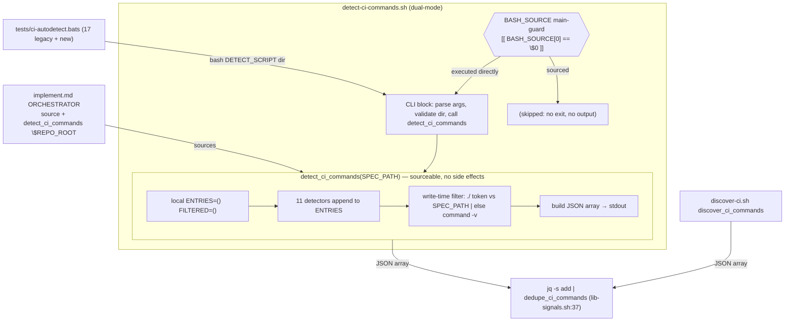
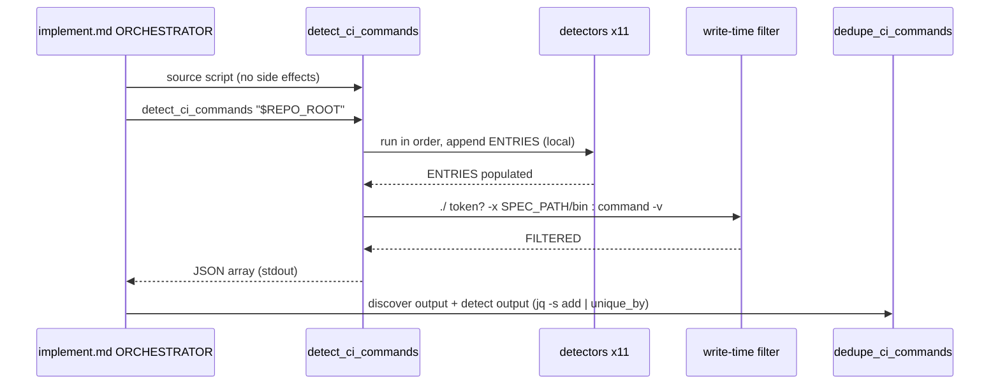

# Design: multi-language-support

## Overview
Refactor `detect-ci-commands.sh` so all detect→filter→emit logic lives inside a single sourceable `detect_ci_commands(<dir>)` function (FR-13/US-9), gated for CLI use by a `BASH_SOURCE` main-guard. Add 6 new ecosystem detectors (PHP, Ruby, Gradle, Maven, Elixir, Deno, C#/.NET) inside that function and patch the write-time `command -v` filter so `./`-prefixed wrapper tokens (`./gradlew`, `./mvnw`) resolve against `SPEC_PATH` (FR-7/US-7). No new source files — only bats fixtures, a doc row, and version bumps.

## Architecture



## Components

### `detect_ci_commands(dir)` — single source of truth (FR-13)
**Purpose**: Wraps the entire detect→filter→emit pipeline; prints JSON array to stdout.
**Responsibilities**:
- Declare `local SPEC_PATH="$1"`, `local ENTRIES=()`, `local FILTERED=()` (function-local → safe to call repeatedly).
- Run all 11 detectors in deterministic order, passing `$SPEC_PATH`.
- Apply the write-time filter, then emit the JSON array.
- `return 0` always; never `exit`.

**Signature / shape**:
```bash
detect_ci_commands() {
  local SPEC_PATH="$1"
  local ENTRIES=() FILTERED=()
  # detectors are top-level functions (defined at source time), each takes "$SPEC_PATH"
  detect_pyproject "$SPEC_PATH";   detect_package_json "$SPEC_PATH"
  detect_makefile "$SPEC_PATH";    detect_cargo "$SPEC_PATH"
  detect_go_mod "$SPEC_PATH";      detect_composer "$SPEC_PATH"
  detect_gemfile "$SPEC_PATH";     detect_gradle "$SPEC_PATH"
  detect_maven "$SPEC_PATH";       detect_mix "$SPEC_PATH"
  detect_deno "$SPEC_PATH";        detect_dotnet "$SPEC_PATH"
  # ...filter loop into FILTERED... ; emit JSON array ; return 0
}
```
> ENTRIES/FILTERED MUST be `local` to `detect_ci_commands`, NOT top-level globals. The orchestrator calls the function inside `$(...)` once per run, but locality guarantees no cross-call accumulation and no global pollution of the sourcing shell.
> Detectors `ENTRIES+=(...)` — `ENTRIES` is visible to them via bash dynamic scope because they are called *from within* `detect_ci_commands`. This is the same accumulator pattern as today, just relocated.

### BASH_SOURCE main-guard + CLI block (FR-13/AC-9.2)
**Purpose**: Make CLI behavior identical to today while keeping `source` side-effect-free (AC-9.3).
```bash
if [[ "${BASH_SOURCE[0]}" == "${0}" ]]; then
  set -euo pipefail            # ← scoped to direct execution ONLY
  FORCE=0; SPEC_PATH=""
  while [[ $# -gt 0 ]]; do case "$1" in
    --force) FORCE=1; shift ;;
    -*) echo "Usage: $0 <spec-path> [--force]" >&2; exit 1 ;;
    *)  SPEC_PATH="$1"; shift ;;
  esac; done
  [[ -z "$SPEC_PATH" ]] && { echo "Usage: $0 <spec-path> [--force]" >&2; exit 1; }
  [[ ! -d "$SPEC_PATH" ]] && { echo "Error: spec path '$SPEC_PATH' does not exist" >&2; exit 1; }
  detect_ci_commands "$SPEC_PATH"
fi
```
`FORCE` is parsed and unused today (preserved as-is; no behavior change).

### 6 new detectors (FR-1..6)
All follow `detect_<marker>() { local base="$1"; <marker-guard> || return 0; ENTRIES+=(...); }`. Emitted tuples:

| Detector | Marker(s) | Emitted `{command, category}` |
|---|---|---|
| `detect_composer` (FR-1) | `composer.json` | **scripts-discovery** via `jq -r '.scripts // {} \| keys[]'`: `composer run <s>` categorized by name (`test*`→test; `lint*\|cs*\|fix*`→lint; `analy[sz]e*\|phpstan*\|psalm*`→typecheck; `build*`→build; else→other). **Fallback** when no scripts: `composer test`→test. First token `composer`. |
| `detect_gemfile` (FR-2) | `Gemfile` | `bundle exec rspec`→test, `bundle exec rubocop`→lint. First token `bundle`. |
| `detect_gradle` (FR-3) | `build.gradle` **OR** `build.gradle.kts` | wrapper-aware prefix `W` = `./gradlew` if `-x "$base/gradlew"` else `gradle`: `W test`→test, `W build`→build. (No `check`-as-typecheck — AC-3.4.) |
| `detect_maven` (FR-3) | `pom.xml` (independent of Gradle) | prefix `M` = `./mvnw` if `-x "$base/mvnw"` else `mvn`: `M test`→test, `M package`→build. |
| `detect_mix` (FR-4) | `mix.exs` | **aliases-discovery (AC-4.1, best-effort, no Elixir parsing)**: `mix.exs` is Elixir source (no JSON, no jq path), so grep-scan the `aliases:` keyword-list / `defp aliases` block for alias atom names via `grep -oE` of `<name>:` entries, match known names (test/lint/credo/dialyzer/format) → emit `mix <alias>`. If the grep scan finds nothing OR is ambiguous, fall back to the canonical commands (AC-4.2). **Fallback (always satisfies AC-4.2/4.3)**: `mix test`→test, `mix credo`→lint, `mix dialyzer`→typecheck, `mix format --check-formatted`→lint. First token `mix`. |
| `detect_deno` (FR-5) | `deno.json` **OR** `deno.jsonc` | **tasks-discovery** via `jq -r '.tasks // {} \| keys[]'`: `deno task <t>` categorized by name (same name-pattern map as composer). **Fallback**: `deno test`→test, `deno lint`→lint, `deno check`→typecheck, `deno fmt --check`→lint. First token `deno`. |
| `detect_dotnet` (FR-6) | GLOB `*.csproj` / `*.sln` via `compgen -G`; fixed-file `global.json` | `dotnet test`→test, `dotnet build`→build, `dotnet format --verify-no-changes`→lint. First token `dotnet`. |

**`detect_dotnet` marker guard (AC-6.1 — glob pitfall)**:
```bash
detect_dotnet() {
  local base="$1"
  if compgen -G "$base/*.csproj" >/dev/null 2>&1 \
     || compgen -G "$base/*.sln" >/dev/null 2>&1 \
     || [[ -f "$base/global.json" ]]; then
    ENTRIES+=('{"command":"dotnet test","category":"test"}')
    ENTRIES+=('{"command":"dotnet build","category":"build"}')
    ENTRIES+=('{"command":"dotnet format --verify-no-changes","category":"lint"}')
  fi
  return 0
}
```
`compgen -G` returns non-zero on no match; wrapping in the `if`/`||` chain means a no-match never aborts under `set -e` (and `set -e` is anyway not active when sourced).

> `composer.json`/`deno.json` scripts-discovery requires `jq` (already a dep, NFR-2). Guard each `jq` call with `command -v jq >/dev/null 2>&1` exactly like `detect_package_json` does, falling through to the canonical fallback if jq is absent.

### Write-time filter patch (FR-7/US-7)
Only the per-entry keep-decision changes; extraction logic and WARN message unchanged.
```bash
for entry in "${ENTRIES[@]}"; do
  local cmd bin keep                                  # AC-9.3: declare all three local
  cmd="${entry#*\"command\":\"}"; cmd="${cmd%%\",*}"
  bin="${cmd%% *}"
  keep=1
  if [[ "$bin" == ./* ]]; then
    [[ -x "$SPEC_PATH/$bin" ]] || keep=0          # AC-7.1
  else
    command -v "$bin" >/dev/null 2>&1 || keep=0    # AC-7.2 unchanged
  fi
  if [[ $keep -eq 1 ]]; then FILTERED+=("$entry")
  else echo "[detect-ci-commands] WARN: skipping $cmd binary $bin not on PATH" >&2; fi
done
```
`SPEC_PATH` is in scope because it is the `local` first arg of `detect_ci_commands` (the function the filter now lives inside). `bin="./gradlew"` → tests `-x "$SPEC_PATH/./gradlew"` (the `/./` is harmless to the OS). Declaring `local cmd bin keep` (not just `keep`) keeps the loop from leaking `cmd`/`bin` as globals into any shell that `source`s the script — preserving AC-9.3's zero-global-pollution intent now that the loop runs inside `detect_ci_commands`.

## Data Flow



## Technical Decisions

| Decision | Options | Choice | Rationale |
|---|---|---|---|
| `set -euo pipefail` placement | (a) top-level (today) (b) inside guard (c) inside function | **(b) inside the main-guard** | AC-9.3: sourcing must not leak `set -e` into the orchestrator (an unhandled non-zero would abort the loop). Direct CLI execution still gets strict mode. Putting it inside the function would re-arm/disarm per call and risk leaking the `pipefail` option to the caller's shell on return — guard scoping is cleanest. |
| `SPEC_PATH` scoping under refactor | global / function-local arg | **function-local arg** (`local SPEC_PATH="$1"`) | The filter needs `SPEC_PATH` for the `./` check; making it the function's local arg keeps the function re-callable and pure, and avoids relying on a CLI-parsed global that does not exist when sourced. |
| ENTRIES/FILTERED scope | global / function-local | **function-local** | Re-callable safety + zero global pollution of the sourcing shell (AC-9.3). Detectors still see ENTRIES via dynamic scope (called from within the function). |
| Detectors: top-level or nested in function | nested / top-level | **top-level functions** | Defined at source time so they exist for both modes; called only from inside `detect_ci_commands`. Mirrors the current file layout (minimal diff). |
| Maven build command | `mvn compile` / `mvn package` | **`mvn package`** | Binding interview decision; `package` is the canonical full build gate. `./mvnw` analog when wrapper present. |
| Gradle category split | `check`→typecheck / test+build | **test + build only** | AC-3.4: `gradle check` is an aggregate (tests + static analysis); tagging it `typecheck` is dishonest and double-runs tests. |
| .NET marker test | `[[ -f ]]` / `compgen -G` | **`compgen -G` for globs**, `[[ -f ]]` for `global.json` | AC-6.1: `[[ -f "$base/*.csproj" ]]` never matches a glob. |
| Wrapper detection | always system bin / detect wrapper | **wrapper if `-x`, else system bin** | Preserves reproducibility (`./gradlew`) while degrading to `gradle`/`mvn` (PATH-resolvable) so output is never empty. |

## File Structure

| File | Action | Purpose |
|---|---|---|
| `plugins/ralphharness/hooks/scripts/detect-ci-commands.sh` | Modify | Refactor to `detect_ci_commands()` + main-guard; add 6 detectors; patch filter |
| `tests/ci-autodetect.bats` | Modify | Add new-marker matrix tests, filter regression, source-no-side-effects test (17 legacy unchanged) |
| `plugins/ralphharness/references/quality-commands.md` | Modify | Add PHP (`composer.json`) + C#/.NET (`*.csproj`/`*.sln`) rows to the config table (lines ~64-72) |
| `plugins/ralphharness/.claude-plugin/plugin.json` | Modify | `version` 5.9.5 → 5.10.0 |
| `.claude-plugin/marketplace.json` | Modify | ralphharness entry `version` 5.9.5 → 5.10.0 |

> No new fixture *files* required: tests build marker dirs + stub PATH binaries inline in temp dirs (existing bats pattern, `SPECIAL_DIR`/`STUBBIN`).

## Error Handling

| Scenario | Strategy | Impact |
|---|---|---|
| Marker absent (NFR-3) | each detector `... || return 0`; `detect_dotnet` `if`-chain returns 0 | Detector emits nothing; never aborts |
| `jq` absent | `command -v jq` guard → skip discovery, use canonical fallback | Fewer scripts discovered; canonical commands still emitted |
| `compgen -G` no match | wrapped in `if`/`||`; non-zero never propagates | No `set -e` abort (also disarmed when sourced) |
| Sourced with no args (AC-9.3) | main-guard false → nothing runs | Caller `$?`==0, shell not exited, no output |
| `./` wrapper not executable (AC-7.1) | filter drops entry, emits existing WARN to stderr | Command excluded; valid JSON still emitted |
| All entries filtered out | emit `[]` (existing behavior) | Valid empty JSON array |

## Edge Cases
- **Gradle + Maven coexist**: independent detectors both fire → both command sets emitted (AC-3.2).
- **composer.json with empty `scripts: {}`**: `keys[]` empty → fallback `composer test`.
- **`build.gradle.kts` only (no Groovy file)**: detector still fires (AC-3.1).
- **`./gradlew` present but not executable**: dropped by filter with WARN (AC-7.1 negative case).
- **`global.json` only, no `.csproj`/`.sln`**: `detect_dotnet` fires via fixed-file branch (AC-6.1).
- **Re-calling `detect_ci_commands` twice in one shell**: function-local ENTRIES → no accumulation across calls.

## Test Strategy

> Core rule: if it lives in this repo and is not an I/O boundary, test it real. The detector IS the SUT; the only "external" surface is PATH binaries (composer/bundle/mix/deno/dotnet/gradle/mvn) which are stubbed because they are not installed in CI.

### Test Double Policy
| Type | Use here |
|---|---|
| **Stub** | PATH binaries (`composer`, `bundle`, `mix`, `deno`, `dotnet`, `gradle`, `mvn`) — stubbed executables in a temp `STUBBIN` dir so the write-time `command -v` filter retains entries. They are external tools, not our code; we only need them resolvable, not functional. |
| **Fake** | none — no in-memory substitute needed; real filesystem temp dirs are used directly. |
| **Mock** | none — we never assert "a binary was invoked"; the observable outcome is the emitted JSON, not an interaction. |
| **Fixture** | Marker files (`composer.json`, `Gemfile`, `build.gradle.kts`, `*.csproj`, executable `./gradlew`, etc.) created inline in temp dirs = predefined data state. |

> The binaries are STUBS not MOCKS: the test cares about the SUT's JSON output, not whether `composer` was called. The filter only checks resolvability via `command -v`.

### Mock Boundary
| Component | Unit/CLI test | Sourced (integration) test | Rationale |
|---|---|---|---|
| `detect_ci_commands` (function) | Stub PATH bins | Stub PATH bins | Own logic — test real; only PATH resolution is stubbed |
| `detect_composer/_gemfile/_gradle/_maven/_mix/_deno/_dotnet` | Stub PATH bins | Stub PATH bins | Own detectors — real output asserted |
| Write-time filter (`./` patch) | Fixture: executable vs absent `./gradlew` | n/a | I/O boundary is the filesystem `-x` test → use a real fixture file, not a double |
| BASH_SOURCE main-guard | none (run via `bash script`) | none (run via `source`) | The guard IS what we assert; no double |
| `dedupe_ci_commands` (lib-signals.sh) | none | Real (sourced) | Existing contract, unchanged — re-verified by 2 legacy tests |
| `discover_ci_commands` (discover-ci.sh) | not under test | not under test | Out of scope (co-producer); NFR-6 dedupe is a non-goal |

### Fixtures & Test Data
| Component | Required state | Form |
|---|---|---|
| `detect_composer` | (a) `composer.json` with `scripts:{test,lint,analyze,build}`; (b) `composer.json` with no `scripts` | inline heredoc in temp dir |
| `detect_gemfile` | empty `Gemfile` | `touch` |
| `detect_gradle` | (a) `build.gradle`; (b) `build.gradle.kts`; (c) `build.gradle` + executable `./gradlew` | heredoc + `chmod +x` |
| `detect_maven` | `pom.xml`; optional executable `./mvnw` | heredoc + chmod |
| `detect_mix` | `mix.exs` (with + without aliases) | heredoc |
| `detect_deno` | `deno.json` with `tasks`; `deno.jsonc` no tasks | heredoc |
| `detect_dotnet` | (a) `App.csproj` glob; (b) `Sln.sln`; (c) `global.json` | `touch` |
| filter regression | executable `./gradlew` present vs absent | `chmod +x` toggle |
| PATH stubs | `composer bundle mix deno dotnet gradle mvn` (+ existing ruff/mypy/pytest/npm/pnpm/yarn) | add to `STUBBIN` loop in `setup()` |

### Test Coverage Table
| Component / Function | Test type | What to assert | Test double | Maps to |
|---|---|---|---|---|
| `detect_composer` (scripts) | CLI | output contains `composer run test`(test), `composer run lint`(lint), `composer run analyze`(typecheck), `composer run build`(build) | Stub `composer` | FR-1/AC-1.1, AC-1.3 |
| `detect_composer` (no scripts) | CLI | output contains `composer test`(test) and no `vendor/bin/*` | Stub `composer` | AC-1.2 |
| `detect_composer` absent | CLI | empty dir → `[]` (covered by existing empty-dir test) | none | AC-1.4 |
| `detect_gemfile` | CLI | output contains `bundle exec rspec`(test), `bundle exec rubocop`(lint); first token `bundle` | Stub `bundle` | FR-2/AC-2.* |
| `detect_gradle` (build.gradle) | CLI | `gradle test`(test), `gradle build`(build); no typecheck entry | Stub `gradle` | FR-3/AC-3.1,3.4 |
| `detect_gradle` (build.gradle.kts) | CLI | fires on `.kts` marker (same assertions) | Stub `gradle` | AC-3.1 |
| `detect_gradle` wrapper | CLI | executable `./gradlew` present → `./gradlew test`/`./gradlew build` SURVIVE filter | Fixture `./gradlew` (real `-x`) | AC-3.3, AC-3.5, AC-7.4 |
| `detect_maven` | CLI | `mvn test`(test), `mvn package`(build); `./mvnw` analog when wrapper present | Stub `mvn` / fixture `./mvnw` | FR-3/AC-3.2,3.3 |
| Gradle+Maven coexist | CLI | both command sets present | Stub `gradle`+`mvn` | AC-3.2 |
| `detect_mix` (fallback) | CLI | `mix test`(test), `mix credo`(lint), `mix dialyzer`(typecheck), `mix format --check-formatted`(lint) | Stub `mix` | FR-4/AC-4.2,4.3 |
| `detect_mix` (aliases) | CLI | alias name → `mix <alias>` preferred | Stub `mix` | AC-4.1 |
| `detect_deno` (tasks) | CLI | `deno task <name>` per task, categorized | Stub `deno` | FR-5/AC-5.1 |
| `detect_deno` (fallback, .jsonc) | CLI | `deno test`/`deno lint`/`deno check`(typecheck)/`deno fmt --check`(lint); fires on `.jsonc` | Stub `deno` | AC-5.2,5.4 |
| `detect_dotnet` (.csproj glob) | CLI | glob marker fires (NOT silently skipped) → `dotnet test`/`dotnet build`/`dotnet format --verify-no-changes` | Stub `dotnet` | FR-6/AC-6.1,6.2 |
| `detect_dotnet` (.sln / global.json) | CLI | each marker independently fires | Stub `dotnet` | AC-6.1 |
| Write-time filter `./` patch | CLI | `./gradlew test` kept iff `-x SPEC_PATH/gradlew`, dropped + WARN when absent | Fixture `./gradlew` | FR-7/AC-7.1,7.4 |
| Filter non-`./` unchanged | CLI | (covered) missing PATH bin still dropped via `command -v` | Stub PATH | AC-7.2 |
| Source no-side-effects | integration | `source detect-ci-commands.sh` in a sub-shell → `$?`==0, no stdout, shell not exited, `set -e` not active afterward | none | FR-13/AC-9.3 |
| Sourced function call | integration | after source, `detect_ci_commands "$dir"` emits valid JSON array for a fixture | Stub PATH | AC-9.1,9.4 |
| CLI path identical | CLI | `bash script dir [--force]` behaves as today; all 17 legacy tests pass | as legacy | AC-9.2,9.5/NFR-4 |
| 17 legacy tests | CLI/integration | unchanged, 17/17 pass | as legacy | NFR-4 |
| Syntax | CLI | `bash -n` clean (existing test) | none | NFR-5 |

### Test File Conventions
Discovered from `tests/ci-autodetect.bats`:
- Test runner: **bats** (`bats tests/ci-autodetect.bats`; broader suite `bats plugins/ralphharness/tests/`).
- Location: **repo-root `tests/`** (NOT `plugins/.../tests/`).
- Pattern: `@test "detect-ci-commands.sh <marker> ..." { ... }` — one `@test` per matrix row.
- Invocation: CLI tests run `output=$(PATH="$STUBBIN:$PATH" bash "$DETECT_SCRIPT" "$spec_dir" 2>/dev/null)`; integration tests `source` the script in a sub-shell.
- Fixtures: built inline in `setup()` temp dirs (`SPECIAL_DIR`); stub bins in `STUBBIN` — extend the existing `for bin in ...` loop with `composer bundle mix deno dotnet gradle mvn`.
- Cleanup: `teardown()` `rm -rf "$SPECIAL_DIR" "$STUBBIN"` (extend if new temp dirs added).
- Assertions: `jq -e`, `jq 'length'`, `jq '[.[] | select(...)] | length'`.

## Performance Considerations
- Detection is O(markers) filesystem stat + a few `jq` calls; negligible. No regression vs today.

## Security Considerations
- No new external input parsing beyond `jq` on manifests (already trusted, same as `detect_package_json`).
- Emitted commands are strings only — never executed by the detector; the consumer decides execution.

## Existing Patterns to Follow
- `detect_package_json` (lines 45-73): scripts-discovery via `jq`, lockfile→pkgmgr, name-pattern category, `command -v jq` guard — mirror for `detect_composer`/`detect_deno`/`detect_mix`.
- `detect_*() { local base="$1"; [[ -f "$base/<marker>" ]] || return 0; ... }` guard form for fixed-file markers.
- WARN message format `[detect-ci-commands] WARN: skipping $cmd binary $bin not on PATH` — keep verbatim (filter test depends on stderr behavior).
- JSON array emit block (lines 141-156) — reuse unchanged inside the function.

## Unresolved Questions
- **NFR-5 shellcheck**: `shellcheck` is NOT installed in this environment (`bash -n` is available and clean). The existing syntax test uses `bash -n`. The executor should run `shellcheck` if installable; otherwise `bash -n` clean is the enforced gate and shellcheck is a manual/CI-side check. Not a blocker for the refactor.

## Implementation Steps
1. **Refactor (FR-13)**: wrap detect→filter→emit in `detect_ci_commands()` with `local SPEC_PATH ENTRIES FILTERED`; move `set -euo pipefail` + arg-parse + dir-validate + `detect_ci_commands "$SPEC_PATH"` into a `[[ "${BASH_SOURCE[0]}" == "${0}" ]]` main-guard. Keep existing 5 detectors as top-level functions called inside the function. (AC-9.1,9.2,9.3)
2. **Verify** 17 legacy bats + source-no-side-effects test pass before adding detectors.
3. **Patch filter (FR-7)**: add `./`-token branch using `-x "$SPEC_PATH/$bin"`; keep non-`./` `command -v` path and WARN unchanged. (AC-7.*)
4. **Add detectors (FR-1..6)** in order: `detect_composer`, `detect_gemfile`, `detect_gradle`, `detect_maven`, `detect_mix`, `detect_deno`, `detect_dotnet`; wire all into `detect_ci_commands` in deterministic order. (FR-8)
5. **Add bats tests** per Coverage Table; extend `STUBBIN` loop with the 7 new stub bins; add filter-regression fixture (`chmod +x ./gradlew`). (FR-10)
6. **Doc (FR-11)**: add PHP + C#/.NET rows to `references/quality-commands.md` config table. Do NOT duplicate Ruby/JVM/Elixir/Deno rows.
7. **Version (FR-12)**: bump 5.9.5 → 5.10.0 in `plugin.json` and `marketplace.json`.
8. **Gate**: `bats tests/ci-autodetect.bats` 17/17 + new tests green; `bash -n` clean; `shellcheck` if available.
