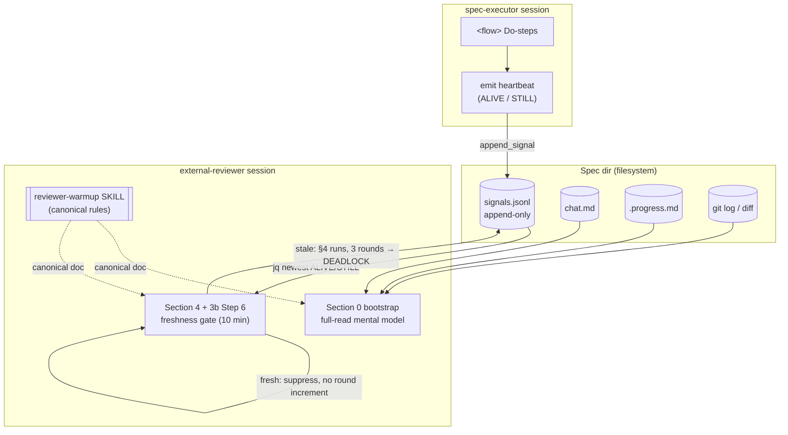
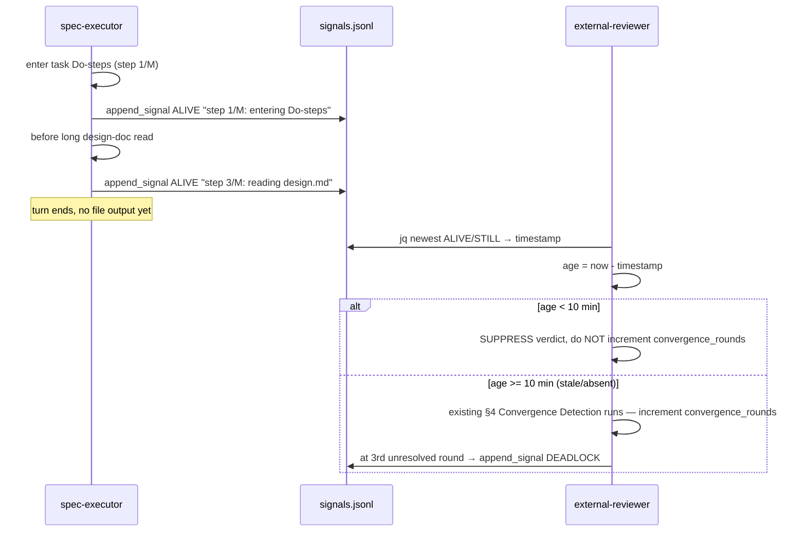

# Design: reviewer-warmup

## Overview

Add an executor liveness heartbeat (`ALIVE`/`STILL` `type:control` events appended to `signals.jsonl`) that the external-reviewer consults before escalating stagnation, and replace the reviewer's history-skipping bootstrap with a full spec-state read. Both behaviors are encoded by extending the existing agent prompts plus one new exportable `reviewer-warmup` skill — no new scripts, no schema migration, `active_signal_count()` untouched.

## Architecture



## Components

### Component A — Executor Heartbeat Emitter

**Purpose**: Prove the executor is alive (and moving) during long, output-silent Do-steps.
**Location**: `spec-executor.md` `<flow>` + Signal Emission Contract.
**Responsibilities**:
- Append an `ALIVE`/`STILL` `type:control` event to `signals.jsonl` on concrete triggers.
- Carry a `reason` with the Do-step index and an activity string so the reviewer sees forward motion.

**Heartbeat event shape** (the exact JSON object appended to `signals.jsonl`):

```json
{"type":"control","signal":"ALIVE","from":"spec-executor","to":"external-reviewer","task":"task-1.3","status":"active","timestamp":"2026-05-17T14:22:08Z","iteration":3,"reason":"step 3/5: reading design.md"}
```

| Field | Value | Notes |
|-------|-------|-------|
| `type` | `"control"` | Same event type as `HOLD`/`PENDING`; rides existing schema. |
| `signal` | `"ALIVE"` or `"STILL"` | Reused vocabulary — NO new `READING` kind. |
| `from` | `"spec-executor"` | Emitter. |
| `to` | `"external-reviewer"` | Intended consumer. |
| `task` | `"task-<X.Y>"` | Current task id from `.ralph-state.json → taskIndex`. |
| `status` | `"active"` | Required by schema; never `"resolved"` — heartbeats are not signals to clear. |
| `timestamp` | ISO 8601 UTC (`date -u +%Y-%m-%dT%H:%M:%SZ`) | Sole freshness source. Newest heartbeat's timestamp drives the gate. |
| `iteration` | `.ralph-state.json → taskIteration` | Monotonic; lets reviewer cross-check cycle progress. |
| `reason` | `"step N/M: <activity>"` | N = current Do-step index, M = total Do-steps in the task, `<activity>` = short label (e.g. `reading design.md`, `running tests`, `entering Do-steps`). |

**Non-blocking proof**: `active_signal_count()` (`lib-signals.sh:25-30`) selects only `.signal=="HOLD" or "PENDING" or "URGENT" or "DEADLOCK"`. `ALIVE`/`STILL` are not in that set, so a heartbeat increments the count by 0 — it rides past the HOLD gate unchanged. `append_signal()` (`lib-signals.sh:15`) validates JSON shape only (`jq -e .`), not the `signal` value; the example line above passes `jq -e .`. No `lib-signals.sh` change.

### Component B — Reviewer Freshness Gate

**Purpose**: Suppress a stagnation/DEADLOCK verdict while a heartbeat is fresh; still escalate genuine stalls.
**Location**: `external-reviewer.md` Section 4 — prepended before §4 "Convergence Detection" (lines 380-405) — and referenced from Section 3b Step 6 (progress-real check, lines 300-339).
**Responsibilities**:
- Read `signals.jsonl`, find the newest `ALIVE`/`STILL` event, compute its age.
- On a fresh heartbeat (< 10 min): suppress the verdict this cycle and skip the existing §4 `convergence_rounds` increment.
- On a stale/absent heartbeat: fall through unchanged to §4's existing 3-round Convergence Detection.

**Interface** (conceptual — implemented as reviewer prompt steps + a `bash` snippet):

```text
Input:  <basePath>/signals.jsonl, current wall-clock time
Output: heartbeat_fresh: boolean
        → if true:  suppress this cycle's verdict AND skip the convergence_rounds increment
        → if false: existing §4 Convergence Detection runs unchanged
```

> The gate does NOT own a counter. `convergence_rounds` is the EXISTING per-active-issue,
> in-memory counter defined in `external-reviewer.md` §4 "Convergence Detection" (lines
> 380-405) — it is not a new variable and not a `.ralph-state.json` field. The gate only
> decides whether the current review cycle is allowed to increment that existing counter:
> a FRESH heartbeat means "do not count this cycle as a stall round"; a STALE/ABSENT
> heartbeat means "§4 increments as it does today, and at 3 rounds DEADLOCK fires".

### Component C — Reviewer Bootstrap (full spec-state read)

**Purpose**: Give the reviewer a spec-state mental model before cycle 1 instead of warming up over ~8 cycles.
**Location**: `external-reviewer.md` Section 0 (lines 19-33).
**Responsibilities**:
- Read `chat.md` IN FULL, read `.progress.md`, read recent `git log` / `git diff --stat` since the spec branch point.
- State a short spec-state mental model before Section 6 cycle 1.
- Stop setting `chat.reviewer.lastReadLine` to the full line count; set it to `0`.
- Preserve active HOLD/PENDING/DEADLOCK detection.

### Component D — `reviewer-warmup` Skill (canonical rules + export)

**Purpose**: Single source of truth for the bootstrap (US-3) and heartbeat-freshness (US-2) rules; exportable into foreign runtimes.
**Location**: `plugins/ralphharness/skills/reviewer-warmup/SKILL.md`.
**Responsibilities**:
- Document the bootstrap procedure and the freshness-gate algorithm canonically.
- `external-reviewer.md` references it; both stay consistent.
- Exported via the pair-debug runtime→path map mechanism.

## Data Flow



1. Executor enters a task's Do-steps → emits `ALIVE` (`reason: "step 1/M: entering Do-steps"`).
2. Before/around a long Explore or design-doc read → emits `ALIVE` (`reason: "step N/M: reading design.md"`).
3. Once per executor turn → emits `ALIVE` if it progressed this turn, else `STILL`.
4. Reviewer, before any stagnation verdict, reads `signals.jsonl`, isolates the newest `ALIVE`/`STILL`, computes age vs 10-min threshold.
5. Fresh → suppress and log deferral; the cycle does NOT increment `convergence_rounds`. Stale/absent → the existing §4 Convergence Detection runs unchanged and escalates DEADLOCK at the 3rd unresolved round.

## Technical Decisions

| Decision | Options Considered | Choice | Rationale |
|----------|-------------------|--------|-----------|
| Liveness primitive | new `READING` kind / reuse `ALIVE`,`STILL` | reuse `ALIVE`/`STILL` | Open enum; legend + coordinator already define them as heartbeats; no migration. |
| Heartbeat transport | `chat.md` marker / `signals.jsonl` event | `signals.jsonl` event | Reviewer already reads `signals.jsonl`; machine-parseable timestamp; rides `append_signal()` JSON validation. |
| Staleness model | cycle-count / time-based | time-based, 10 min | A long design-doc read can span multiple cycles; 10 min exceeds realistic long-read durations. The gate is purely additive — it never replaces §4's existing 3-round Convergence Detection, it just skips the round increment while the heartbeat is fresh. |
| `reason` content | activity only / step index + activity | `"step N/M: <activity>"` | Lets reviewer observe forward motion (step 2→3), not just liveness. |
| `ALIVE` vs `STILL` | always `ALIVE` / distinguish | distinguish | `ALIVE` = progressed this turn, `STILL` = alive but no progress — gives reviewer a stall hint without false escalation. |
| Bootstrap | full-read (a) / seeded digest file (b) | (a) full-read | No file-lifecycle concern; reviewer already reads `.progress.md`/git mid-cycle — just move it to cycle 0. |
| Rules home | inline in `external-reviewer.md` / new skill | new exportable skill, canonical | US-4 needs a portable artifact; skill is single source of truth, agent references it. |
| Export mechanism | new map / reuse pair-debug map | reuse pair-debug runtime→path map | FR-7 mandates pair-debug parity; one map, one pattern. |

## File Structure

| File | Action | Purpose |
|------|--------|---------|
| `plugins/ralphharness/skills/reviewer-warmup/SKILL.md` | Create | Canonical bootstrap + heartbeat-freshness rules; exportable skill. |
| `plugins/ralphharness/agents/spec-executor.md` | Modify | `<flow>` heartbeat-emit step; Signal Emission Contract row for `ALIVE`/`STILL`. |
| `plugins/ralphharness/agents/external-reviewer.md` | Modify | Section 0 full-read bootstrap; Section 4 + 3b Step 6 freshness gate; reference the skill. |
| `plugins/ralphharness/commands/implement.md` | Modify | Onboarding step offering reviewer-skill export (manual path / automatic copy). |
| `plugins/ralphharness/templates/chat.md` | Modify | Legend rows for `ALIVE`/`STILL` reflect `signals.jsonl` heartbeat use. |
| `plugins/ralphharness/templates/signals.jsonl` | Modify | Schema comment documents heartbeat events. |
| `plugins/ralphharness/references/coordinator-pattern.md` | Modify | Signal table heartbeat note (already present at line 246 — clarify non-blocking + `signals.jsonl`). |
| `plugins/ralphharness/tests/test-reviewer-warmup.bats` | Create | Grep/`jq`/`bash -n` assertions + scripted heartbeat-sequence simulation. |
| `plugins/ralphharness/.claude-plugin/plugin.json` | Modify | Version bump 5.5.1 → 5.6.0 (design task, not done now). |
| `.claude-plugin/marketplace.json` | Modify | Mirror ralphharness version bump (design task, not done now). |

## Reviewer Freshness-Gate Algorithm

The gate is a **pure additive pre-check** on the existing 3-round Convergence Detection
(`external-reviewer.md` §4, lines 380-405). It is prepended to Section 4 and referenced
from Section 3b Step 6. It introduces NO new threshold — it only decides whether the
current review cycle is allowed to increment the existing `convergence_rounds` counter.

```
# heartbeat freshness gate — run BEFORE the existing §4 Convergence Detection
STALENESS_MINUTES = 10

newest = `grep -v '^[[:space:]]*#' <basePath>/signals.jsonl 2>/dev/null \
          | jq -c 'select(.type=="control" and (.signal=="ALIVE" or .signal=="STILL"))' \
          | tail -1`

if newest is empty:                       # no heartbeat ever emitted
    heartbeat_fresh = false                # treat as stale — do not block escalation
else:
    ts  = newest.timestamp                 # ISO 8601
    age_min = (now_epoch - epoch(ts)) / 60
    if epoch(ts) parse failed (malformed):  # see Error Handling
        heartbeat_fresh = false
    else:
        heartbeat_fresh = age_min < STALENESS_MINUTES

if heartbeat_fresh:
    log "REVIEWER: deferring escalation — fresh executor heartbeat "
        "(age <age_min> min, reason: <newest.reason>)"
    DO NOT write WARNING-progress-stuck / DEADLOCK this cycle
    DO NOT increment the existing §4 `convergence_rounds` counter
    # a healthy, reading executor must not accumulate stall rounds
    return  # skip §4 Convergence Detection for this cycle
else:
    # heartbeat stale OR absent — the EXISTING §4 logic runs UNCHANGED:
    #   convergence_rounds increments as today (same task still FAIL/WARNING),
    #   and at 3 unresolved rounds §4 writes DEADLOCK.
    proceed with existing §4 Convergence Detection (3-round mechanism)
```

**`epoch(ts)`** uses `date -u -d "$ts" +%s` (GNU date). Wrap in a failure check; on parse failure the heartbeat is treated as stale (fail-safe — never masks a genuine stall).

> No separate higher threshold exists. The only escalation threshold is §4's existing
> 3 rounds. The gate's sole effect is to skip a round increment while the heartbeat is
> fresh — so a long, healthy read never reaches the 3rd round in the first place.

**AC-2.4 worked path**: executor crashed mid-read; the newest `ALIVE` timestamp is 25 min
old → `heartbeat_fresh = (25 < 10) = false`. The gate falls through to the existing §4
Convergence Detection, which runs unchanged: the task stays FAIL across review cycles, so
`convergence_rounds` increments 1 → 2 → 3. On the **3rd unresolved round** §4 writes
DEADLOCK to `signals.jsonl`. The heartbeat does NOT mask the stall — it only ever
suppressed cycles while it was still fresh.

**AC-2.2 worked path**: executor is on a long design-doc read; newest `ALIVE` timestamp is 90 s old; `heartbeat_fresh = true` → reviewer logs the deferral and writes no verdict this cycle.

## AC-2.5 No-Regression Guard — BYTE-STABLE Sections

The freshness gate is ADDITIVE for *detection*: it can only *suppress* an escalation or
skip a round increment, never alter how a real bug is detected. A precise distinction
applies to §4 "Convergence Detection":

- **§4 Convergence Detection (lines 380-405) is MODIFIED — NOT byte-stable.** This spec
  prepends the freshness-gate block to it AND makes the `convergence_rounds` increment
  conditional on heartbeat freshness (fresh cycle → no increment). The 3-round escalation
  threshold itself is unchanged, but the section's text is edited.
- **The DETECTION sections REMAIN byte-stable** — no edits land inside these ranges:

| Detection (BYTE-STABLE) | Section / line range | Why untouched |
|-------------------------|----------------------|---------------|
| FABRICATION-class catches & PASS-evidence rule | Section 5, lines 409-428 (esp. line 426 "actively run the exact verify command") | Real-bug detection — out of scope for this spec. |
| E2E anti-pattern / navigation-violation detection | Section 3b (E2E review), lines 300-339 (e2e/Step-6 detection logic) | Untouched — the gate sits as an additive pre-check; the e2e detection text is byte-identical. |
| Schema-mismatch / criterion verification | Sections 2–3 verification principles (applied at Section 6 step 5e) | Detection logic unchanged. |
| Version-bump checks | Reviewer's existing review-cycle criteria | Unchanged. |

Edits are confined to: (a) a NEW gate block prepended to Section 4, with the §4
Convergence Detection round-increment made conditional on heartbeat freshness, referenced
from Step 6; (b) Section 0 bootstrap (lines 19-33); (c) one reference line pointing to the
skill. The `test-reviewer-warmup.bats` suite includes grep assertions that the
FABRICATION/verify-command-evidence sentence and the e2e-anti-pattern reference string
still exist verbatim.

## Bootstrap Redesign — `external-reviewer.md` Section 0

Current Section 0 (lines 19-33) reads `chat.md` only to signal-scan, then sets `chat.reviewer.lastReadLine` to the full line count (line 30) — skipping all history. New Section 0:

| Step | Old | New |
|------|-----|-----|
| Read `chat.md` | signal-scan only | **Read IN FULL** — build a mental model of prior collaboration. |
| Read `.progress.md` | not read | Read fully — executor's state digest. |
| Read git | not read | `git log --oneline` + `git diff --stat` since the spec branch point. |
| `lastReadLine` | set to full line count (skip) | set to `0` — cycle 1 processes existing history. |
| Mental model | none | State a short spec-state model (what has happened so far) before cycle 1. |
| HOLD/PENDING/DEADLOCK detection | present (lines 27-29) | **Preserved verbatim** — still defers (HOLD/PENDING) or stops (DEADLOCK). |
| `chat.md` absent | skip silently | unchanged — skip silently. |

The skill (`reviewer-warmup/SKILL.md`) is the canonical text of this procedure; Section 0 carries a short summary plus `See skill: reviewer-warmup`. No second `chat.md` condensation path is introduced — the reviewer reads whatever `chat.md` currently is (condensed by `context-middleware` or not); `condense-context.sh` / `lib-context.sh` are NOT touched.

## Exportable Reviewer Skill

**Name**: `reviewer-warmup`
**Directory**: `plugins/ralphharness/skills/reviewer-warmup/`
**File**: `SKILL.md`

**Structure**:

```markdown
---
name: reviewer-warmup
description: This skill should be used when the external-reviewer starts a spec
  (bootstrap) or evaluates stagnation/DEADLOCK — it defines the full spec-state
  bootstrap read and the executor-heartbeat freshness gate.
version: 0.1.0
user-invocable: false
---

# Reviewer Warm-up

## Bootstrap (before review cycle 1)
- Read chat.md in full, read .progress.md, read git log/diff since branch point.
- Set chat.reviewer.lastReadLine = 0.
- State a spec-state mental model.
- Preserve active HOLD/PENDING/DEADLOCK detection.

## Heartbeat Freshness Gate (additive pre-check on §4 Convergence Detection)
- Staleness threshold: 10 minutes, time-based.
- Newest ALIVE/STILL in signals.jsonl fresher than 10 min → suppress verdict this cycle
  AND do not increment the existing §4 `convergence_rounds` counter.
- Stale/absent → the existing §4 Convergence Detection runs unchanged: convergence_rounds
  increments and at the 3rd unresolved round DEADLOCK is escalated.
- The gate adds NO new threshold — escalation stays governed by §4's existing 3 rounds.
- <full pseudocode from this design's Freshness-Gate Algorithm section>
```

**Canonical relationship**: the skill holds the authoritative procedure; `external-reviewer.md` Section 0 and Section 4 carry concise summaries and a `See skill: reviewer-warmup` pointer (AC-4.2 single source of truth).

**Export mechanism** (reuses the pair-debug pattern):

- **Hook point**: a new onboarding sub-step in `implement.md`, modeled on the "Pair-Debug Placement Step" (lines 364-392). It is offered at onboarding/implementation time when an external reviewer runs in a foreign runtime.
- **Runtime→path map** reused from `pair-debug.md` §Section 5, with the skill filename substituted:

  | Runtime | Destination |
  |---------|-------------|
  | Roo Code | `.roo/commands/reviewer-warmup.md` |
  | Qwen | `.qwen/commands/reviewer-warmup.md` |
  | Cursor | `.cursor/commands/reviewer-warmup.md` |
  | Other / Unknown | Manual fallback |

- **Manual-path mode**: print the absolute source path `<abs>/plugins/ralphharness/skills/reviewer-warmup/SKILL.md` plus the activation step ("paste the file contents as the reviewer session prompt / place in the runtime's skills folder").
- **Automatic-copy mode**: resolve destination from the map, copy `SKILL.md` there. On conflict, prompt overwrite/skip per file (idempotent re-run).
- **Conflict prompt / unknown runtime**: identical to pair-debug — unknown runtime falls back to manual print with reason `"no known destination path for <runtime>"`.

**Export report** (printed in both modes):
```
Reviewer warm-up skill exported.
Skill file:
  source:      <abs>/plugins/ralphharness/skills/reviewer-warmup/SKILL.md
  destination: <abs dest> # automatic mode only
To activate:
  <runtime-specific concrete step>
```

## Error Handling

| Error Scenario | Handling Strategy | Impact |
|----------------|-------------------|--------|
| `signals.jsonl` missing/empty at reviewer bootstrap | `grep ... 2>/dev/null` yields empty; `newest` empty → `heartbeat_fresh = false`. Bootstrap continues; HOLD/PENDING/DEADLOCK scan also handles empty silently. | None — fail-safe: no heartbeat = treat as stale, normal stagnation logic applies. |
| Malformed heartbeat line in `signals.jsonl` | `jq -c 'select(...)'` skips non-JSON / non-matching lines. If newest matched line has an unparseable `timestamp`, `date -u -d` fails → `heartbeat_fresh = false`. | None — fail-safe; a corrupt heartbeat never suppresses a genuine escalation. |
| Heartbeat write fails (`append_signal` flock timeout, exit 75) | Executor logs the failure to `.progress.md` learnings; does not retry-loop. Missing heartbeat → reviewer treats as stale. | Executor work continues; worst case is a false-stall window, not a crash. |
| Runtime→path map cannot resolve destination | Fall back to manual print with reason `"no known destination path for <runtime>"` (pair-debug parity). | User copies skill manually; no guessed path. |
| Destination file already exists (automatic copy) | Prompt overwrite/skip per file — idempotent re-run. | User-controlled. |
| `chat.md` absent at bootstrap | Skip the full-read step silently (unchanged from current Section 0). | None. |

## Test Strategy

> Project type is `cli` (Claude Code plugin — markdown + shell). Per requirements Verification Contract, **skip all VE/E2E tasks**. No browser, no HTTP, no build step.

### Test Double Policy

| Type | Use in this spec |
|------|------------------|
| **Stub** | Not used — no external I/O wrappers in scope. |
| **Fake** | Not used. |
| **Mock** | Not used — no interaction-verification needed. |
| **Fixture** | A hand-written `signals.jsonl` with `ALIVE`/`STILL` events at known timestamps (one fresh, one stale) drives the freshness-gate simulation. Prepares data, replaces no code. |

The only "double" is fixture data. The artifacts under test are markdown prompts and one shell helper script (`detect-ci-commands.sh` is NOT touched; only `bash -n` on any `.sh` that a task actually edits — expected: none, since the design adds no scripts).

### Mock Boundary

| Component (from this design) | Unit test | Integration test | Rationale |
|------------------------------|-----------|------------------|-----------|
| Heartbeat Emitter (`spec-executor.md`) | none — grep assertion on prompt text | n/a (skip integration, `cli`) | Markdown prompt; assert the emission step + Signal Emission Contract row exist. |
| Heartbeat event shape | none — `jq -e` on a sample line | n/a | Validate JSON shape + non-blocking against `active_signal_count`. |
| Freshness Gate (`external-reviewer.md`) | none — Fixture-driven scripted simulation | n/a | Simulate the `signals.jsonl` fixture through the gate algorithm. |
| Bootstrap (`external-reviewer.md` Section 0) | none — grep assertion on prompt text | n/a | Assert full-read steps present, `lastReadLine` skip removed. |
| `reviewer-warmup` skill | none — grep assertion on `SKILL.md` | n/a | Assert frontmatter + bootstrap + freshness rules present. |
| Export step (`implement.md`) | none — grep assertion | n/a | Assert manual/automatic modes + conflict prompt + unknown fallback. |

> All rows use Fixture or no double. No Stub/Mock — there is no live I/O boundary to isolate; the SUT is static markdown and a pure-text gate algorithm.

### Fixtures & Test Data

| Component | Required state | Form |
|-----------|----------------|------|
| Freshness-gate simulation | A `signals.jsonl` with: (1) a fresh `ALIVE` (timestamp = now − 90 s) for the suppression case; (2) a stale `ALIVE` (timestamp = now − 25 min) for the escalation case. | Generated inside `test-reviewer-warmup.bats` via `date -u -d` (no checked-in fixture file needed). |
| Escalation case | A stale heartbeat plus the existing §4 Convergence Detection at its 3rd unresolved round (`convergence_rounds = 3`). | Simulated as a variable in the test's gate harness. |
| `active_signal_count` non-regression | A `signals.jsonl` containing one `ALIVE` line. | Inline in test; assert `active_signal_count` returns `0`. |

### Test Coverage Table

| Component / Function | Test type | What to assert | Test double |
|----------------------|-----------|----------------|-------------|
| Heartbeat event shape | unit | A sample heartbeat line passes `jq -e .`; has `type=control`, `signal` ∈ {ALIVE,STILL}, `reason` matching `^step [0-9]+/[0-9]+: `. | fixture |
| `active_signal_count` non-regression | unit | Sourcing `lib-signals.sh` and running `active_signal_count` on a `signals.jsonl` with one `ALIVE` line returns `0` (heartbeat non-blocking). | fixture |
| `spec-executor.md` emission | unit | grep finds the `<flow>` heartbeat-emit step AND a Signal Emission Contract row for `ALIVE`/`STILL` → `signals.jsonl`, tied to "Do-steps" and "long" read triggers. | none |
| Freshness gate — fresh case | unit | Fixture with `ALIVE` 90 s old → gate yields `escalate=false` and a deferral log string. | fixture |
| Freshness gate — stale + 3 convergence rounds | unit | Fixture with `ALIVE` 25 min old → gate falls through to §4 Convergence Detection; at the 3rd unresolved round it escalates to DEADLOCK. | fixture |
| Freshness gate — fresh skips round increment | unit | Fixture with `ALIVE` 90 s old → gate suppresses the verdict AND `convergence_rounds` is NOT incremented for that cycle. | fixture |
| Freshness gate — empty `signals.jsonl` | unit | Missing/empty file → `heartbeat_fresh=false`, normal logic. | fixture |
| `external-reviewer.md` Section 0 | unit | grep finds "Read chat.md IN FULL", ".progress.md", "git log"/"git diff --stat", `lastReadLine = 0`; the old "lastReadLine to the current line count" skip text is ABSENT. | none |
| AC-2.5 byte-stable guard | unit | grep finds the verbatim FABRICATION/verify-command-evidence sentence and the e2e-anti-pattern reference string still present. | none |
| `reviewer-warmup/SKILL.md` | unit | grep finds frontmatter `name: reviewer-warmup`, bootstrap section, "10 min" threshold, freshness pseudocode. | none |
| `external-reviewer.md` references skill | unit | grep finds `See skill: reviewer-warmup` in Section 0 and Section 4. | none |
| `implement.md` export step | unit | grep finds reviewer-skill export with manual-path + automatic-copy modes, conflict prompt, and "no known destination path" unknown fallback. | none |
| Docs updates | unit | grep finds `ALIVE`/`STILL` heartbeat note in `chat.md` legend, schema comment in `signals.jsonl`, heartbeat row in `coordinator-pattern.md`. | none |
| Modified `.sh` (if any) | unit | `bash -n` clean on any `.sh` a task edits (expected: none). | none |

### Test File Conventions

Discovered from the codebase (`plugins/ralphharness/tests/`):
- **Test runner**: `bats` 1.13.0 (`bats <file>.bats`). Verified present; smoke run of `test-export.bats` passed 5/5.
- **Test file location**: `plugins/ralphharness/tests/*.bats`. New file: `test-reviewer-warmup.bats`.
- **Pattern**: each `.bats` file resolves `REPO_ROOT` via `git rev-parse --show-toplevel`, then `@test` blocks run `grep -q` / `jq` / `bash -n` assertions against plugin markdown and shell files. Example: `test-export.bats`, `test-placement-step.bats`.
- **Integration / E2E**: none — `cli` project, skipped per Verification Contract.
- **Mock cleanup**: n/a — fixtures are inline temp data created within each `@test` (use `BATS_TEST_TMPDIR`).
- **Fixture location**: inline in the `.bats` file via `date -u` and heredoc — consistent with existing tests; `tests/fixtures/` exists for any larger fixture if needed.
- **Run command**: `bats plugins/ralphharness/tests/test-reviewer-warmup.bats`.

## Performance Considerations

- Heartbeat append is an O(1) `printf >>` under a 5 s flock — negligible per turn.
- Bootstrap full-read of `chat.md` is bounded: `context-middleware` keeps `chat.md` condensed (≤ ~last 15 messages + preserved signals), so a "full read" stays cheap throughout the spec.

## Security Considerations

- No new attack surface: heartbeats are `type:control` events written via the existing `append_signal()` flock path with JSON validation. No new file, no new lock, no new executable.
- Export copies a markdown skill into a user-confirmed runtime path only — same trust boundary as the existing pair-debug export.

## Existing Patterns to Follow

- **Signal append**: `append_signal "$SPEC_PATH" "$payload"` via `lib-signals.sh` — JSON validated, flock fd 202. Do not hand-roll appends.
- **`signals.jsonl` resolve-by-append**: never edit lines; heartbeats are `status:active` and simply accumulate (newest wins for freshness).
- **Skill frontmatter**: `name` / `description` / `version` / `user-invocable: false` — mirror `skills/reality-verification/SKILL.md`.
- **Export pattern**: pair-debug runtime→path map, manual/automatic modes, conflict prompt, unknown→manual fallback (`pair-debug.md` §5, `implement.md` lines 364-392).
- **Test pattern**: `bats` grep/`jq`/`bash -n` assertions on plugin artifacts, `REPO_ROOT` via `git rev-parse`.
- **Concision**: agent-prompt edits stay terse — bullets, one-line steps — matching surrounding `spec-executor.md`/`external-reviewer.md` style.

## Unresolved Questions

None — all design-interview decisions are encoded above (heartbeat cadence, 10-min threshold, `reason` format, reuse `ALIVE`/`STILL`, bootstrap variant (a), one exportable skill).

## Implementation Steps

1. **(US-1)** Add the heartbeat-emit step to `spec-executor.md` `<flow>` (after step 6 "Parse task", on entering Do-steps + before long reads) and a Signal Emission Contract row for `ALIVE`/`STILL` → `signals.jsonl`; document the `reason` `"step N/M: <activity>"` format and `ALIVE` vs `STILL` rule.
2. **(US-2)** Prepend the freshness-gate algorithm block to `external-reviewer.md` Section 4 (before §4 "Convergence Detection", lines 380-405) and reference it from Section 3b Step 6; encode the 10-min threshold. Make the §4 `convergence_rounds` increment conditional on heartbeat freshness (fresh cycle → no increment); the AC-2.4 stale-heartbeat DEADLOCK path stays governed by §4's existing 3-round Convergence Detection — add no new threshold.
3. **(US-3)** Rewrite `external-reviewer.md` Section 0: full-read of `chat.md` + `.progress.md` + git, `lastReadLine = 0`, state a mental model; preserve HOLD/PENDING/DEADLOCK detection.
4. **(US-4)** Create `plugins/ralphharness/skills/reviewer-warmup/SKILL.md` as the canonical bootstrap + freshness-gate doc; add `See skill: reviewer-warmup` pointers in `external-reviewer.md` Sections 0 and 4.
5. **(US-4/FR-7)** Add the reviewer-skill export sub-step to `implement.md` onboarding, reusing the pair-debug runtime→path map (filename `reviewer-warmup.md`), manual/automatic modes, conflict prompt, unknown→manual fallback, and the export report.
6. **(US-5)** Update docs: `chat.md` legend `ALIVE`/`STILL` rows, `signals.jsonl` schema comment, `coordinator-pattern.md` signal-table heartbeat note (non-blocking + `signals.jsonl`).
7. Create `plugins/ralphharness/tests/test-reviewer-warmup.bats` per the Test Coverage Table; run `bats plugins/ralphharness/tests/test-reviewer-warmup.bats` and confirm green.
8. Bump `plugins/ralphharness/.claude-plugin/plugin.json` 5.5.1 → 5.6.0 and mirror in `.claude-plugin/marketplace.json`.

---
_Changelog: 2026-05-17 — initial design._
_Changelog: 2026-05-17 — corrected DEADLOCK threshold: removed the fictional 7-cycle gate; the freshness gate is a pure additive pre-check on `external-reviewer.md` §4's existing 3-round Convergence Detection (`convergence_rounds` = per-issue in-memory counter, not a `.ralph-state.json` field). Fresh heartbeat skips the round increment; stale/absent falls through to §4 unchanged. Updated Freshness-Gate Algorithm, AC-2.4 worked path, Component B interface/location, Data Flow + sequenceDiagram, AC-2.5 byte-stable distinction (§4 Convergence Detection now MODIFIED; FABRICATION §5 and e2e/Step-6 detection still byte-stable), SKILL.md body, Technical Decisions, Implementation Step 2, and the test fixtures/coverage table._
