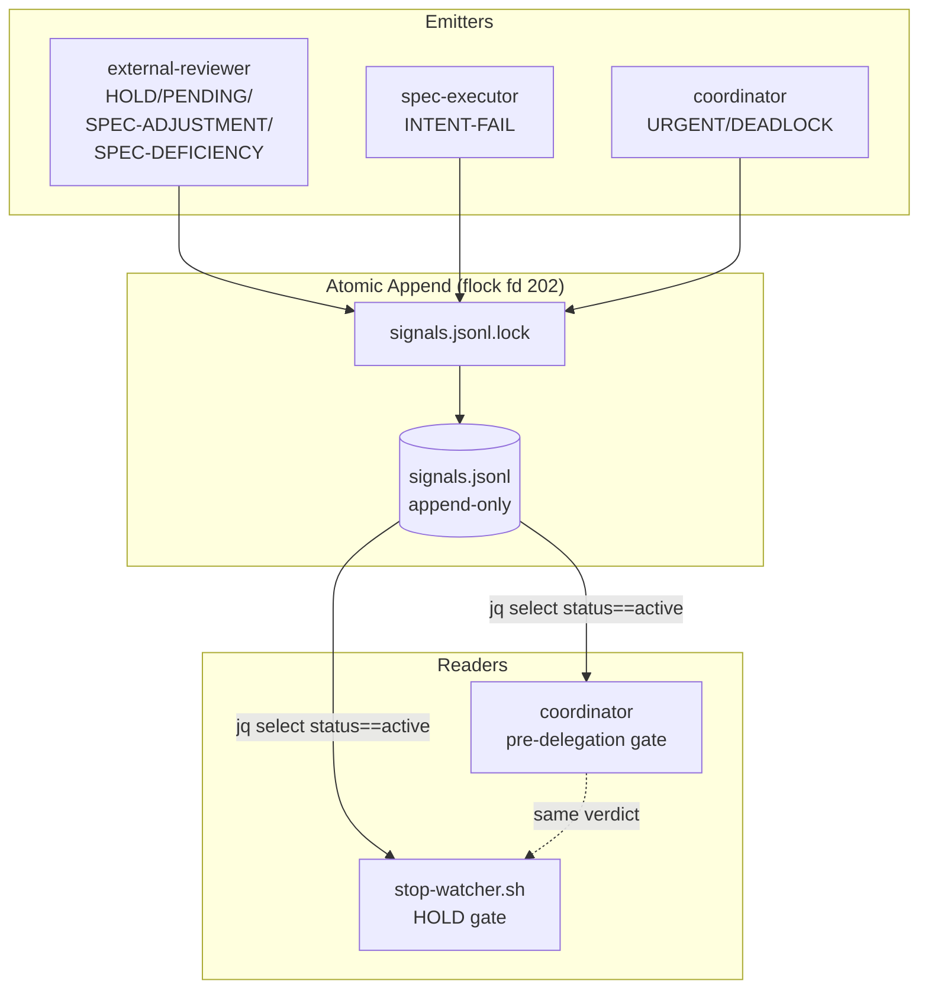
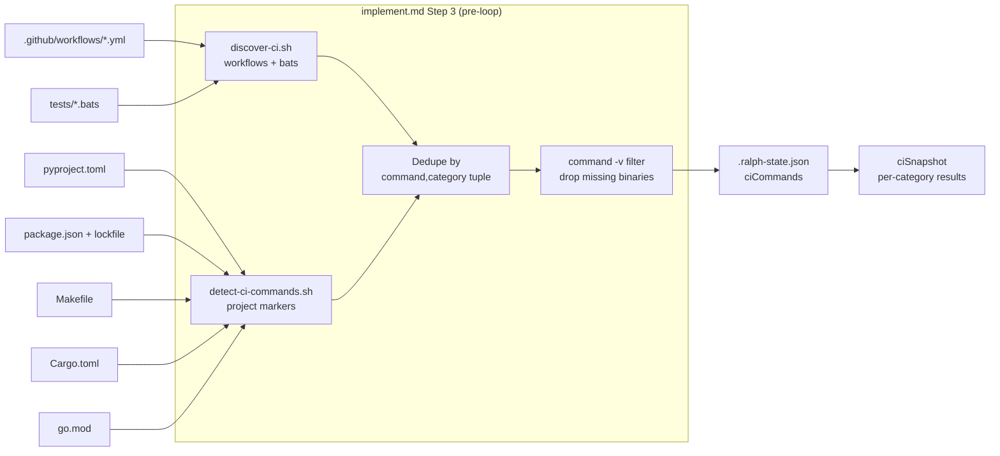
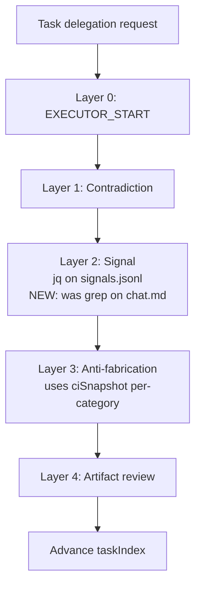

# Design: Signal Event Log + CI Auto-Detection

> Phase 6 of engine-roadmap-epic. Mechanical replacement for grep-based HOLD detection (gap C2) and per-category CI snapshot tracking (gap C4).

## Overview

Purpose tag — what this design accomplishes.

We introduce a single new artifact, `signals.jsonl`, an append-only JSON-Lines event log per spec, and one new hook script, `detect-ci-commands.sh`, that composes with the existing `discover-ci.sh`. Both the coordinator (`implement.md` Step 3 / pre-delegation gate) and the `stop-watcher.sh` hook switch to the same `jq` query over `signals.jsonl` to make HOLD/PENDING/URGENT/DEADLOCK decisions — eliminating the C2 "two engine entry points disagree" failure mode by construction. CI commands are discovered once at execution start, classified by category (`lint`/`typecheck`/`test`/`build`/`other`), filtered by `command -v`, and recorded under `.ralph-state.json.ciCommands` with a new `ciSnapshot` field that records per-category results separately from per-task verify (fixing C4).

---

## Architecture

### Signal Flow

Purpose tag — how a control signal travels from emitter to engine decision.



### CI Discovery Pipeline

Purpose tag — how project markers turn into per-category state entries.



### Verification Layer Placement

Purpose tag — where the new mechanical check fits in the canonical 5-layer pipeline.



> Layer 2 is the only layer touched by this spec. Layers 0/1/3/4 are unchanged. Layer 3 gains read access to the new `ciSnapshot` shape (consumption, not behaviour change).

---

## Components

Purpose tag — table maps every touched file to its purpose, action, and the FR it satisfies.

| Component (path) | Action | Purpose | FR |
|---|---|---|---|
| `specs/<name>/signals.jsonl` | data artifact (per spec) | Append-only JSON-Lines control event log; single source of truth for HOLD/PENDING/URGENT/DEADLOCK/INTENT-FAIL/SPEC-ADJUSTMENT/SPEC-DEFICIENCY | FR-1, FR-4 |
| `plugins/ralphharness/templates/signals.jsonl` | create | Seed copied at spec creation: explanatory header comment + one commented active/resolved example pair | FR-1 |
| `plugins/ralphharness/hooks/scripts/detect-ci-commands.sh` | create | Scan project markers, emit `[{command, category}]`, filter by `command -v`, hand off to dedupe | FR-3, FR-11 |
| `plugins/ralphharness/hooks/scripts/discover-ci.sh` | unchanged (compose) | Existing workflow/bats scanner — its output is the first input to the dedupe step | FR-11 |
| `plugins/ralphharness/hooks/scripts/replay-signals.sh` | create | Incident-review helper: prints active signal set as it stood at `--at-iteration N` | FR-13 |
| `plugins/ralphharness/hooks/scripts/stop-watcher.sh` | modify | HOLD gate switched to `jq` on `signals.jsonl` (grep fallback). One-WARN-per-run on `jq` absence. | FR-7, FR-14 |
| `plugins/ralphharness/commands/implement.md` | modify | Step 3 calls `detect-ci-commands.sh`. Pre-delegation gate replaces grep on chat.md with `jq` on signals.jsonl (= Layer 2). | FR-2, FR-3 |
| `plugins/ralphharness/schemas/spec.schema.json` | modify | Add `signals.lastProcessedLine`. Upgrade `ciCommands` from `string[]` to `array<{command,category}>`. Add `ciSnapshot` (per-category). | FR-4 |
| `plugins/ralphharness/references/channel-map.md` | modify | New row: `signals.jsonl` (fd 202, writers, readers, lock file). Also update existing `.ralph-field-baseline.json.lock` row to fd 204 (prerequisite refactor — see Implementation Step 0). | FR-5 |
| `plugins/ralphharness/hooks/scripts/stop-watcher.sh` | modify (prerequisite) | Refactor baseline lock at line 572-573 from fd 202 -> fd 204 to free fd 202 for `signals.jsonl.lock` (decision D3). Single-file refactor; sole consumer of fd 202 in current code. | D3, FR-7 |
| `plugins/ralphharness/references/verification-layers.md` | modify | Layer 2 now reads `signals.jsonl`. Remove chat.md mention. | FR-6 |
| `plugins/ralphharness/references/coordinator-pattern.md` | modify | Add Signal Protocol section with atomic-append snippet (fd 202). Note signals.jsonl read precedes chat.md read. | FR-10, FR-8 |
| `plugins/ralphharness/templates/chat.md` | modify | Signal legend split into two tables: control (→ signals.jsonl) vs collaboration (→ chat.md). Migration note for legacy `[HOLD]`. | FR-9 |
| `plugins/ralphharness/agents/external-reviewer.md` | modify | Signal emission contract: writes HOLD/PENDING/SPEC-ADJUSTMENT/SPEC-DEFICIENCY to signals.jsonl. | FR-8 |
| `plugins/ralphharness/agents/spec-executor.md` | modify | Signal emission contract: writes INTENT-FAIL to signals.jsonl. | FR-8 |

---

## Data Model

Purpose tag — exact wire formats.

### `signals.jsonl` line schema

One JSON object per line. UTF-8, no trailing comma, no surrounding array.

| Field | Type | Required | Notes |
|---|---|---|---|
| `type` | `"control"` | yes | Only control events live in this file; collaboration markers stay in chat.md |
| `signal` | enum | yes | `HOLD`, `PENDING`, `URGENT`, `DEADLOCK`, `INTENT-FAIL`, `SPEC-ADJUSTMENT`, `SPEC-DEFICIENCY` |
| `from` | string | yes | `coordinator`, `external-reviewer`, `spec-executor`, `human` |
| `to` | string | yes | `coordinator`, `external-reviewer`, `spec-executor`, `all` |
| `task` | string | yes | Task ID (e.g. `task-1.1`) or `"all"` |
| `status` | enum | yes | `active`, `resolved`, `superseded` |
| `timestamp` | string | yes | ISO-8601 UTC (`2026-05-14T10:00:00Z`) |
| `iteration` | integer | yes | `globalIteration` from `.ralph-state.json` at write time |
| `reason` | string | yes | Free text — short rationale |
| `severity` | enum | no | `low` / `medium` / `high` — only meaningful for URGENT/DEADLOCK |

Example sequence (3 lines):

```json
{"type":"control","signal":"HOLD","from":"external-reviewer","to":"coordinator","task":"task-1.1","status":"active","timestamp":"2026-05-14T10:00:00Z","iteration":12,"reason":"Verify exits 1"}
{"type":"control","signal":"HOLD","from":"external-reviewer","to":"coordinator","task":"task-1.1","status":"resolved","timestamp":"2026-05-14T10:05:00Z","iteration":15,"reason":"Executor fixed; verify exits 0"}
{"type":"control","signal":"DEADLOCK","from":"coordinator","to":"all","task":"task-2.3","status":"active","timestamp":"2026-05-14T11:00:00Z","iteration":34,"reason":"Reviewer and executor disagree on done_when","severity":"high"}
```

### `.ralph-state.json` additions

```json
{
  "signals": {
    "lastProcessedLine": 0
  },
  "ciCommands": [
    {"command": "ruff check .",          "category": "lint"},
    {"command": "mypy .",                 "category": "typecheck"},
    {"command": "pytest",                 "category": "test"}
  ],
  "ciSnapshot": {
    "lint":      {"result": "pass", "exitCode": 0,  "timestamp": "2026-05-14T11:02:00Z", "iteration": 34, "command": "ruff check ."},
    "typecheck": {"result": "fail", "exitCode": 1,  "timestamp": "2026-05-14T11:02:01Z", "iteration": 34, "command": "mypy ."},
    "test":      {"result": "pass", "exitCode": 0,  "timestamp": "2026-05-14T11:02:03Z", "iteration": 34, "command": "pytest"},
    "build":     null,
    "other":     null
  }
}
```

Rules:
- `signals.lastProcessedLine` — coordinator's read cursor for replay/diff; **never** used as the active-signal source (active-signal check always rescans).
- `ciCommands[i].category` ∈ `{lint, typecheck, test, build, other}` (closed enum).
- `ciSnapshot.<category>` is `null` if no command in that category exists OR has not been run yet this iteration.
- `ciSnapshot.<category>.result` ∈ `{pass, fail, skip}`. `skip` only if the binary is missing at run time (rare; usually filtered earlier).

### `templates/signals.jsonl` exact bytes

```
# signals.jsonl — append-only control event log (Phase 6, signal-log-and-ci-autodetect)
# Schema: type=control, signal, from, to, task, status, timestamp, iteration, reason
# DO NOT EDIT existing lines. Resolve a signal by appending a new line with status=resolved.
# Examples (commented out — lines starting with # are not valid JSONL; remove the # to use):
# {"type":"control","signal":"HOLD","from":"external-reviewer","to":"coordinator","task":"task-1.1","status":"active","timestamp":"2026-01-01T00:00:00Z","iteration":1,"reason":"<why>"}
# {"type":"control","signal":"HOLD","from":"external-reviewer","to":"coordinator","task":"task-1.1","status":"resolved","timestamp":"2026-01-01T00:05:00Z","iteration":2,"reason":"<resolution>"}
```

> The header lines start with `#`. `jq -c` skips lines starting with `#` only via `jq -R 'select(startswith("#")|not) | fromjson'`. Our active-signal query uses this filter (see Concurrency & Atomicity section).

---

## Technical Decisions

Purpose tag — at least six load-bearing choices with rationale and rejected alternatives.

| # | Decision | Options considered | Choice | Rationale |
|---|---|---|---|---|
| D1 | Event log format | JSONL, single-file JSON array, SQLite, YAML, CSV | **JSONL** | Append concurrency-friendly (one line = one syscall), native `jq` query, human-greppable, no schema migration tooling needed, matches OpenHands' inmutable event log idiom |
| D2 | Resolution semantics | Edit `status` in place / append new event with `status="resolved"` | **Append new event** | OpenHands hard invariant: history is immutable. Edit-in-place makes hash drift impossible to test (NFR-4 fails). Append is constant cost. |
| D3 | Lock fd allocation | `200` (chat) / `201` (tasks) / `202` (currently used by stop-watcher baseline lock — to be refactored) / `203` (next free) | **`202`** (requirements-preserving) | `requirements.md` AC-1.4 mandates fd 202 for `signals.jsonl.lock`. `stop-watcher.sh:572-573` currently uses fd 202 for `.ralph-field-baseline.json.lock` — this is the sole conflicting consumer. **Resolution (user-ratified): refactor stop-watcher baseline lock to fd 204** (single-file prerequisite, Implementation Step 0). This preserves the spec's stated invariant and avoids amending requirements. |
| D4 | Dedupe key | `command` only / `(command, category)` tuple / hash of full entry | **`(command, category)` tuple** | A project may run `pytest` as both `test` (integration) and `other` (smoke). Dedupe by command alone collapses these. Dedupe by tuple preserves semantic distinction needed by `ciSnapshot`. |
| D5 | `command -v` filter location | Schema validation / write-time in detect-ci-commands.sh / runtime in coordinator | **Write-time in detect-ci-commands.sh** | Schema can't run shell. Runtime adds latency on every CI snapshot. Write-time runs once at Step 3 → fastest path, simplest to test, removes false entries before any consumer sees them. |
| D6 | Category enum closure | Open string / closed enum of 5 / closed enum of N | **Closed 5: lint/typecheck/test/build/other** | Open string defeats per-category snapshot table. 5 covers all detected toolchain commands in research §6.1 + `other` escape hatch for unclassifiable items (e.g. `make publish`). |
| D7 | Replay tool surface | Inline jq snippet in docs / separate script / library function | **Separate `replay-signals.sh`** | Incident review happens out-of-band, often after the spec dir is archived. A script is callable from any shell, has stable args, and is independently testable. Inline jq has no test target. |
| D8 | Legacy `[HOLD]` grace cycle | Hard cutover / one-release grace / permanent dual-read | **One-release grace** | Existing in-flight specs would break on hard cutover. Permanent dual-read keeps the C2 root cause alive (text interpretation). One release lets running specs finish on the old path while new specs use only signals.jsonl. |
| D9 | `ciCommands` migration | Schema-break / dual-read / auto-wrap legacy strings | **Auto-wrap on first read** | `[]string` → `[{command,category:"other"}]` is a lossless map. Schema-break invalidates existing in-flight `.ralph-state.json`. Auto-wrap is one line of jq, no operator intervention. |
| D10 | `jq` missing handling | Hard fail / grep fallback / install jq | **Grep fallback + WARN once** | NFR-3 requires the engine boot on systems without jq. The grep fallback (`grep -c '"status":"active"' signals.jsonl`) is less precise (doesn't filter by signal name) but is a strict superset of "should I block?" — false positives stop the loop, which is the safe direction. |

---

## Concurrency & Atomicity

Purpose tag — guarantees and failure cases for shared writes.

### Atomic-append pattern (canonical)

All writers (coordinator, external-reviewer, spec-executor) use this snippet. fd `202` is reserved exclusively for `signals.jsonl.lock` (was previously used by stop-watcher's baseline lock — refactored to fd 204 in Implementation Step 0).

```bash
append_signal() {
  local spec_path="$1" payload="$2"
  # Validate JSON BEFORE acquiring the lock (no torn-write risk if invalid).
  echo "$payload" | jq -e . >/dev/null || { echo "[ralphharness] malformed signal payload, aborting" >&2; return 2; }
  (
    exec 202>"${spec_path}/signals.jsonl.lock"
    flock -x -w 5 202 || { echo "[ralphharness] flock timeout on signals.jsonl.lock" >&2; exit 75; }
    printf '%s\n' "$payload" >> "${spec_path}/signals.jsonl"
  ) 202>"${spec_path}/signals.jsonl.lock"
}
```

### Active-signal query (canonical)

Used by both coordinator and stop-watcher. Strips comment lines, parses as JSON, filters by status and signal.

```bash
active_count=$(
  grep -v '^[[:space:]]*#' "${spec_path}/signals.jsonl" 2>/dev/null \
  | jq -c 'select(.status=="active") | select(.signal=="HOLD" or .signal=="PENDING" or .signal=="URGENT" or .signal=="DEADLOCK")' \
  | wc -l
)
```

### Ordering guarantees

1. **Append ordering**: `flock -x` serialises writers; the line written N+1 is appended after the line written N. Read order = write order.
2. **Read-side ordering**: jq processes lines top-to-bottom. A `resolved` event with the same `task`+`signal` appearing **after** an `active` event supersedes it in the AC-1.2 filter only because the filter returns lines, not aggregated state. For accurate state queries (e.g. replay), `replay-signals.sh` performs a stateful fold (see §Replay).
3. **Lock timeout = 5 s**: `flock -w 5`. On timeout the writer logs to `.progress.md` and emits a DEADLOCK signal (out-of-band path: writes directly to `signals.jsonl` only if the lock is free; otherwise writes a `.signals.lock-failure` flag file).

### Torn-line / malformed-line handling

If a torn write occurs (only possible if `flock` was bypassed):
- `jq -c` exits non-zero on the malformed line.
- The active-signal pipeline pipes into `wc -l`, which still works for whole lines; the bad line is silently skipped by jq error suppression — **unsafe**. Therefore the canonical query above uses no `-e`; we add a parallel validation pass at coordinator start:
  ```bash
  bad=$(grep -v '^[[:space:]]*#' "${spec_path}/signals.jsonl" | jq -e . >/dev/null 2>&1; echo $?)
  if [ "$bad" -ne 0 ]; then
    # Auto-emit DEADLOCK and halt — Verification Contract: malformed line is escalation-worthy.
    append_signal "$spec_path" '{"type":"control","signal":"DEADLOCK","from":"coordinator","to":"all","task":"all","status":"active","timestamp":"'"$(date -u +%FT%TZ)"'","iteration":'"$iter"',"reason":"malformed JSON line in signals.jsonl"}'
  fi
  ```

### Why coordinator and stop-watcher cannot disagree

Both call the **identical** active-signal query against the **identical** file. There is no per-process cache. Therefore the C2 root cause (two readers using different filters on a mutable file) is removed by construction.

---

## Failure Modes & Graceful Degradation

Purpose tag — one row per failure path.

| Failure | Detection | Response | NFR |
|---|---|---|---|
| `jq` not on PATH | `command -v jq` returns non-zero at engine boot | Switch to `grep -c '"status":"active"' signals.jsonl`. Log one-time WARN to `.progress.md`: `"WARN: jq unavailable, using grep fallback (less precise filter, signal-name filter disabled)"`. Engine continues. | NFR-3 |
| Malformed JSON line | `jq -e .` exit non-zero in validation pass | Auto-append DEADLOCK signal, halt loop, require human repair. Coordinator writes `"MALFORMED SIGNAL LINE at line $N"` to `.progress.md`. | Verification Contract escalation |
| Detected CI command's binary absent | `command -v $bin` non-zero inside `detect-ci-commands.sh` | Drop entry, log WARN to `.progress.md`: `"WARN: skipping <cmd> (binary <bin> not on PATH)"`. Never enters state. | AC-2.4 |
| `signals.jsonl` missing on legacy spec | `[ ! -f signals.jsonl ]` at coordinator/stop-watcher entry | Bootstrap empty file by `cp templates/signals.jsonl <spec>/signals.jsonl`. Log WARN once: `"WARN: bootstrapped signals.jsonl for legacy spec"`. | NFR-6 |
| Line edited in place (hash drift) | bats test compares `sha256sum -c` snapshot taken at engine boot | Test failure at review time (cannot detect at runtime — log only). Document operator rule: append-only. | AC-4.1 |
| Coordinator/stop-watcher divergence | — | **Impossible by construction**: both read the same file with the same jq query. No code path divergence exists. | AC-3.4 |
| `flock` contention timeout | `flock -w 5` exits 1 | Writer retries once after random jitter (50-150 ms). On second timeout, log to `.progress.md` and write `.signals.lock-failure` flag (next coordinator iteration converts it to a DEADLOCK signal). | NFR-5 |
| Legacy `[HOLD]` in chat.md (grace cycle) | grep finds `^\[HOLD\]$` AND jq active-count is 0 | Treat as active HOLD for one release cycle. Log WARN: `"WARN: legacy [HOLD] marker in chat.md — migrate to signals.jsonl (see references/coordinator-pattern.md §Signal Protocol)"`. | AC-3.6, NFR-6 |
| Schema mismatch (legacy `ciCommands: string[]`) | `jq '.ciCommands[0] | type'` returns `"string"` | Auto-wrap: `.ciCommands |= map(if type=="string" then {command:., category:"other"} else . end)`. Persist atomically. | AC-2.5 |

---

## Migration & Backward Compatibility

Purpose tag — what happens to in-flight specs that lack the new artifacts.

| Legacy state | Detection | Migration step | One-time? |
|---|---|---|---|
| No `signals.jsonl` | file missing | Copy `templates/signals.jsonl` into `<spec>/`. | Yes, idempotent |
| No `signals.lastProcessedLine` in state | `jq '.signals.lastProcessedLine // null'` is null | Default to `0` via `.signals.lastProcessedLine = (.signals.lastProcessedLine // 0)`. | Yes |
| `ciCommands` is `string[]` | `jq '.ciCommands[0] | type'` returns `"string"` | Auto-wrap to `{command:., category:"other"}`. | Yes |
| No `ciSnapshot` field | `jq '.ciSnapshot // null'` is null | Initialise to `{lint:null, typecheck:null, test:null, build:null, other:null}`. | Yes |
| `[HOLD]` markers in chat.md, no signals.jsonl entries | grep finds, jq active-count 0 | Honour the grep result for one release cycle. Annotate `.progress.md` with WARN line on first detection per spec. | Per-spec one-release grace |

All migrations run at the top of `commands/implement.md` Step 3, before `detect-ci-commands.sh` is invoked. No human action required.

---

## Test Strategy

> Core rule: signal-log behaviour is engine glue — bats integration tests are the right level. No mocks of `jq`, `flock`, or filesystem.

### Test Double Policy

| Type | When to use here |
|---|---|
| **Stub** | None needed — engine has no third-party I/O |
| **Fake** | Fake spec directory (tmp dir with seeded files) for integration |
| **Mock** | None — interactions are the observable outcome via real files |
| **Fixture** | Pre-built `.ralph-state.json` and `signals.jsonl` files in `tests/fixtures/phase6/` |

### Mock Boundary

| Component | Unit (bats per-function) | Integration (bats end-to-end) | Rationale |
|---|---|---|---|
| `detect-ci-commands.sh` | Real (uses tmp dir with marker files) | Real | Pure filesystem scanner; mocking would defeat the test |
| `discover-ci.sh` composition | Real | Real | Existing script — exercise its real output as input |
| `stop-watcher.sh` HOLD gate | Real (run script with seeded stdin + state) | Real | The gate IS the integration point; mock has no value |
| `implement.md` Layer 2 jq query | Tested as shell snippet | Real (via end-to-end harness `tests/integration.bats`) | Snippet is small; test the literal query against fixtures |
| `replay-signals.sh` | Real with fixture signals.jsonl | Real | Deterministic stateful fold; needs golden output |
| `signals.jsonl` append concurrency | N/A | Real (launch 5 parallel writers, assert no torn lines) | Race is observable only with real flock |

### Fixtures & Test Data

| Component | Required state | Form |
|---|---|---|
| Active-signal jq query | `signals.jsonl` with 3 active + 2 resolved + 1 superseded across HOLD/PENDING/URGENT/DEADLOCK | `tests/fixtures/phase6/signals-mixed.jsonl` |
| Migration: legacy ciCommands | `.ralph-state.json` with `"ciCommands": ["pytest", "ruff check ."]` | `tests/fixtures/phase6/state-legacy-cicmds.json` |
| Migration: legacy `[HOLD]` in chat.md | `chat.md` with `^[HOLD]$` and no signals.jsonl | `tests/fixtures/phase6/legacy-hold-chat.md` |
| CI detect: pyproject + package.json + Makefile | Seed in tmp dir | Built inline in test setup |
| Replay: signal history at iteration 12 | Append-ordered signals.jsonl with iteration field | `tests/fixtures/phase6/signals-history.jsonl` + golden output |
| Hash-stability test | Snapshot of `sha256sum` on each line before mutation attempt | Built inline |

### Test Coverage Table

| Component / behaviour | Test type | What to assert | Test double |
|---|---|---|---|
| `signals.jsonl` append immutability | integration | After 10 appends, `sha256sum` of lines 1..9 unchanged | none |
| Active-signal jq query — only-active | integration | 3 active HOLD → count=3 | none |
| Active-signal jq query — resolved ignored | integration | 1 active + 1 resolved same task → count=1 | none |
| Active-signal jq query — non-control ignored | integration | An entry with `type="collab"` → count=0 | none |
| flock fd 202 isolation (post-refactor) | integration | 5 parallel writers, all lines well-formed JSON; stop-watcher baseline lock on fd 204 does not contend | none |
| stop-watcher baseline lock refactor | unit | fd 204 baseline lock works identically to prior fd 202 implementation; no regression in role-boundaries enforcement | none |
| `detect-ci-commands.sh` — pyproject markers | integration | Output includes `{command:"ruff check .", category:"lint"}`, `{command:"mypy .", category:"typecheck"}`, `{command:"pytest", category:"test"}` | none |
| `detect-ci-commands.sh` — package.json + pnpm-lock | integration | Output includes `{command:"pnpm lint", category:"lint"}` not `npm` | none |
| `detect-ci-commands.sh` — Makefile lint/test/check | integration | Output emits make targets with correct category | none |
| `detect-ci-commands.sh` — Cargo + go.mod | integration | Output emits clippy/test/fmt and vet/test | none |
| `command -v` filter | integration | Seed `pytest` in PATH, omit `mypy` → `mypy .` absent from output | none |
| Dedupe by (command, category) | integration | discover-ci emits `pytest` (test), detect-ci emits `pytest` (test) → 1 entry | none |
| Migration: legacy ciCommands string[] | integration | After migration: `[{command:"pytest", category:"other"}, ...]` | none (uses fixture) |
| Migration: legacy [HOLD] in chat.md | integration | grep fallback active for one release; WARN logged exactly once | none (uses fixture) |
| `replay-signals.sh --at-iteration 12` | integration | Output = golden file; deterministic across 3 runs | none |
| `ciSnapshot` per-category recording | integration | After Layer 3 runs all detected commands, `ciSnapshot.lint`, `ciSnapshot.test`, `ciSnapshot.typecheck` each have `result` + `exitCode` | none |
| `jq` missing fallback | integration | Stub PATH to hide jq → grep fallback runs, WARN once | path-stub fake |
| Coordinator/stop-watcher agreement | integration | Both invoked on same fixture spec → both report same active count | none |

### Test File Conventions

Discovered via `bats --version` + `ls tests/*.bats`:

- **Test runner**: `bats 1.13.0` (confirmed on PATH)
- **Test file location**: `tests/*.bats` (project root, not co-located)
- **Naming**: kebab-case feature names (e.g. `tests/state-management.bats`, `tests/stop-hook.bats`)
- **Phase 6 file**: TO CREATE `tests/signal-log.bats` and `tests/ci-autodetect.bats`
- **Fixture location**: `tests/fixtures/` (existing) — Phase 6 subdir `tests/fixtures/phase6/` TO CREATE
- **Helper location**: `tests/helpers/` (existing)
- **Run command**: `bats tests/signal-log.bats tests/ci-autodetect.bats`
- **Full suite command**: `bats tests/` (smoke-verified clean as of design time)

---

## File-Change Inventory

| Path | Action | Priority | FRs |
|---|---|---|---|
| `plugins/ralphharness/templates/signals.jsonl` | create | high | FR-1 |
| `plugins/ralphharness/hooks/scripts/detect-ci-commands.sh` | create | high | FR-3, FR-11 |
| `plugins/ralphharness/hooks/scripts/replay-signals.sh` | create | low | FR-13 |
| `plugins/ralphharness/schemas/spec.schema.json` | modify | high | FR-4 |
| `plugins/ralphharness/hooks/scripts/stop-watcher.sh` | modify | high | FR-7, FR-14 |
| `plugins/ralphharness/commands/implement.md` | modify | high | FR-2, FR-3, FR-12 |
| `plugins/ralphharness/references/channel-map.md` | modify | high | FR-5 |
| `plugins/ralphharness/references/verification-layers.md` | modify | high | FR-6 |
| `plugins/ralphharness/references/coordinator-pattern.md` | modify | high | FR-8, FR-10 |
| `plugins/ralphharness/templates/chat.md` | modify | medium | FR-9 |
| `plugins/ralphharness/agents/external-reviewer.md` | modify | high | FR-8 |
| `plugins/ralphharness/agents/spec-executor.md` | modify | high | FR-8 |
| `tests/signal-log.bats` | create | high | NFR-2, AC-1.* |
| `tests/ci-autodetect.bats` | create | high | NFR-7, AC-2.* |
| `tests/fixtures/phase6/*` | create | high | (supports above) |

Counts: **6 create**, **9 modify**.

---

## Out of Scope

Restated from requirements + design-time exclusions:

- `chat.md` deprecation beyond the one-release grace cycle (Phase 7).
- Executing CI commands themselves — discovery + categorization only (Spec 4 territory).
- Signal condensation / archival to `.signals-archive/` — replay only.
- New collaboration signals (HYPOTHESIS, EXPERIMENT, etc.) — Phase 7.
- **Design-time exclusion**: schema validation of `signals.jsonl` via JSON Schema. The plugin-level schema validates state files, not append-only logs. Validation is enforced by the atomic-append helper.
- **Design-time exclusion**: cross-spec signal correlation (would require an index). Each spec's `signals.jsonl` stands alone.

---

## Open Questions / Risks

Purpose tag — items the architect cannot resolve from the inputs; flag for human decision before tasks phase.

1. **fd 202 already in use** ✅ RESOLVED (user-ratified). `requirements.md` AC-1.4 mandates fd 202 for `signals.jsonl.lock`. `stop-watcher.sh:572-573` currently uses fd 202 for `.ralph-field-baseline.json.lock`. **Resolution**: refactor stop-watcher baseline lock from fd 202 -> fd 204 as a prerequisite (Implementation Step 0). This preserves the requirements invariant. Single-file change; stop-watcher is the sole consumer of fd 202 in the current codebase, so no further call-sites need updating.
2. **`severity` field**: requirements list `severity` as optional but no consumer reads it in this spec. Should we drop it (YAGNI) or wire it into stop-watcher's escalation prompt (DEADLOCK severity=high routes differently)? Architect recommendation: keep optional but unused — Phase 7 collaboration may consume it.
3. **`detect-ci-commands.sh` precedence vs workflow output**: when discover-ci.sh emits `pytest` (from a workflow `- run: pytest -v`) and detect-ci-commands.sh emits `pytest` (from pyproject.toml dev-deps), the dedupe step picks one. Which "wins" — workflow form (`pytest -v`) or marker form (`pytest`)? Dedupe by `(command, category)` does not collapse these (different `command` strings). Result: both end up in `ciCommands`. Acceptable, or do we want canonicalisation?
4. **`signals.lastProcessedLine` actual purpose**: AC-1.5 mandates the field. The active-signal query in AC-1.2 rescans the whole file (correct behaviour). The cursor is therefore only useful for diff-since-last-iter audit log. Should the coordinator append a `signals-diff` block to `.progress.md` each iteration? Out-of-scope decision.
5. **Replay determinism vs clock**: `replay-signals.sh --at-iteration N` is deterministic on the file but two signals can share the same `iteration` (parallel emitters). Tie-breaker: file order (line number). Document and enforce in `replay-signals.sh`.

---

## Implementation Steps

0. **Prerequisite — free fd 202** (BLOCKING for all subsequent steps). Refactor `plugins/ralphharness/hooks/scripts/stop-watcher.sh:572-573` to use fd 204 for `.ralph-field-baseline.json.lock`. Update `references/channel-map.md` baseline-lock row to fd 204. Add unit test asserting baseline-lock behaviour is unchanged. (D3)
1. **Schema first** — modify `plugins/ralphharness/schemas/spec.schema.json`: add `signals.lastProcessedLine`, upgrade `ciCommands` to `array<{command,category}>`, add `ciSnapshot`. Run schema-validation bats. (FR-4)
2. **Create `templates/signals.jsonl`** with the exact bytes in §Data Model. (FR-1)
3. **Create `hooks/scripts/detect-ci-commands.sh`** with marker matrix from AC-2.2, `command -v` filter (AC-2.4), `(command,category)` tuple output, idempotent re-run (`--force` flag). (FR-3)
4. **Compose detect with discover**: orchestrator in `commands/implement.md` Step 3 — call discover-ci.sh first, detect-ci-commands.sh second, dedupe by tuple, write to `.ralph-state.json.ciCommands`. (FR-11)
5. **Replace HOLD check** in `commands/implement.md` (pre-delegation gate, currently ~line 302): canonical jq query from §Concurrency. Keep grep fallback under `command -v jq` test. Document Layer 2 mapping. (FR-2, FR-14)
6. **Mirror HOLD check in `hooks/scripts/stop-watcher.sh`** — same jq query, same grep fallback. Both code paths read `signals.jsonl`. (FR-7)
7. **Update `references/channel-map.md`** — add signals.jsonl row with fd 202. (FR-5)
8. **Update `references/verification-layers.md`** — Layer 2 reads signals.jsonl. Remove chat.md grep reference. (FR-6)
9. **Update `references/coordinator-pattern.md`** — add Signal Protocol section before Chat Protocol; insert atomic-append snippet (fd 202). (FR-10)
10. **Update agent contracts**: `agents/external-reviewer.md`, `agents/spec-executor.md` per AC-3.5 emission rules. (FR-8)
11. **Update `templates/chat.md`** signal legend — split control vs collaboration. Add migration note. (FR-9)
12. **Wire Layer 3 to ciSnapshot**: after each quality checkpoint, write per-category results to `.ralph-state.json.ciSnapshot`. (FR-12)
13. **Create `hooks/scripts/replay-signals.sh`** with `--at-iteration N` flag, deterministic file-order tie-break. (FR-13)
14. **Write bats tests** per Test Coverage Table. Add fixtures under `tests/fixtures/phase6/`. (NFR-2, NFR-4, NFR-5, NFR-7)
15. **Smoke-run full suite** `bats tests/` — assert no regression in existing tests, all new tests green.
